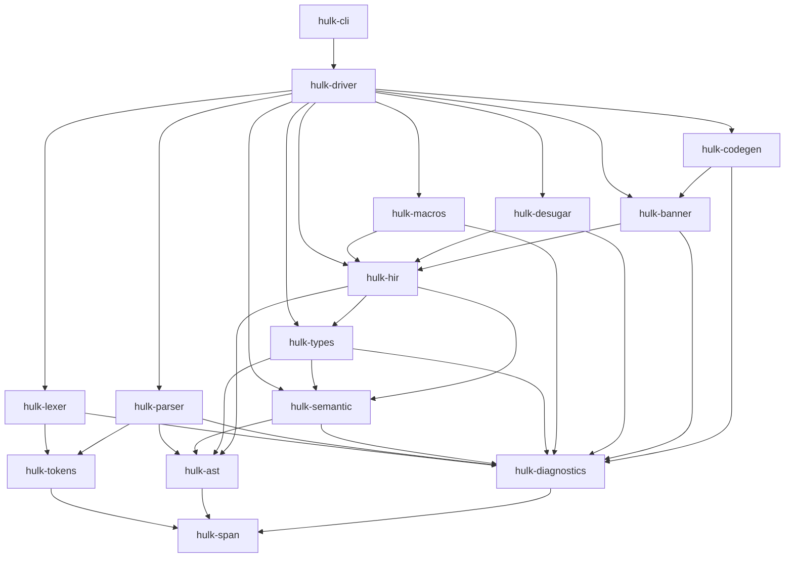

# HULK Compiler — Pipeline de Implementación

> Compilador del lenguaje **HULK** (Havana University Language for Kompilers) escrito en **Rust**, con **lexer y parser hechos a mano**, backend **LLVM** vía `inkwell`, **arquitectura clean** organizada como workspace de Cargo, y metodología **GitFlow** para la organización del desarrollo.

Este documento es el plan maestro de implementación. Define secciones, subsecciones y tareas atómicas. Cada tarea está escrita como un prompt autocontenido que un modelo con acceso al código puede ejecutar.

---

## Tabla de contenidos

- [Filosofía del proyecto](#filosofía-del-proyecto)
- [Decisiones arquitectónicas globales](#decisiones-arquitectónicas-globales)
- [Arquitectura Clean — estructura del workspace](#arquitectura-clean--estructura-del-workspace)
- [Metodología GitFlow](#metodología-gitflow)
- [Formato de una tarea](#formato-de-una-tarea)
- [Sistema de documentación](#sistema-de-documentación)
- [Convenciones de testing](#convenciones-de-testing)
- [Índice de secciones](#índice-de-secciones)
- [Secciones del pipeline](#secciones-del-pipeline)

---

## Filosofía del proyecto

HULK es un lenguaje incremental por diseño: cada feature se construye sobre las anteriores. Nuestro pipeline refleja esta filosofía — cada sección añade funcionalidad real y verificable, y al final de cada una tenemos un compilador **que funciona** para un subconjunto creciente de HULK. Nunca entramos en una fase donde "el compilador no corre hasta que terminen otras tres secciones".

Los tres ejes prioritarios (explicitados por el usuario) son:

1. **Robustez en el manejo de errores**: diagnósticos al nivel de `rustc` con spans, labels, sugerencias, recovery y reporte múltiple.
2. **Cobertura de tests extensa**: unit + integration + snapshot + fuzzing + end-to-end.
3. **Documentación detallada con justificaciones técnicas**: cada decisión documentada con alternativas consideradas y comparación.

---

## Decisiones arquitectónicas globales

Estas decisiones son transversales a todas las secciones. La sección 1 las documenta en profundidad, aquí van listadas para referencia.

| Decisión | Elección | Razón breve |
|---|---|---|
| Lenguaje | Rust (edition 2021 o superior) | Seguridad de memoria, enums para ASTs, ecosistema de compiladores maduro |
| Organización | Cargo workspace con múltiples crates | Separación de responsabilidades, compilación incremental, reutilización |
| Lexer | Hecho a mano, producción eager de todos los tokens | Simple, testeable, sin dependencias |
| Parser | **Pratt parser** (recursive descent + precedence climbing) | Natural para expresiones con operadores, manejable con el AST de HULK, estándar en la industria (Rust, Go, TypeScript) |
| AST | Enum + Box/Rc según necesidad | Idiomático en Rust, fácil de hacer pattern matching |
| Diagnósticos | Crate propio `hulk-diagnostics` con `codespan-reporting` | Mensajes tipo rustc con spans y labels |
| Error recovery | Sí, tanto en lexer como en parser | Reportar todos los errores posibles en una sola pasada |
| Tipos | Nominal con inferencia estilo Hindley-Milner restringido + síntesis de protocolos | Lo que HULK especifica |
| IR intermedio | **BANNER** (definido por HULK) | Es parte de la especificación, facilita testing aislado del backend |
| Backend | **LLVM** vía `inkwell` | Optimizaciones gratis, múltiples targets, aprendizaje valioso |
| Versión LLVM | LLVM 17 (feature `llvm17-0` de inkwell) | Ajustar a lo disponible en CI; documentar cómo instalar |
| HIR intermedio | AST anotado con `SymbolId`s y `TypeId`s | Contrato explícito entre frontend y middleend |
| Runtime | Librería en C enlazada estáticamente | GC + builtins + strings, interfaz FFI simple con LLVM |
| GC | Mark-and-sweep con shadow stack | Lo que HULK especifica como referencia |
| JIT (para REPL) | `inkwell`'s `ExecutionEngine` (MCJIT) | Reusa la misma infraestructura de codegen |
| Prelude | Archivo `prelude.hulk` embebido, procesado antes del programa del usuario | La spec define tipos como `Range` en HULK mismo, el prelude es HULK, no Rust hardcodeado |
| CLI | Ejecutable con subcomandos (`compile`, `run`, `check`, `test`, `repl`) vía `clap` | Experiencia similar a `cargo`/`rustc` |
| Testing | `cargo test` + `insta` (snapshots) + `cargo-fuzz` (fuzzing con corpus) + `proptest` + tests E2E propios | Pirámide de tests completa |
| Cobertura | `cargo-tarpaulin` en CI | Umbrales 85%/70% medibles |
| Logging/tracing | `tracing` crate para diagnósticos internos del compilador | Debugging del compilador sin prints |
| CI | GitHub Actions | Estándar, gratis, integra con GitFlow |
| Documentación | `rustdoc` para API + markdowns en `/doc` para decisiones + README en raíz | Separación entre API y diseño |

---

## Arquitectura Clean — estructura del workspace

La arquitectura clean aplicada a un compilador se traduce en **capas que solo dependen hacia adentro**. El núcleo (AST, tipos, diagnósticos) no conoce nada de LLVM ni del CLI. Las capas externas (CLI, codegen) dependen de las internas.

Estructura por **grupos funcionales** (no por capas numeradas, que generan sobre-ingeniería para grupos de un solo crate):

```
hulk-compiler/                            (workspace root)
├── Cargo.toml                            (workspace manifest)
├── Cargo.lock
├── README.md                             (visión general, para GitHub)
├── CHANGELOG.md                          (historial de cambios por versión)
├── PIPELINE.md                           (este documento)
├── doc/                                  (documentación detallada)
│   ├── seccion-01-setup.md
│   ├── seccion-02-diagnostics.md
│   ├── ...
│   └── seccion-18-e2e.md
├── examples/                             (programas HULK de ejemplo)
│   ├── hello.hulk
│   ├── fibonacci.hulk
│   └── ...
├── tests-e2e/                            (tests end-to-end ejecutables)
├── runtime/                              (runtime de C para GC + builtins)
│   ├── Makefile
│   ├── gc.c
│   ├── strings.c
│   └── builtins.c
├── prelude/                              (código HULK builtin)
│   └── prelude.hulk                      (Iterable, Enumerable, Range, etc.)
└── crates/                               (15 crates en total)
    # ━━━ NÚCLEO (infraestructura transversal) ━━━
    ├── hulk-span/                        (spans y source maps)
    ├── hulk-diagnostics/                 (diagnósticos y renderizado)
    # ━━━ FRONTEND (texto → AST) ━━━
    ├── hulk-tokens/                      (definición de tokens)
    ├── hulk-lexer/                       (lexer manual)
    ├── hulk-ast/                         (AST sin tipar + NodeId)
    ├── hulk-parser/                      (parser Pratt)
    # ━━━ ANÁLISIS SEMÁNTICO (AST → HIR) ━━━
    ├── hulk-semantic/                    (resolución de nombres, scopes)
    ├── hulk-types/                       (sistema de tipos, inferencia, checking)
    ├── hulk-hir/                         (AST anotado con SymbolId + TypeId)
    # ━━━ MIDDLEEND (HIR → HIR transformado) ━━━
    ├── hulk-macros/                      (expansión de macros)
    ├── hulk-desugar/                     (for→while, functor-wrap, etc.)
    # ━━━ BACKEND (HIR → código nativo) ━━━
    ├── hulk-banner/                      (IR intermedio BANNER)
    ├── hulk-codegen/                     (BANNER → LLVM IR → object file)
    # ━━━ ORQUESTACIÓN ━━━
    ├── hulk-driver/                      (pipeline completo + tests de arq.)
    └── hulk-cli/                         (binario, interfaz al usuario)
```

> **Nota sobre HIR (High-level Intermediate Representation)**: el flujo es AST → (resolver + type-checker) → HIR → (macros + desugar) → HIR transformado → BANNER → LLVM. El HIR es un AST inmutable donde cada `Ident` tiene su `SymbolId` resuelto y cada expresión su `TypeId` computado. Separa cleanly el frontend (no sabe nada de tipos) del middleend (trabaja sobre HIR con tipos).

### Diagrama de dependencias



**Regla de oro**: las flechas nunca van hacia arriba. Un cambio en el CLI no puede requerir cambios en el lexer. Un cambio en el lexer puede forzar ajustes hacia abajo (parser, etc.), pero eso es deliberado.

---

## Metodología GitFlow

**Contexto**: el proyecto es desarrollado por una sola persona. No se configura branch protection en GitHub, no hay PRs obligatorios, no hay reviews. Sin embargo, se mantiene la **estructura jerárquica** de ramas (`main` ← `develop` ← `section/NN` ← `feature/NN.M`) porque da trazabilidad clara por sección/subsección en la historia de Git y permite aislar el trabajo en progreso. La disciplina es auto-impuesta: los checklists de `CONTRIBUTING.md` y del Apéndice A son para uso propio antes de mergear.

Adaptamos GitFlow a este proyecto así:

```
main                ← releases estables (tags v0.1, v0.2, ...)
  │
  └── develop       ← integración de todas las secciones
        │
        ├── section/01-setup
        │     ├── feature/01.1-workspace-init
        │     ├── feature/01.2-gitflow-ci
        │     └── feature/01.3-exhaustive-tests  ← subsección de testing
        │
        ├── section/02-diagnostics
        │     ├── feature/02.1-span-crate
        │     ├── feature/02.2-diagnostic-types
        │     ├── feature/02.3-rendering
        │     └── feature/02.4-exhaustive-tests
        │
        └── section/03-lexer
              ├── feature/03.1-token-types
              ├── feature/03.2-character-reader
              ├── ...
              └── feature/03.N-exhaustive-tests
```

### Reglas

1. **Cada subsección es una feature branch** (`feature/NN.M-nombre-descriptivo`) que sale de la rama de su sección padre.
2. **Al terminar una subsección**: tests locales pasan → merge directo (`--no-ff`) a la rama de sección → se borra la rama de subsección local y remotamente → se crea la siguiente subsección desde la rama de sección actualizada.
3. **Cada sección termina con una subsección dedicada a testing exhaustivo** (sufijo `exhaustive-tests`). Esta subsección agrega fuzzing, property tests, tests de integración transversales, y valida que toda la sección funciona en conjunto.
4. **Al terminar una sección**: la rama de sección se mergea a `develop` (`--no-ff`) solo si los tests exhaustivos pasan localmente. Se borra la rama de sección y la siguiente se crea desde `develop` actualizado.
5. **Cada push/merge dispara CI**: todos los tests de todas las secciones anteriores deben seguir pasando (no-regression). Aunque no sea bloqueante (no hay branch protection), un CI rojo se arregla antes de continuar.
6. **Releases a `main`**: se taggean cuando se alcanza un hito significativo (v0.1 = frontend completo, v0.2 = middleend, v0.3 = backend, v1.0 = HULK completo). Se mergea `develop` → `main` (`--no-ff`) y se crea el tag.
7. **Hotfixes**: sale de `main`, va a `hotfix/<descripcion>`, se mergea a `main` y a `develop`, se taggea patch version (ej. `v0.1.3`). Si hay ramas `section/*` activas, deben rebasearse (o merge) sobre `develop` actualizado para incorporar el fix.
8. **Commits atómicos**: un commit por tarea. Mensaje con formato `[SNN.M.T] breve descripción` (ej: `[S03.2.1] Implementa Cursor con peek/advance`).
9. **Cuando una tarea cambia un contrato de una capa anterior** (ej: 6 agrega un campo a `Expr`): el commit debe incluir los cambios en todos los crates que consumen ese contrato. Si es muy invasivo, considerar un RFC breve en `doc/rfc/XXXX.md` antes de implementar.

### CI por rama

| Rama | Se ejecuta |
|---|---|
| `feature/*` | Lint (`clippy`), formato (`rustfmt`), unit tests del crate afectado |
| `section/*` | Todo lo anterior + integration tests de la sección |
| `develop` | Todo + tests E2E + snapshot tests + build en release + fuzzing corto |
| `main` | Todo + fuzzing largo + benchmarks + generación de artefactos |

---

## Formato de una tarea

Cada tarea en este pipeline sigue esta estructura rígida, pensada para ser usable directamente como prompt para un modelo con acceso al código:

```markdown
#### Tarea NN.M.T — <título breve>

**Rama**: `feature/NN.M-<slug>` (se trabaja dentro de esta rama)

**Contexto previo**: <qué ya existe en el repo, qué crates están implementados,
qué se puede asumir>

**Objetivo**: <qué debe lograr esta tarea, en una frase>

**Archivos a crear/modificar**:
- `crates/.../archivo.rs` (crear/modificar)
- `tests/archivo.rs` (crear)
- ...

**Descripción detallada**:
<explicación paso a paso de qué hay que implementar, con suficiente
detalle para que sea ejecutable sin ambigüedad>

**Criterios de aceptación**:
- [ ] Criterio 1 (medible)
- [ ] Criterio 2
- ...

**Tests a pasar**:
- `cargo test -p hulk-<crate> <nombre_test>`
- ...

**Actualización de documentación**:
- `doc/seccion-NN-<nombre>.md`: agregar subsección "<título>" explicando
  la decisión X, comparándola con alternativas Y y Z.
- `README.md` (si aplica): actualizar sección de features soportadas.

**Commit sugerido**: `[SNN.M.T] <descripción>`
```

---

## Sistema de documentación

Existen **tres niveles de documentación**, cada uno con su propósito:

### 1. `README.md` (raíz del repo, visible en GitHub)

- Qué es HULK (resumen).
- Qué features soporta el compilador actualmente (checklist vivo).
- Cómo compilar el proyecto (`cargo build --release`).
- Cómo ejecutar un programa HULK (`./target/release/hulk run file.hulk`).
- Ejemplos básicos.
- Link a `PIPELINE.md` y a `doc/`.
- Estado del proyecto (versión, cobertura de tests, badge de CI).

### 2. `doc/seccion-NN-<nombre>.md` (documentación detallada)

Un markdown por sección. Estructura obligatoria:

```markdown
# Sección NN — <Nombre>

## Resumen
<qué hace esta sección, qué aporta al compilador>

## Posición en el pipeline
<qué secciones asume completadas, qué secciones dependen de esta>

## Decisiones técnicas

### Decisión 1: <título>
- **Qué se eligió**: ...
- **Alternativas consideradas**:
  - Alternativa A: <descripción, pros, contras>
  - Alternativa B: <descripción, pros, contras>
- **Justificación**: <por qué esta es la mejor para nuestro caso>
- **Ejemplo de código**:
  ```rust
  // código real del proyecto, con path
  // (crates/hulk-XXX/src/YYY.rs:NN)
  ```
- **Explicación línea por línea**: <solo las partes no obvias>

### Decisión 2: ...
...

## API expuesta por esta capa
<funciones, tipos, traits públicos, con ejemplo de uso>

## Estrategia de testing
<qué se testea, cómo, qué casos borde, qué no se testea y por qué>

## Lecciones aprendidas y gotchas
<cosas que descubrimos durante la implementación, pitfalls>
```

### 3. `rustdoc` (generado de los comentarios `///` en el código)

- Cada ítem público (función, struct, trait, enum) debe tener doc comment.
- Ejemplos en doc tests cuando aporten.
- Se genera con `cargo doc --no-deps --open`.

### Regla para diagramas

Se incluyen diagramas (ASCII o Mermaid) cuando **reducen el tiempo de comprensión**. Candidatos naturales: arquitectura de capas, flujo del pipeline, estructura del AST, autómata del lexer, estructura del shadow stack. No se pone diagrama por ponerlo.

### Regla para actualización

**Cada tarea debe actualizar la documentación relevante.** Una tarea no se considera terminada si el markdown de la sección no refleja lo implementado. Esto evita deuda documental crónica.

---

## Convenciones de testing

### Pirámide

```
         /\
        /E2E\          ← tests-e2e/  (programas HULK completos)
       /------\
      / snapshot\      ← insta (AST, tokens, diagnósticos)
     /----------\
    / integration \    ← crates/*/tests/  (cruzando módulos)
   /--------------\
  /  unit tests   \   ← #[cfg(test)] dentro de cada módulo
 /------------------\
```

### Herramientas

| Tipo | Herramienta | Dónde vive |
|---|---|---|
| Unit | `#[test]` de Rust | `#[cfg(test)]` en cada módulo |
| Integration | `#[test]` de Rust | `crates/<crate>/tests/*.rs` |
| Snapshot | `insta` | Integrado con unit/integration tests |
| Property-based | `proptest` | En subsecciones de tests exhaustivos |
| Fuzzing | `cargo-fuzz` + `libFuzzer` | `fuzz/` en crates que lo ameriten (lexer, parser) |
| End-to-end | Script Rust propio | `tests-e2e/` |
| Benchmarks | `criterion` | `benches/` en crates que lo ameriten |

### Convenciones

- **Nombres de tests**: `test_<cosa>_<escenario>`. Ej: `test_lexer_string_con_escape_de_newline`.
- **Casos borde obligatorios** por cada feature: input vacío, input máximo, input inválido, UTF-8 no-ASCII donde aplique.
- **Tests de error**: por cada tipo de error posible, un test que verifica que **se produce el diagnóstico correcto con el span correcto**.
- **Snapshot tests**: para AST y diagnósticos, se usan snapshots. Los cambios deliberados se aceptan con `cargo insta review`.
- **No hay tests `ignore`**: si un test está roto, o se arregla o se elimina. Nada a medias.
- **Cobertura objetivo**: ≥85% en crates de lógica pura (lexer, parser, types, banner), ≥70% en codegen (el resto está cubierto por E2E).

---

## Índice de secciones

| # | Sección | Rama | Versión alcanzada |
|---|---|---|---|
| 1 | Setup del proyecto y arquitectura clean | `section/01-setup` | v0.0.1 |
| 2 | Sistema de diagnósticos y manejo de errores | `section/02-diagnostics` | v0.0.2 |
| 3 | Lexer manual | `section/03-lexer` | v0.0.3 |
| 4 | Parser Pratt manual y AST | `section/04-parser` | v0.0.4 |
| 5 | Análisis semántico: resolución de nombres y scopes | `section/05-semantic` | v0.0.5 |
| 6 | Sistema de tipos nominal y type checking | `section/06-types` | v0.0.6 |
| 7 | Inferencia de tipos y síntesis de protocolos | `section/07-inference` | v0.0.7 |
| 8 | Protocolos y typing estructural | `section/08-protocols` | v0.1.0 ✦ |
| 9 | Vectores e iterables | `section/09-vectors` | v0.1.1 |
| 10 | Functors y lambdas | `section/10-functors` | v0.1.2 |
| 11 | Macros y expansión | `section/11-macros` | v0.2.0 ✦ |
| 12 | Desugaring y transformaciones de AST | `section/12-desugar` | v0.2.1 |
| 13 | IR intermedio BANNER | `section/13-banner` | v0.2.2 |
| 14 | Runtime library (C + FFI) | `section/14-runtime` | v0.2.3 |
| 15 | Code generation con LLVM | `section/15-codegen` | v0.3.0 ✦ |
| 16 | Garbage Collector: mark-and-sweep + shadow stack | `section/16-gc` | v0.3.1 |
| 17 | CLI y herramientas de usuario final | `section/17-cli` | v0.3.2 |
| 18 | Testing end-to-end, fuzzing y hardening | `section/18-e2e` | v1.0.0 ✦ |

✦ = hito con release a `main`. v0.1.0 = frontend completo; v0.2.0 = middleend completo; v0.3.0 = backend funcional; v1.0.0 = producto hardened.

---

# Secciones del pipeline

---

## Sección 1 — Setup del proyecto y arquitectura clean

**Rama**: `section/01-setup`
**Doc**: `doc/seccion-01-setup.md`
**Objetivo global**: establecer las bases del proyecto: workspace de Cargo con crates vacíos pero conectados, CI configurado, GitFlow operativo, y documentación inicial.

### Subsección 1.1 — Workspace y crates esqueleto

**Rama**: `feature/01.1-workspace-init`

#### Tarea 1.1.1 — Crear workspace de Cargo

**Contexto previo**: repositorio Git vacío, con `.gitignore` de Rust estándar.

**Objetivo**: crear el `Cargo.toml` del workspace en la raíz con todos los crates listados, aunque no existan todavía.

**Archivos a crear/modificar**:
- `Cargo.toml` (raíz del repo): workspace manifest.
- `.gitignore`: agregar `target/`, `Cargo.lock` NO se ignora.
- `rust-toolchain.toml`: fijar versión estable (ej: `1.75`).

**Descripción detallada**:
1. El `Cargo.toml` raíz declara `[workspace]` con `members = ["crates/*"]`.
2. En `[workspace.package]` definir `version = "0.0.1"`, `edition = "2021"`, `license = "MIT"`, `authors`, `repository`.
3. En `[workspace.dependencies]` centralizar versiones que se usarán: `thiserror`, `codespan-reporting`, `clap`, `insta`, `proptest`, `inkwell` (con feature `llvm17-0` — ajustar según LLVM disponible en CI), `tracing`, `tracing-subscriber`.
4. `resolver = "2"`.
5. Crear `rust-toolchain.toml` con `channel = "1.75.0"` (ajustar a la versión estable actual compatible con `inkwell`).
6. **Dependencia de sistema LLVM**: documentar en `README.md` cómo instalar LLVM 17 en Linux (`sudo apt install llvm-17-dev clang-17`), macOS (`brew install llvm@17`) y Windows (notas de limitaciones). Configurar variable de entorno `LLVM_SYS_170_PREFIX` si hace falta.
7. Verificar que `cargo check` pasa aunque todavía no haya crates (el workspace puede estar vacío si el glob no matchea nada — alternativamente crear un crate dummy).

**Criterios de aceptación**:
- [ ] `cargo check` pasa sin errores.
- [ ] La raíz del proyecto tiene la estructura documentada en el apartado de arquitectura.
- [ ] `.gitignore` correcto.

**Tests a pasar**: no aplica todavía.

**Actualización de documentación**:
- `doc/seccion-01-setup.md`: crear el archivo con la estructura estándar. Agregar decisión "Uso de Cargo workspace con resolver 2" explicando alternativas (un solo crate, crates separados sin workspace) y justificando la elección.
- `README.md`: crear con sección "Build" inicial.

**Commit sugerido**: `[S01.1.1] Crea workspace de Cargo y configuración base`

---

#### Tarea 1.1.2 — Crear los 15 crates esqueleto

**Contexto previo**: tarea 1.1.1 completada, workspace de Cargo válido.

**Objetivo**: crear los 15 crates listados en la arquitectura, cada uno con un `lib.rs` mínimo que compile y un test dummy que pase. **Nota**: en esta tarea los crates son solo esqueletos (un `pub fn` y un `#[test]` trivial); la implementación real llega en las secciones correspondientes.

**Archivos a crear/modificar** (por cada crate):
- `crates/<nombre>/Cargo.toml`
- `crates/<nombre>/src/lib.rs` con un `pub fn crate_name() -> &'static str`
- `crates/<nombre>/src/lib.rs` con un `#[test]` que verifique ese valor

**Descripción detallada**:
1. Crear los crates en este orden (respeta el orden de dependencias): `hulk-span`, `hulk-diagnostics`, `hulk-tokens`, `hulk-lexer`, `hulk-ast`, `hulk-parser`, `hulk-semantic`, `hulk-types`, `hulk-hir`, `hulk-macros`, `hulk-desugar`, `hulk-banner`, `hulk-codegen`, `hulk-driver`, `hulk-cli`.
2. Para crates que son librerías: `cargo new crates/hulk-X --lib`. Para el CLI: `cargo new crates/hulk-cli --bin`.
3. Ajustar cada `Cargo.toml` para heredar versión y edición del workspace: `version.workspace = true`, `edition.workspace = true`.
4. Declarar las dependencias entre crates según el diagrama de dependencias (pero aún no usarlas, solo declararlas). Ej: `hulk-lexer` depende de `hulk-tokens` y `hulk-diagnostics`.
5. En cada `lib.rs` (o `main.rs`), agregar una función pública trivial y un test que la verifique. Esto asegura que al ejecutar `cargo test` todos los crates tienen al menos un test pasando.
6. Verificar que `cargo build --workspace` y `cargo test --workspace` pasan.

**Criterios de aceptación**:
- [ ] Existen los 15 crates en `crates/`.
- [ ] `cargo build --workspace` termina sin errores.
- [ ] `cargo test --workspace` pasa con 15 tests (uno por crate).
- [ ] El grafo de dependencias entre crates respeta estrictamente la regla de capas (verificable con `cargo tree`).

**Tests a pasar**:
- `cargo test --workspace`

**Actualización de documentación**:
- `doc/seccion-01-setup.md`: agregar decisión "Organización en 15 crates" explicando por qué esta granularidad (comparar con: un solo crate, 5 crates, 20 crates). Incluir el diagrama de dependencias en Mermaid.

**Commit sugerido**: `[S01.1.2] Crea los 15 crates del workspace con dependencias`

---

#### Tarea 1.1.3 — Verificación automática de la regla de capas

**Contexto previo**: los 15 crates existen y compilan.

**Objetivo**: agregar un test de arquitectura que falla si alguien introduce un ciclo o una dependencia prohibida (ej: `hulk-lexer` dependiendo de `hulk-parser`).

**Archivos a crear/modificar**:
- `crates/hulk-driver/tests/architecture.rs` (tests que parsean `cargo metadata` y verifican el grafo).

**Alcance del test** (importante entender qué detecta y qué no):
- **SÍ detecta**: dependencias declaradas en `Cargo.toml` que violan la whitelist (ej: añadir `hulk-parser = { path = "../hulk-parser" }` a `hulk-lexer/Cargo.toml`).
- **SÍ detecta**: ciclos en el grafo de dependencias (cargo los detectaría en build, pero el test falla antes con mensaje claro).
- **NO detecta**: usos "filosóficos" de una API (ej: si un crate re-exporta tipos que vienen de una dependencia transitiva, o si se usa `Box<dyn Trait>` para evadir dependencias).
- **NO detecta**: dependencias de features internas (ej: `cfg(test)` usos que rompen la capa).
- Para esas detecciones más finas, se requeriría análisis estático más sofisticado (fuera de scope).

**Descripción detallada**:
1. Agregar `cargo_metadata` como dev-dependency en `hulk-driver`.
2. Escribir un test que ejecuta `cargo metadata --format-version 1`, parsea el output, y verifica que las dependencias entre crates respetan una whitelist explícita.
3. La whitelist se define como una constante en el test: un mapa `crate → set<crates permitidos>` que refleja el diagrama de dependencias.
4. Si alguien añade una dependencia no permitida, el test falla con un mensaje claro listando la arista prohibida.
5. Si añaden un crate nuevo sin actualizar la whitelist, el test falla.

**Criterios de aceptación**:
- [ ] `cargo test -p hulk-driver --test architecture` pasa.
- [ ] Si se añade artificialmente una dependencia prohibida (ej: `hulk-lexer` → `hulk-parser`), el test falla con un mensaje claro.
- [ ] Si se crea un crate nuevo y no se añade a la whitelist, el test falla.

**Tests a pasar**:
- `cargo test -p hulk-driver --test architecture`

**Actualización de documentación**:
- `doc/seccion-01-setup.md`: agregar decisión "Enforcement automático de la regla de capas" con ejemplo de código del test y lista explícita de qué detecta y qué no.

**Commit sugerido**: `[S01.1.3] Añade test de arquitectura para enforcement de capas`

---

### Subsección 1.2 — GitFlow y CI

**Rama**: `feature/01.2-gitflow-ci`

#### Tarea 1.2.1 — Configurar ramas base

**Contexto previo**: tarea 1.1.3 completada.

**Objetivo**: crear las ramas `main` y `develop` y documentar el flujo de trabajo.

**Archivos a crear/modificar**:
- `CONTRIBUTING.md`: guía de uso de GitFlow para el proyecto.

**Descripción detallada**:
1. Desde `main`, crear `develop`. Push de ambas al remoto.
2. `CONTRIBUTING.md` explica:
   - Flujo de ramas: `feature/X.Y-…` sale de `section/X-…`, `section/X-…` sale de `develop`, releases van de `develop` a `main`.
   - Formato de commits: `[SNN.M.T] descripción imperativa`.
   - Checklist auto-impuesto pre-merge (tests pasando localmente, doc actualizada, commit message con formato correcto, `cargo fmt && cargo clippy` limpios).
   - Merge siempre con `--no-ff` para preservar la estructura de la historia.
3. Al ser proyecto single-developer: **no se configura branch protection en GitHub, no hay PRs obligatorios, no hay reviews**. La disciplina es auto-impuesta mediante el checklist.

**Criterios de aceptación**:
- [ ] Ramas `main` y `develop` existen en el remoto.
- [ ] `CONTRIBUTING.md` documenta el flujo y el checklist pre-merge.

**Tests a pasar**: no aplica.

**Actualización de documentación**:
- `doc/seccion-01-setup.md`: decisión "Adaptación de GitFlow a proyecto single-developer", comparando con trunk-based development y GitHub Flow, justificando por qué se mantiene la estructura jerárquica de ramas (trazabilidad por sección/subsección en la historia) sin la carga de PRs y reviews.

**Commit sugerido**: `[S01.2.1] Configura GitFlow con ramas base`

---

#### Tarea 1.2.2 — CI con GitHub Actions

**Contexto previo**: tarea 1.2.1 completada.

**Objetivo**: pipeline de CI que corre en cada push, con distintos niveles según la rama.

**Archivos a crear/modificar**:
- `.github/workflows/ci.yml`: workflow principal.
- `.github/workflows/coverage.yml`: workflow de cobertura (puede ser job en ci.yml).
- `.github/workflows/nightly-fuzz.yml`: workflow de fuzzing nocturno (se activa en develop).
- `.github/workflows/release.yml`: workflow de release (se activa con tags).

**Descripción detallada**:
1. `ci.yml` corre en `push` a `main`, `develop`, `section/**`, `feature/**`.
2. Jobs:
   - **fmt**: `cargo fmt --all --check`.
   - **clippy**: `cargo clippy --workspace --all-targets -- -D warnings`.
   - **test**: `cargo test --workspace --all-features`.
   - **doc**: `cargo doc --workspace --no-deps --document-private-items`.
   - **architecture**: `cargo test -p hulk-driver --test architecture`.
   - **coverage** (solo en develop y main): `cargo tarpaulin --workspace --out Xml --output-dir coverage/`. Subir reporte a Codecov o archivar artifact. Verificar umbrales: falla si cobertura < umbral del crate (85% para lexer/parser/types/banner, 70% para codegen, 60% para driver/cli).
3. Para ramas `develop` y `main`, agregar jobs extra: build release, generar artefactos, correr fuzzing corto (tarda < 2 min por target).
4. Usar cache de `~/.cargo` y `target/` para acelerar CI.
5. Matriz de OS: al menos `ubuntu-latest` (principal). Opcionalmente `macos-latest` y `windows-latest` (documentar si hay limitaciones con LLVM en Windows).
6. Para instalar LLVM 17 en Ubuntu CI: `sudo apt-get install -y llvm-17-dev libpolly-17-dev clang-17` y exportar `LLVM_SYS_170_PREFIX=/usr/lib/llvm-17`.

**Criterios de aceptación**:
- [ ] CI corre automáticamente en cada push.
- [ ] Si `cargo fmt` o `cargo clippy` detectan algo, el CI falla.
- [ ] Si algún test falla, el CI falla.
- [ ] Cobertura se reporta en cada run de CI (como artifact o summary).
- [ ] El CI completo tarda < 10 minutos en el primer run, < 3 minutos con cache.

**Tests a pasar**: el propio CI.

**Actualización de documentación**:
- `doc/seccion-01-setup.md`: decisión "CI con GitHub Actions" explicando alternativas (GitLab CI, CircleCI, Travis) y por qué GitHub Actions. **Decisión "cargo-tarpaulin vs grcov"** con justificación.
- `README.md`: añadir badges de CI, coverage.

**Commit sugerido**: `[S01.2.2] Configura pipeline de CI con GitHub Actions`

---

#### Tarea 1.2.3 — Configurar herramientas de calidad

**Contexto previo**: tarea 1.2.2 completada.

**Objetivo**: `rustfmt` y `clippy` configurados con reglas consistentes, más pre-commit hooks opcionales.

**Archivos a crear/modificar**:
- `rustfmt.toml`: configuración de formato.
- `clippy.toml`: configuración de lints.
- `deny.toml`: configuración de `cargo-deny` (licencias, advisories).
- `.github/workflows/ci.yml`: añadir job de `cargo-deny`.

**Descripción detallada**:
1. `rustfmt.toml`: `edition = "2021"`, `max_width = 100`, `imports_granularity = "Crate"`, etc.
2. `clippy.toml`: configurar umbrales (ej: `cognitive-complexity-threshold = 30`).
3. `deny.toml`: whitelist de licencias (MIT, Apache-2.0, BSD), blacklist de crates vulnerables.
4. Documentar cómo instalar `cargo-deny` y cómo correr localmente `cargo fmt && cargo clippy && cargo deny check`.

**Criterios de aceptación**:
- [ ] Las 3 herramientas corren en CI.
- [ ] `cargo fmt` aplica el formato consistente.
- [ ] `cargo clippy -- -D warnings` pasa en todo el workspace.

**Tests a pasar**:
- CI completo.

**Actualización de documentación**:
- `doc/seccion-01-setup.md`: decisión "Herramientas de calidad" con justificación de cada configuración.

**Commit sugerido**: `[S01.2.3] Configura rustfmt, clippy y cargo-deny`

---

#### Tarea 1.2.4 — CHANGELOG y documentos meta

**Contexto previo**: 1.2.3.

**Objetivo**: crear archivos meta del proyecto: `CHANGELOG.md`, `LICENSE`, `CODE_OF_CONDUCT.md`, y actualizar `README.md` con contenido inicial completo.

**Archivos a crear/modificar**:
- `CHANGELOG.md`: siguiendo [Keep a Changelog](https://keepachangelog.com/).
- `LICENSE`: MIT (ajustar a la licencia elegida).
- `CODE_OF_CONDUCT.md`: Contributor Covenant estándar.
- `README.md`: ampliar con: descripción, features del compilador (checklist de HULK features implementadas), cómo instalar LLVM, cómo compilar el proyecto, cómo ejecutar un programa, badges (CI, coverage, license), link a `PIPELINE.md`.

**Descripción detallada**:
1. `CHANGELOG.md`: secciones por versión (`## [Unreleased]`, `## [0.0.1]`, etc.). Cada versión lista `Added`, `Changed`, `Fixed`, `Removed`. Se actualiza a medida que se mergean features a `develop` — no al hacer release.
2. `LICENSE`: texto MIT completo con año y nombre del autor.
3. `README.md` con sección "HULK features supported" como checklist (`- [x] Expressions`, `- [ ] OOP`, etc.) que se va marcando a medida que se completan secciones.

**Criterios de aceptación**:
- [ ] Todos los archivos existen y tienen contenido mínimo válido.
- [ ] `CHANGELOG.md` tiene entrada para `v0.0.1`.
- [ ] README renderiza bien en GitHub.

**Tests a pasar**: no aplica.

**Actualización de documentación**:
- `doc/seccion-01-setup.md`: decisión "Keep a Changelog format" y "Contributor Covenant for CoC".

**Commit sugerido**: `[S01.2.4] Añade CHANGELOG, LICENSE, CoC y README completo`

---

#### Tarea 1.2.5 — Infraestructura de logging/tracing

**Contexto previo**: 1.2.4.

**Objetivo**: setup del crate `tracing` para logging interno del compilador. Esto es invaluable para debugging de fases complejas (inferencia, expansión de macros, codegen).

**Archivos a crear/modificar**:
- `crates/hulk-driver/src/tracing_setup.rs`: inicialización de `tracing-subscriber`.
- `crates/hulk-cli/src/main.rs`: llamar al setup al iniciar.
- Todos los `Cargo.toml` de crates que vayan a loggear: agregar `tracing` como dep.

**Descripción detallada**:
1. Añadir `tracing` y `tracing-subscriber` a `workspace.dependencies`.
2. En `hulk-driver`, crear función `init_tracing(verbose: bool)` que configura `tracing-subscriber::fmt` con el filtro apropiado (`hulk=info` normal, `hulk=debug` con `-v`, `hulk=trace` con `-vv`).
3. En cada fase del compilador, usar `tracing::info!`, `tracing::debug!`, `tracing::trace!` según corresponda. **Regla**: `info!` para hitos ("starting type check"), `debug!` para detalles útiles al diagnosticar bugs ("resolved symbol X to Y"), `trace!` para firehose ("visiting node 4832").
4. Usar `#[tracing::instrument]` en funciones principales de cada fase para obtener spans automáticos.
5. Los logs NUNCA reemplazan los diagnósticos: los diagnósticos son para el usuario del compilador, los logs son para el desarrollador del compilador.

**Criterios de aceptación**:
- [ ] `hulk --verbose run file.hulk` muestra logs informativos.
- [ ] `hulk -vv run file.hulk` muestra trazas detalladas.
- [ ] Sin flag, no hay logs por defecto (solo diagnósticos).

**Tests a pasar**: test manual; `cargo test --workspace` sigue pasando.

**Actualización de documentación**: **Decisión "tracing vs log crate"** justificando tracing (spans estructurados, mejor para async/multi-threaded en el futuro). Guía de "cuándo usar info/debug/trace".

**Commit sugerido**: `[S01.2.5] Añade infraestructura de logging con tracing`

---

### Subsección 1.3 — Testing exhaustivo de la sección 1

**Rama**: `feature/01.3-exhaustive-tests`

#### Tarea 1.3.1 — Verificación integral del setup

**Contexto previo**: todas las subsecciones anteriores completadas.

**Objetivo**: un script/test que verifica end-to-end que el proyecto está bien configurado para el siguiente contribuidor.

**Archivos a crear/modificar**:
- `scripts/verify-setup.sh`: script bash que valida el entorno.
- `crates/hulk-driver/tests/setup_validation.rs`: tests programáticos.

**Descripción detallada**:
1. `verify-setup.sh` verifica: que existen las 13 carpetas de crates, que existe `Cargo.toml` en la raíz, que `cargo check` pasa, que `cargo test --workspace` pasa, que existen los archivos de CI, rustfmt, clippy, etc.
2. `setup_validation.rs` verifica programáticamente la estructura: existe `doc/seccion-01-setup.md`, existe `README.md`, existe `CONTRIBUTING.md`, `rustfmt.toml`, `clippy.toml`, `deny.toml`, `rust-toolchain.toml`.
3. Si alguien borra un archivo clave, el test falla con un mensaje específico.

**Criterios de aceptación**:
- [ ] `bash scripts/verify-setup.sh` imprime "✓ Setup válido" si todo está bien.
- [ ] `cargo test -p hulk-driver --test setup_validation` pasa.
- [ ] Si se borra cualquier archivo crítico, un test falla con un mensaje claro.

**Tests a pasar**:
- `cargo test --workspace`
- `bash scripts/verify-setup.sh`

**Actualización de documentación**:
- `doc/seccion-01-setup.md`: agregar sección "Verificación del setup" con lista de checks.
- `README.md`: añadir instrucciones "First-time setup" apuntando al script.

**Commit sugerido**: `[S01.3.1] Añade verificación integral del setup`

---

#### Tarea 1.3.2 — Merge de la sección a develop

**Contexto previo**: todos los tests exhaustivos pasan.

**Objetivo**: consolidar la sección 1 y mergear a `develop`.

**Descripción detallada**:
1. Verificar localmente que `cargo test --workspace`, `cargo fmt --check`, `cargo clippy -- -D warnings` y `bash scripts/verify-setup.sh` pasan en `section/01-setup`.
2. Verificar que `doc/seccion-01-setup.md` está completo con todas las decisiones documentadas.
3. Merge `section/01-setup` → `develop` con `--no-ff` (preserva la estructura de sección en la historia). Push de `develop`.
4. Verificar que el CI pasa en `develop`.
5. Merge `develop` → `main` con `--no-ff` y crear tag `v0.0.1`. Push con tags.
6. Borrar la rama `section/01-setup` local y remotamente.

**Criterios de aceptación**:
- [ ] Sección 1 mergeada a `develop` y CI verde.
- [ ] Tag `v0.0.1` en `main`.
- [ ] `doc/seccion-01-setup.md` completo.
- [ ] Rama `section/01-setup` borrada.

**Commit sugerido**: no aplica (es un merge commit).

---

## Sección 2 — Sistema de diagnósticos y manejo de errores

**Rama**: `section/02-diagnostics`
**Doc**: `doc/seccion-02-diagnostics.md`
**Objetivo global**: construir la infraestructura transversal de reporte de errores. Esta sección **debe ir antes que lexer y parser** porque ambos la usarán desde su primera tarea. El sistema debe soportar: spans, múltiples severidades, labels, notas, sugerencias, y renderizado estilo rustc con colores.

### Subsección 2.1 — Crate `hulk-span`

**Rama**: `feature/02.1-span-crate`

#### Tarea 2.1.1 — Tipo `Span` y `SourceId`

**Contexto previo**: crate `hulk-span` vacío.

**Objetivo**: representar una ubicación (rango de bytes) en un archivo fuente, con identificador de archivo.

**Archivos a crear/modificar**:
- `crates/hulk-span/src/lib.rs`

**Descripción detallada**:
1. `SourceId(u32)`: identificador único de un archivo fuente.
2. `Span { source: SourceId, start: u32, end: u32 }`: rango semiabierto `[start, end)` en bytes.
3. Métodos: `Span::new`, `Span::dummy()` (para AST sintético), `Span::contains(pos: u32)`, `Span::merge(other)` (une dos spans contiguos o disjuntos tomando el mínimo del start y máximo del end).
4. Derivar `Copy, Clone, Debug, PartialEq, Eq, Hash`.
5. Agregar `impl Display` que imprime `source:start..end` para debugging.

**Criterios de aceptación**:
- [ ] Los tipos derivan los traits necesarios.
- [ ] `merge` produce el span que cubre ambos inputs.
- [ ] `contains` funciona correctamente para posiciones dentro y fuera.
- [ ] `Span::dummy()` marca spans que el renderer debe ignorar.

**Tests a pasar**:
- `cargo test -p hulk-span`

**Actualización de documentación**:
- `doc/seccion-02-diagnostics.md`: crear archivo. Decisión "Spans basados en offsets de byte (no línea/columna)" comparando con tuplas `(line, col)`. Los offsets son eficientes y se convierten a line/col bajo demanda.

**Commit sugerido**: `[S02.1.1] Implementa Span y SourceId`

---

#### Tarea 2.1.2 — `SourceMap` y conversión offset → línea/columna

**Contexto previo**: tarea 2.1.1 completada.

**Objetivo**: estructura que gestiona múltiples archivos fuente y convierte offsets a (línea, columna) para el rendering.

**Archivos a crear/modificar**:
- `crates/hulk-span/src/source_map.rs`
- `crates/hulk-span/src/lib.rs` (re-export)

**Descripción detallada**:
1. `SourceFile { id: SourceId, name: String, content: String, line_starts: Vec<u32> }`. `line_starts[i]` es el offset del inicio de la línea `i` (0-indexed).
2. `SourceMap { files: Vec<SourceFile> }` con métodos: `add_file(name, content) -> SourceId`, `get(id) -> &SourceFile`, `lookup_line_col(source, offset) -> (line, col)`.
3. `line_starts` se computa al agregar el archivo (escaneando `\n`). El lookup es binario (`binary_search`).
4. Implementar `impl codespan_reporting::files::Files for SourceMap` para integrar con el renderer.

**Criterios de aceptación**:
- [ ] `lookup_line_col` funciona correctamente incluso en archivos con líneas vacías y con EOF sin newline.
- [ ] Funciona con UTF-8 multibyte (columna se reporta en caracteres, no en bytes — decidir y documentar).
- [ ] Implementa `Files` trait de `codespan-reporting`.

**Tests a pasar**:
- `cargo test -p hulk-span`
- Tests de casos borde: archivo vacío, línea única sin `\n`, muchas líneas vacías.

**Actualización de documentación**:
- `doc/seccion-02-diagnostics.md`: decisión "Conversión offset → línea/columna diferida", comparando con almacenar `(line, col)` en cada span.

**Commit sugerido**: `[S02.1.2] Implementa SourceMap con lookup de líneas`

---

### Subsección 2.2 — Tipos de diagnóstico

**Rama**: `feature/02.2-diagnostic-types`

#### Tarea 2.2.1 — `Diagnostic`, `Severity`, `Label`

**Contexto previo**: crate `hulk-span` completo.

**Objetivo**: tipos que representan un error/advertencia con labels múltiples y notas.

**Archivos a crear/modificar**:
- `crates/hulk-diagnostics/src/diagnostic.rs`
- `crates/hulk-diagnostics/src/lib.rs`

**Descripción detallada**:
1. `Severity { Error, Warning, Info, Help }`.
2. `LabelStyle { Primary, Secondary }`.
3. `Label { style: LabelStyle, span: Span, message: String }`.
4. `Diagnostic { severity: Severity, code: Option<&'static str>, message: String, labels: Vec<Label>, notes: Vec<String> }`.
5. Builder API: `Diagnostic::error("message").with_code("E001").with_label(primary(span, "aquí")).with_note("ayuda")`.
6. El campo `code` permite errores como `E0308` (estilo rustc), útil para buscar en docs.

**Criterios de aceptación**:
- [ ] API builder fluida.
- [ ] Se pueden construir diagnósticos con 0, 1, N labels.
- [ ] Se puede distinguir label primario de secundarios.

**Tests a pasar**:
- `cargo test -p hulk-diagnostics`

**Actualización de documentación**:
- `doc/seccion-02-diagnostics.md`: decisión "Diagnósticos como datos, no como strings" explicando la separación entre producción y renderizado.

**Commit sugerido**: `[S02.2.1] Implementa tipos Diagnostic, Severity, Label`

---

#### Tarea 2.2.2 — `DiagnosticSink` — acumulador para error recovery

**Contexto previo**: tarea 2.2.1 completada.

**Objetivo**: estructura que acumula diagnósticos durante una fase (lexer, parser) permitiendo producir múltiples errores en una sola pasada.

**Archivos a crear/modificar**:
- `crates/hulk-diagnostics/src/sink.rs`

**Descripción detallada**:
1. `DiagnosticSink { diagnostics: Vec<Diagnostic>, error_count: usize }`.
2. Métodos: `emit(diagnostic)`, `has_errors() -> bool`, `take_diagnostics() -> Vec<Diagnostic>`, `error_count() -> usize`.
3. Considerar un límite opcional `max_errors` para cortar si hay demasiados.
4. Thread-safety: por ahora `&mut self`, no necesitamos `Sync`.

**Criterios de aceptación**:
- [ ] Permite acumular N diagnósticos.
- [ ] `has_errors()` distingue errores de warnings/info.
- [ ] `take_diagnostics()` consume el sink (para mover al renderer).

**Tests a pasar**:
- `cargo test -p hulk-diagnostics`

**Actualización de documentación**:
- `doc/seccion-02-diagnostics.md`: decisión "Sink pattern para error recovery" comparando con `Result<T, Error>` clásico.

**Commit sugerido**: `[S02.2.2] Implementa DiagnosticSink`

---

### Subsección 2.3 — Renderizado de diagnósticos

**Rama**: `feature/02.3-rendering`

#### Tarea 2.3.1 — Renderer estilo rustc con `codespan-reporting`

**Contexto previo**: sección 2.2 completa.

**Objetivo**: convertir `Diagnostic` en texto coloreado al estilo rustc, imprimible en terminal.

**Archivos a crear/modificar**:
- `crates/hulk-diagnostics/src/render.rs`
- `Cargo.toml` de `hulk-diagnostics`: añadir `codespan-reporting`, `termcolor`.

**Descripción detallada**:
1. Función `render(diagnostic, source_map, writer)` que usa `codespan-reporting::term::emit`.
2. Conversión `Diagnostic` (nuestro) → `codespan_reporting::diagnostic::Diagnostic` (de la librería).
3. Soporte de colores con `termcolor::StandardStream` (detecta TTY automáticamente).
4. Configurar estilo: `Config::default()` pero ajustar `chars` y `styles` si se quiere un look particular.
5. Función `render_all(diagnostics, source_map, writer)` para renderizar un lote.

**Criterios de aceptación**:
- [ ] Output visualmente similar a errores de `rustc`: `error[E001]: message\n  --> file:line:col\n   |\n LL | source line\n   |   ^^^^^ label\n   = note: note`.
- [ ] Colores en terminal, plain text cuando no hay TTY.
- [ ] Múltiples labels en un diagnóstico se renderizan bien.

**Tests a pasar**:
- `cargo test -p hulk-diagnostics`
- Tests que capturan el output (como `String`) y lo comparan con snapshots (`insta`).

**Actualización de documentación**:
- `doc/seccion-02-diagnostics.md`: decisión "Uso de codespan-reporting vs renderer propio", con ejemplo de output renderizado (screenshot en ASCII).

**Commit sugerido**: `[S02.3.1] Implementa renderizado de diagnósticos estilo rustc`

---

#### Tarea 2.3.2 — Macros `bail!` y `report!` para uso ergonómico

**Contexto previo**: tarea 2.3.1 completada.

**Objetivo**: macros que simplifican la emisión de errores desde fases del compilador.

**Archivos a crear/modificar**:
- `crates/hulk-diagnostics/src/macros.rs`

**Descripción detallada**:
1. Macro `report!(sink, severity, span, "message {args}")` que construye y emite un diagnóstico.
2. Macro `error!(sink, span, "message")`, `warning!(sink, span, "message")`.
3. Las macros soportan format strings de Rust (como `println!`).
4. Documentar en doc-comments con ejemplos.

**Criterios de aceptación**:
- [ ] Las macros compilan con `cargo check`.
- [ ] Uso ergonómico: `error!(sink, span, "unexpected token {}", token.kind)`.
- [ ] Permiten agregar labels adicionales fácilmente.

**Tests a pasar**:
- `cargo test -p hulk-diagnostics`

**Actualización de documentación**:
- `doc/seccion-02-diagnostics.md`: decisión "Macros para ergonomía" con ejemplos comparativos (con/sin macros).

**Commit sugerido**: `[S02.3.2] Añade macros para emisión de diagnósticos`

---

### Subsección 2.4 — Testing exhaustivo de diagnósticos

**Rama**: `feature/02.4-exhaustive-tests`

#### Tarea 2.4.1 — Tests de snapshot del renderizado

**Contexto previo**: subsecciones 2.1-2.3 completas.

**Objetivo**: tests que capturan el output renderizado como snapshot y lo comparan en CI para detectar regresiones visuales.

**Archivos a crear/modificar**:
- `crates/hulk-diagnostics/tests/snapshot_rendering.rs`

**Descripción detallada**:
1. Crear diagnósticos representativos (error simple, error con múltiples labels, error con notas, warning, info, help).
2. Renderizar cada uno a un `String` (sin color, para que los snapshots sean estables).
3. Usar `insta::assert_snapshot!` para comparar con el snapshot almacenado.
4. Incluir casos borde: span que cubre varias líneas, span al final de archivo, label en línea vacía.

**Criterios de aceptación**:
- [ ] Al menos 10 snapshots distintos cubriendo casos representativos.
- [ ] `cargo insta review` funciona para aceptar cambios deliberados.

**Tests a pasar**:
- `cargo test -p hulk-diagnostics --test snapshot_rendering`

**Actualización de documentación**:
- `doc/seccion-02-diagnostics.md`: sección "Testing" explicando la estrategia de snapshots.

**Commit sugerido**: `[S02.4.1] Añade tests de snapshot del renderizado`

---

#### Tarea 2.4.2 — Property-based tests de `SourceMap`

**Contexto previo**: tarea 2.4.1 completada.

**Objetivo**: tests que generan inputs arbitrarios para verificar invariantes del `SourceMap`.

**Archivos a crear/modificar**:
- `crates/hulk-span/tests/proptest_source_map.rs`

**Descripción detallada**:
1. Generar strings arbitrarios y offsets arbitrarios dentro de ellos.
2. Verificar que `lookup_line_col(offset)` siempre produce una línea/columna válida (línea ≤ `count('\n')+1`, columna ≥ 1).
3. Verificar que offsets al principio/fin de cada línea dan `col == 1` / `col == len_linea + 1`.
4. Verificar que `merge` es conmutativo y asociativo.

**Criterios de aceptación**:
- [ ] Los property tests corren al menos 1000 casos por run.
- [ ] No hay panics ni asserts fallidos.

**Tests a pasar**:
- `cargo test -p hulk-span --test proptest_source_map`

**Actualización de documentación**:
- `doc/seccion-02-diagnostics.md`: sección "Property-based testing" explicando `proptest` y qué invariantes se verifican.

**Commit sugerido**: `[S02.4.2] Añade property tests para SourceMap`

---

#### Tarea 2.4.3 — Merge de la sección 2

Similar a 1.3.2. Merge de `section/02-diagnostics` → `develop`, tag `v0.0.2`.

---

## Sección 3 — Lexer manual

**Rama**: `section/03-lexer`
**Doc**: `doc/seccion-03-lexer.md`
**Objetivo global**: tokenizar programas HULK con lexer hecho a mano, en dos fases (primero todos los tokens, luego el parser los consume). Soportar todos los tokens que HULK define: literales (números, strings, booleanos), identificadores, keywords, operadores (incluyendo los compuestos como `@@`, `:=`, `=>`, `->`, `<=`, `>=`, `==`, `!=`), delimitadores, y espacios/comentarios (skippados).

### Subsección 3.1 — Definición de tokens

**Rama**: `feature/03.1-token-types`

#### Tarea 3.1.1 — Enum `TokenKind` exhaustivo

**Contexto previo**: crate `hulk-tokens` vacío.

**Objetivo**: definir todos los tipos de token de HULK.

**Archivos a crear/modificar**:
- `crates/hulk-tokens/src/kind.rs`
- `crates/hulk-tokens/src/lib.rs`

**Descripción detallada**:
1. Enum `TokenKind` con variantes:
   - **Literales**: `Number(f64)`, `String(String)`, `True`, `False`.
   - **Identificadores**: `Ident(String)`, `DollarIdent(String)` — el segundo para `$nombre` en macros (ver decisión abajo).
   - **Keywords**: `Let`, `In`, `If`, `Elif`, `Else`, `While`, `For`, `Function`, `Type`, `Inherits`, `New`, `Protocol`, `Extends`, `Is`, `As`, `Self_` (por `self`), `Base` (por `base`), `Def` (por macros), `Match`, `Case`, `Default` (para macros con pattern matching).
   - **Operadores aritméticos**: `Plus`, `Minus`, `Star`, `Slash`, `Percent`, `Caret` (`^`).
   - **Operadores de comparación**: `Lt`, `Gt`, `Le`, `Ge`, `EqEq`, `NotEq`.
   - **Operadores lógicos**: `Amp` (`&`), `Pipe` (`|`), `Bang` (`!`). **Nota**: `Pipe` se usa tanto como "or" binario (`a | b`) como separador de generator en vectores implícitos (`[e | x in it]`). El mismo token, distinción **sintáctica** en el parser según contexto (ver 4.4.3).
   - **Operadores de string**: `At` (`@`), `AtAt` (`@@`). **Nota**: `At` también funciona como prefijo en argumentos de macro (`swap(@x, @y)`). Mismo token; el parser distingue por contexto (ver 4.5.4).
   - **Asignación**: `Eq` (`=`), `ColonEq` (`:=`).
   - **Flechas**: `FatArrow` (`=>`), `ThinArrow` (`->`).
   - **Delimitadores**: `LParen`, `RParen`, `LBrace`, `RBrace`, `LBracket`, `RBracket`.
   - **Puntuación**: `Comma`, `Semicolon`, `Colon`, `Dot`.
   - **Especiales**: `Eof`, `Error`. **Importante**: `Error` **NO** lleva `String` — el token solo marca "algo salió mal aquí"; el mensaje del diagnóstico vive en el `DiagnosticSink`. Esto permite derivar `Copy, Clone, PartialEq` sin problemas.
2. **Decisión sobre `$`**: no es un operador global. Solo aparece en el lenguaje como prefijo de un identificador en declaraciones de macro (`$iter`). Por tanto **se lexea como un único token** `DollarIdent(name)` cuando se ve `$` seguido inmediatamente (sin whitespace) de una letra. Si `$` aparece en otro contexto, es error léxico.
3. Cada variante implementa `Debug, Clone, PartialEq`. Solo las variantes sin payload derivan `Copy`; las que tienen `String` o `f64` no.
4. `impl TokenKind` con `fn as_str(&self) -> &'static str` que devuelve el lexema canónico (para las variantes sin payload; las que tienen `String` devuelven un placeholder como `"<identifier>"`).

**Criterios de aceptación**:
- [ ] Todos los tokens usados por la gramática de HULK están cubiertos.
- [ ] `TokenKind::Error` no tiene payload.
- [ ] `$x` se lexea como `DollarIdent("x")`, `$` aislado produce error léxico.
- [ ] `TokenKind` deriva `Debug, Clone, PartialEq`.

**Tests a pasar**:
- `cargo test -p hulk-tokens`

**Actualización de documentación**:
- `doc/seccion-03-lexer.md`: crear archivo. Tabla con todos los tokens, su lexema y su categoría. Decisión "Un solo enum vs enum jerárquico" comparando alternativas. **Decisión "Tokens ambiguos resueltos en el parser"** listando `Pipe` (or/generator) y `At` (concat/macro-symbolic). **Decisión "$ como DollarIdent"** justificando no tratarlo como operador.

**Commit sugerido**: `[S03.1.1] Define TokenKind con todos los tokens de HULK`

---

#### Tarea 3.1.2 — Struct `Token` con span

**Contexto previo**: tarea 3.1.1 completada.

**Objetivo**: representar un token con su posición en el archivo.

**Archivos a crear/modificar**:
- `crates/hulk-tokens/src/token.rs`
- `crates/hulk-tokens/Cargo.toml`: dep `hulk-span`.

**Descripción detallada**:
1. `Token { kind: TokenKind, span: Span }`.
2. Métodos: `new`, `is_eof`, `is_error`.
3. Derivar `Debug, Clone, PartialEq`.

**Criterios de aceptación**:
- [ ] Struct simple y ergonómico.
- [ ] Se puede construir y comparar.

**Tests a pasar**: `cargo test -p hulk-tokens`.

**Actualización de documentación**: actualizar `doc/seccion-03-lexer.md`.

**Commit sugerido**: `[S03.1.2] Añade struct Token con span`

---

#### Tarea 3.1.3 — Tabla de keywords

**Contexto previo**: 3.1.2 completa.

**Objetivo**: mapear strings a keywords de forma eficiente.

**Archivos a crear/modificar**:
- `crates/hulk-tokens/src/keywords.rs`

**Descripción detallada**:
1. Función `keyword_from_str(s: &str) -> Option<TokenKind>`.
2. Implementación con `match` sobre string literal (el compilador genera una tabla eficiente).
3. Alternativa considerada: `phf::Map` — documentar por qué se descarta (no se justifica la dep).

**Criterios de aceptación**:
- [ ] Todas las keywords mapean correctamente.
- [ ] Identificadores que parecen keyword pero no lo son (ej: `lettuce`) devuelven `None`.

**Tests a pasar**: `cargo test -p hulk-tokens`.

**Actualización de documentación**: documentar la decisión.

**Commit sugerido**: `[S03.1.3] Añade tabla de keywords`

---

### Subsección 3.2 — Lexer: infraestructura básica

**Rama**: `feature/03.2-character-reader`

#### Tarea 3.2.1 — `Cursor` sobre bytes del archivo

**Contexto previo**: `hulk-tokens` y `hulk-diagnostics` completos.

**Objetivo**: estructura de bajo nivel que permite leer bytes/caracteres del archivo con peek, advance, y tracking del offset.

**Archivos a crear/modificar**:
- `crates/hulk-lexer/src/cursor.rs`

**Descripción detallada**:
1. `Cursor<'src> { source: &'src str, pos: u32 }`.
2. Métodos:
   - `peek() -> Option<char>`: devuelve el siguiente `char` sin consumir.
   - `peek_nth(n) -> Option<char>`: peek adelantado (para operadores compuestos como `@@`).
   - `advance() -> Option<char>`: consume y devuelve el char, avanza `pos` por los bytes UTF-8.
   - `bump_while(predicate)`: avanza mientras el predicado sea verdadero.
   - `pos() -> u32`.
   - `is_eof() -> bool`.
3. Trabaja con UTF-8 correctamente. `pos` cuenta en bytes, no en chars.

**Criterios de aceptación**:
- [ ] Funciona con strings ASCII y UTF-8 multibyte.
- [ ] `peek_nth` no consume.
- [ ] Cursor nunca panica en fin de archivo.

**Tests a pasar**:
- `cargo test -p hulk-lexer`
- Casos borde: archivo vacío, archivo de un char, UTF-8 multibyte.

**Actualización de documentación**: decisión "Cursor sobre `&str` vs `Vec<char>`".

**Commit sugerido**: `[S03.2.1] Implementa Cursor con peek/advance`

---

#### Tarea 3.2.2 — Esqueleto del `Lexer` y entry point

**Contexto previo**: 3.2.1 completa.

**Objetivo**: estructura `Lexer` que produce tokens, con un método `tokenize` que devuelve `Vec<Token>`.

**Archivos a crear/modificar**:
- `crates/hulk-lexer/src/lib.rs`
- `crates/hulk-lexer/src/lexer.rs`

**Descripción detallada**:
1. `Lexer<'src> { cursor: Cursor<'src>, source_id: SourceId, sink: &'src mut DiagnosticSink }`. Una sola lifetime `'src`, ligada al lifetime del source string y del sink (el sink vive al menos lo que vive la tokenización).
2. Función pública `tokenize(source_id, source, sink) -> Vec<Token>`.
3. Loop principal: lee tokens hasta EOF, agregándolos al vector. Siempre termina con un token `Eof`.
4. Delegación a submétodos según el primer caracter (dígito → número; letra → ident/keyword; `"` → string; operador/símbolo → operador).
5. Skip de whitespace y comentarios (se implementan en subsección siguiente).

**Criterios de aceptación**:
- [ ] API pública clara.
- [ ] Puede tokenizar un string vacío (devuelve `[Eof]`).
- [ ] Integra con `DiagnosticSink`.

**Tests a pasar**:
- `cargo test -p hulk-lexer`

**Actualización de documentación**: estructura del lexer, diagrama del flujo.

**Commit sugerido**: `[S03.2.2] Esqueleto del Lexer`

---

### Subsección 3.3 — Lexer: tokens simples

**Rama**: `feature/03.3-simple-tokens`

#### Tarea 3.3.1 — Whitespace y comentarios

**Contexto previo**: 3.2.2 completa.

**Objetivo**: skippear whitespace y comentarios sin producir tokens.

**Archivos a crear/modificar**:
- `crates/hulk-lexer/src/lexer.rs`

**Descripción detallada**:
1. Whitespace: espacio, tab, `\n`, `\r`, `\r\n`.
2. Comentarios: `//` hasta fin de línea (decidir si HULK los soporta — revisar spec; si no están, omitir esta parte y documentar).
3. Comentarios de bloque `/* ... */` (decidir igual).
4. Función `skip_trivia()` llamada al inicio de cada iteración del loop principal.

**Criterios de aceptación**:
- [ ] Whitespace entre tokens no produce tokens.
- [ ] Comentarios (si aplican) se skippean.
- [ ] Programas con solo whitespace tokenizan a `[Eof]`.

**Tests a pasar**: `cargo test -p hulk-lexer`.

**Actualización de documentación**: documentar si HULK tiene comentarios. Decisión "Lexer sin tokens de trivia (vs preservar para formatter)".

**Commit sugerido**: `[S03.3.1] Implementa skip de whitespace y comentarios`

---

#### Tarea 3.3.2 — Delimitadores y puntuación

**Contexto previo**: 3.3.1.

**Objetivo**: lexear `( ) { } [ ] , ; : .`.

**Descripción detallada**: casos del `match` inicial que reconocen un solo caracter y producen el token correspondiente.

**Criterios de aceptación**: todos los delimitadores mapean correctamente, con span de 1 byte.

**Tests a pasar**: tests unitarios por cada delimitador.

**Actualización de documentación**: no aplica (trivial).

**Commit sugerido**: `[S03.3.2] Lexea delimitadores y puntuación`

---

#### Tarea 3.3.3 — Operadores simples y compuestos

**Contexto previo**: 3.3.2.

**Objetivo**: lexear operadores de uno y dos caracteres, con lookahead cuando sea necesario.

**Operadores a soportar**:
- Unarios/binarios: `+ - * / % ^ < > = ! & | @ :`.
- `$` no es operador global: solo aparece en declaraciones de macro como parte de un `DollarIdent` (ver 3.4.1).
- Compuestos: `<= >= == != := => -> @@`.

**Decisión sobre ambigüedades de la spec de HULK**:

> La spec de HULK es **inconsistente** en dos operadores. Hay que fijar una decisión y documentarla:
>
> - **División**: la spec (sección 6, línea 67) dice literalmente que la división es `\` (backslash), pero **todos los ejemplos** (líneas 72, 115, 149, 160, etc.) usan `/`. Se elige **`/`** porque: (a) es lo que usan los ejemplos reales, (b) `\` como división es extremadamente inusual en lenguajes modernos, (c) liberamos `\` para escapes en strings sin conflictos.
> - **Exponenciación**: la spec usa `^` en las definiciones formales (líneas 67, 530, 1087) pero un ejemplo (línea 162) usa `**`. Se elige **`^`** como principal; `**` **NO** se soporta (se documenta en la doc de la sección).

**Archivos a crear/modificar**:
- `crates/hulk-lexer/src/lexer.rs`

**Descripción detallada**:
1. Para cada caracter inicial, ver si el siguiente forma un operador compuesto:
   - `<` → `<=` o `<`.
   - `>` → `>=` o `>`.
   - `=` → `==`, `=>`, o `=`.
   - `!` → `!=` o `!`.
   - `:` → `:=` o `:`.
   - `-` → `->` o `-`.
   - `@` → `@@` o `@`.
2. Usar `peek_nth(1)` para decidir.
3. Span correcto (2 bytes para compuestos, 1 para simples).

**Criterios de aceptación**:
- [ ] Todos los operadores, simples y compuestos, lexean correctamente.
- [ ] `@@@` lexea como `[AtAt, At]` (el spec dice que no hay `@@@`).
- [ ] `====` lexea como `[EqEq, EqEq]`, no como error.
- [ ] `**` produce un diagnóstico ("operator `**` is not supported, use `^` for exponentiation").
- [ ] `\` seguido de algo que no es un escape válido produce un diagnóstico ("unexpected character `\\`; use `/` for division").

**Tests a pasar**: tests específicos por cada operador, más casos borde.

**Actualización de documentación**: tabla de operadores con precedencia (aunque eso sea del parser, adelantar aquí la info). **Decisión crítica "Ambigüedades de la spec HULK"** documentando `/` vs `\` y `^` vs `**` con referencias a líneas concretas de `Hulk.md` y justificación.

**Commit sugerido**: `[S03.3.3] Lexea operadores simples y compuestos`

---

### Subsección 3.4 — Lexer: literales y identificadores

**Rama**: `feature/03.4-literals-idents`

#### Tarea 3.4.1 — Identificadores, keywords y `$ident`

**Contexto previo**: 3.3.3.

**Objetivo**: reconocer identificadores según las reglas de HULK (comienza con letra, seguido de letras/dígitos/`_`), distinguir keywords, y lexear `$ident` como token unitario `DollarIdent`.

**Descripción detallada**:
1. Si el primer char es letra (ASCII por ahora, documentar si se soporta Unicode), consumir letras/dígitos/`_`.
2. Obtener el slice `&str` del identificador.
3. Consultar la tabla de keywords: si es keyword, producir el `TokenKind` correspondiente; si no, `Ident(s)`.
4. `true` y `false` son literales booleanos, no identificadores — ya están en la tabla de keywords como `True`/`False`.
5. **`$ident`**: si el primer char es `$`, el siguiente **debe** ser una letra. Consumir letras/dígitos/`_` después y producir `DollarIdent(name)` (sin incluir el `$` en el nombre). Si `$` está aislado o seguido de no-letra, emitir diagnóstico "expected identifier after `$`".
6. **Error**: identificadores que empiezan con `_` o con dígito. En este caso, emitir diagnóstico y producir `Token::Error`.

**Criterios de aceptación**:
- [ ] Todos los ejemplos válidos de identificadores en la spec de HULK lexean correctamente.
- [ ] Todos los ejemplos inválidos producen error.
- [ ] Keywords se distinguen de identificadores.
- [ ] `$iter` lexea como `DollarIdent("iter")`.
- [ ] `$ 1` (con espacio) o `$$` producen error léxico.

**Tests a pasar**: `cargo test -p hulk-lexer`. Tests con los ejemplos exactos de la spec.

**Actualización de documentación**: decisión "Soporte de Unicode en identificadores: solo ASCII por simplicidad". Documentar el lexing de `$ident`.

**Commit sugerido**: `[S03.4.1] Lexea identificadores, keywords y $ident`

---

#### Tarea 3.4.2 — Literales numéricos

**Contexto previo**: 3.4.1.

**Objetivo**: lexear números (HULK tiene un solo tipo `Number` que es float de 32 bits, pero internamente usamos `f64` y convertimos al final).

**Descripción detallada**:
1. Parte entera: uno o más dígitos.
2. Parte fraccional opcional: `.` seguido de uno o más dígitos.
3. Exponente opcional: `e` o `E`, `+`/`-` opcional, uno o más dígitos.
4. Parsear con `str::parse::<f64>()`.
5. **Decisión f64 vs f32**: la spec de HULK dice literalmente "32-bit floating-point", pero internamente usamos **`f64`** por tres razones: (a) mayor precisión, menos sorpresas para el usuario didáctico; (b) en Rust `f64` es el tipo default, más natural; (c) el overhead de memoria es irrelevante para un lenguaje didáctico, y LLVM optimiza bien. Si alguien quiere estricta conformidad con la spec, puede cambiar a `f32` en un solo lugar (el tipo del literal). Documentar esta decisión.
6. **Error**: `1.` sin parte fraccional (decidir: error o válido como `1.0`). Propuesta: **válido como `1.0`** (JavaScript, Python, C lo aceptan); documentar.
7. **Error**: `1e` sin exponente → error léxico.
8. **Error**: overflow al parsear (número más grande que `f64::MAX`) → emitir warning, usar `f64::INFINITY`.

**Criterios de aceptación**:
- [ ] Enteros, decimales, notación científica.
- [ ] Errores en números mal formados.

**Tests a pasar**: muchos casos unitarios, incluyendo casos borde.

**Actualización de documentación**: decisión sobre `Number` como f64 interno vs f32.

**Commit sugerido**: `[S03.4.2] Lexea literales numéricos`

---

#### Tarea 3.4.3 — Literales de string

**Contexto previo**: 3.4.2.

**Objetivo**: lexear strings con escapes.

**Descripción detallada**:
1. `"..."`. Dentro: cualquier char excepto `"` y `\n` sin escapar.
2. Escapes: `\"`, `\\`, `\n`, `\t`. Decidir si soportar más (`\r`, `\0`, `\xNN`, `\u{...}`).
3. **Error**: string sin cerrar (EOF antes de `"`). Emitir diagnóstico con span apuntando al `"` inicial.
4. **Error**: escape inválido. Emitir diagnóstico.
5. Construir el valor del string (procesando los escapes).

**Criterios de aceptación**:
- [ ] Strings con y sin escapes.
- [ ] Strings vacíos.
- [ ] Manejo robusto de errores.

**Tests a pasar**: tests con todos los escapes, strings sin cerrar, escapes inválidos.

**Actualización de documentación**: tabla de escapes soportados, decisión sobre escapes no soportados.

**Commit sugerido**: `[S03.4.3] Lexea literales de string`

---

### Subsección 3.5 — Error recovery del lexer

**Rama**: `feature/03.5-error-recovery`

#### Tarea 3.5.1 — Manejo de caracteres inesperados

**Contexto previo**: 3.4.3.

**Objetivo**: el lexer nunca se detiene; ante un caracter no reconocido, emite diagnóstico y continúa.

**Descripción detallada**:
1. Si el caracter no matchea nada, producir `Token { kind: Error(message), span }` y avanzar el cursor un caracter.
2. El parser luego recibirá estos tokens de error y decidirá cómo manejarlos.
3. Alternativamente, el lexer puede saltar caracteres inválidos silenciosamente tras emitir el diagnóstico (decidir — típicamente es mejor producir el token de error y dejar que el parser sepa).

**Criterios de aceptación**:
- [ ] Un programa con muchos chars inválidos produce muchos diagnósticos, no solo el primero.
- [ ] El lexer siempre termina (no hay loops infinitos).

**Tests a pasar**: programas con 10+ errores léxicos deben producir 10+ diagnósticos.

**Actualización de documentación**: decisión "Error tokens vs silent skip", con ejemplo.

**Commit sugerido**: `[S03.5.1] Implementa error recovery en el lexer`

---

### Subsección 3.6 — Testing exhaustivo del lexer

**Rama**: `feature/03.6-exhaustive-tests`

#### Tarea 3.6.1 — Snapshot tests sobre programas reales

**Contexto previo**: 3.5.1.

**Objetivo**: tokenizar una batería de programas HULK reales y comparar con snapshots.

**Archivos a crear/modificar**:
- `crates/hulk-lexer/tests/snapshot.rs`
- `crates/hulk-lexer/tests/programs/*.hulk` (programas de ejemplo).

**Descripción detallada**:
1. 20+ programas HULK que cubren todas las features lexicales.
2. Cada programa se tokeniza, y el `Vec<Token>` resultante (como debug format) se compara con snapshot.

**Criterios de aceptación**: todos los snapshots están aceptados; cubren todos los tokens.

**Tests a pasar**: `cargo test -p hulk-lexer --test snapshot`.

**Actualización de documentación**: lista de programas y qué features cubren.

**Commit sugerido**: `[S03.6.1] Añade snapshot tests con programas reales`

---

#### Tarea 3.6.2 — Property tests

**Contexto previo**: 3.6.1.

**Objetivo**: verificar invariantes con inputs arbitrarios.

**Descripción detallada**:
1. **Invariante 1**: spans son monótonos crecientes y no solapan (excepto EOF).
2. **Invariante 2**: la concatenación de spans cubre todo el archivo.
3. **Invariante 3**: lexear dos veces el mismo input da el mismo resultado.
4. **Invariante 4**: el lexer siempre termina en tiempo polinomial al tamaño del input.
5. Generar strings arbitrarios con `proptest`.

**Criterios de aceptación**: los tests pasan con 10000 inputs arbitrarios por invariante.

**Tests a pasar**: `cargo test -p hulk-lexer --test proptest_invariants`.

**Actualización de documentación**: sección "Invariantes del lexer" listando y justificando.

**Commit sugerido**: `[S03.6.2] Añade property tests del lexer`

---

#### Tarea 3.6.3 — Fuzzing del lexer con corpus

**Contexto previo**: 3.6.2.

**Objetivo**: fuzzing con `cargo-fuzz` para encontrar panics en el lexer. A diferencia del parser, el lexer sí se beneficia de bytes aleatorios porque siempre debe producir algo (aunque sean error tokens), pero un corpus inicial acelera el descubrimiento de bugs.

**Archivos a crear/modificar**:
- `crates/hulk-lexer/fuzz/fuzz_targets/tokenize.rs`
- `crates/hulk-lexer/fuzz/corpus/` — corpus inicial: programas de `crates/hulk-lexer/tests/programs/*.hulk` más algunos casos deliberadamente adversarios (UTF-8 multibyte pegado, escapes al borde del archivo, strings enormes).
- `crates/hulk-lexer/fuzz/Cargo.toml`

**Descripción detallada**:
1. Setup de `cargo-fuzz` en el crate.
2. Fuzz target: recibe bytes, los convierte a string (si es UTF-8 válido) y tokeniza. Si no es UTF-8, return inmediato (el lexer no tiene que manejar non-UTF-8).
3. El test pasa si no hay panic ni loop infinito (libFuzzer detecta timeouts).
4. Invariantes adicionales a chequear dentro del fuzz target: `tokens.last().kind == Eof`, ningún `span.start > span.end`, offsets dentro del rango del input.
5. Integrar en CI: fuzzing corto (30 segundos) para PRs a `develop`.

**Criterios de aceptación**:
- [ ] Al menos 5 minutos de fuzzing en local sin encontrar panics.
- [ ] Corpus inicial con ≥15 archivos incluyendo casos adversarios.
- [ ] CI corre fuzzing corto.

**Tests a pasar**: `cargo fuzz run tokenize -- -max_total_time=30`.

**Actualización de documentación**: sección "Fuzzing" con instrucciones de uso y explicación del corpus.

**Commit sugerido**: `[S03.6.3] Añade fuzzing del lexer con corpus inicial`

---

#### Tarea 3.6.4 — Merge de la sección 3

Merge `section/03-lexer` → `develop`, tag `v0.0.3`.

---

## Sección 4 — Parser Pratt manual y AST

**Rama**: `section/04-parser`
**Doc**: `doc/seccion-04-parser.md`
**Objetivo global**: construir el AST de HULK (sin tipos, sin resolver nombres) a partir del vector de tokens. Parser Pratt hecho a mano con tablas de precedencia. Error recovery robusto. AST inmutable con spans en cada nodo.

### Subsección 4.1 — Definición del AST

**Rama**: `feature/04.1-ast-types`

#### Tarea 4.1.1 — Nodos de expresión con `NodeId`

**Contexto previo**: secciones 1-3 completas.

**Objetivo**: enum `Expr` con todas las formas de expresión de HULK, cada nodo con un identificador único (`NodeId`) y su span.

**Archivos a crear/modificar**:
- `crates/hulk-ast/src/expr.rs`
- `crates/hulk-ast/src/node_id.rs`
- `crates/hulk-ast/src/lib.rs`

**Descripción detallada**:
1. `NodeId(u32)`: identificador único y monótono por nodo del AST. Asignado por el parser al construir cada nodo, único dentro de un `Program`. Permite a fases posteriores (resolver, type checker) anotar información **por nodo** en mapas `HashMap<NodeId, ...>` sin necesitar `Rc`/identidad de puntero. `NodeId` deriva `Copy, Clone, Debug, PartialEq, Eq, Hash`.
2. `NodeIdGenerator { next: u32 }` con método `fresh() -> NodeId`. El parser tiene uno y lo pasa/usa al crear nodos. Alternativa: el builder del AST lo encapsula.
3. `struct Expr { id: NodeId, kind: ExprKind, span: Span }`.
4. Enum `ExprKind`:
   - `NumberLit(f64)`, `StringLit(String)`, `BoolLit(bool)`.
   - `Ident(String)`.
   - `SelfExpr`, `BaseExpr`.
   - `Binary { op: BinOp, lhs: Box<Expr>, rhs: Box<Expr> }`.
   - `Unary { op: UnOp, expr: Box<Expr> }`.
   - `Call { callee: Box<Expr>, args: Vec<Expr> }` — para `f(...)`.
   - `MethodCall { receiver: Box<Expr>, method: String, args: Vec<Expr> }` — para `obj.m(...)`.
   - `FieldAccess { receiver: Box<Expr>, field: String }` — para `obj.f`.
   - `Index { receiver: Box<Expr>, index: Box<Expr> }` — para `v[i]`.
   - `Let { bindings: Vec<LetBinding>, body: Box<Expr> }`.
   - `Assign { target: Box<Expr>, value: Box<Expr> }` — para `x := e`.
   - `If { cond: Box<Expr>, then_branch: Box<Expr>, elifs: Vec<(Expr, Expr)>, else_branch: Box<Expr> }`.
   - `While { cond: Box<Expr>, body: Box<Expr> }`.
   - `For { var: String, var_type: Option<TypeAnnot>, iter: Box<Expr>, body: Box<Expr> }`.
   - `Block(Vec<Expr>)` — expresión bloque.
   - `New { type_name: String, args: Vec<Expr> }` — args siempre obligatorios (paréntesis vacíos válidos: `new T()`).
   - `Is { expr: Box<Expr>, type_name: String }`.
   - `As { expr: Box<Expr>, type_name: String }`.
   - `VectorExplicit(Vec<Expr>)`.
   - `VectorImplicit { elem: Box<Expr>, var: String, iter: Box<Expr> }`.
   - `Lambda { params: Vec<Param>, return_type: Option<TypeAnnot>, body: Box<Expr> }` — `params` puede ser vacío (lambda sin params).
   - `MacroCall { name: String, args: Vec<MacroArg>, body_block: Option<Vec<Expr>> }` — `body_block` captura el `{...}` posterior a la llamada a macro si existe. `MacroArg` puede ser `Regular(Expr)`, `Symbolic(String)` (para `@ident`) o `Placeholder(String)` (para `$ident`).
   - `Error` — nodo placeholder cuando el parser falla; permite continuar construyendo el AST tras error recovery.
5. `enum BinOp`: `Add`, `Sub`, `Mul`, `Div`, `Mod`, `Pow`, `Concat` (`@`), `ConcatSpace` (`@@`), `Lt`, `Gt`, `Le`, `Ge`, `Eq`, `NotEq`, `And`, `Or`, `Is` (para `e is T`).
6. `enum UnOp`: `Neg`, `Not`.
7. `struct LetBinding { id: NodeId, name: String, type_annot: Option<TypeAnnot>, value: Expr, span: Span }`.
8. `struct Param { id: NodeId, name: String, type_annot: Option<TypeAnnot>, span: Span }`.
9. `struct TypeAnnot { id: NodeId, name: TypeName, span: Span }`. `TypeName` incluye tipos simples (`Number`), vectores (`Number[]`, `Number*`), functors (`(A, B) -> C`).

**Criterios de aceptación**:
- [ ] Todas las expresiones de HULK tienen su variante.
- [ ] Todo `Expr`, `LetBinding`, `Param`, `TypeAnnot` tiene `NodeId` único.
- [ ] El AST captura spans en todos los nodos.
- [ ] Derivar `Debug, Clone` (pero **no** `Copy` por los `String` y `Vec`).
- [ ] `NodeId`s monótonos crecientes (verificable en test).

**Tests a pasar**: `cargo test -p hulk-ast` (constructores básicos + unicidad de `NodeId`).

**Actualización de documentación**: diagrama del AST. Decisión "Un solo enum vs enums separados" comparando con alternativas. **Decisión "NodeId para anotar información por nodo"** comparando con alternativas (identidad por `Rc`, por span, por posición en un `Vec` de nodos).

**Commit sugerido**: `[S04.1.1] Define nodos de expresión del AST con NodeId`

---

#### Tarea 4.1.2 — Nodos de top-level (declaraciones)

**Contexto previo**: 4.1.1.

**Objetivo**: AST de funciones, tipos, protocolos, macros, y el programa completo.

**Archivos a crear/modificar**:
- `crates/hulk-ast/src/decl.rs`
- `crates/hulk-ast/src/program.rs`

**Descripción detallada**:
1. `Program { decls: Vec<Decl>, entry: Option<Expr> }` — `entry` es la expresión final global.
2. `Decl` enum: `Function(FunctionDecl)`, `Type(TypeDecl)`, `Protocol(ProtocolDecl)`, `Macro(MacroDecl)`.
3. `FunctionDecl { name: String, params: Vec<Param>, return_type: Option<TypeAnnot>, body: Expr, span: Span }`.
4. `TypeDecl { name: String, params: Vec<Param>, parent: Option<TypeParent>, members: Vec<TypeMember>, span: Span }`.
5. `TypeParent { name: String, args: Vec<Expr>, span: Span }` — para `inherits Parent(args)`.
6. `TypeMember`: `Attribute(AttrDecl)`, `Method(MethodDecl)`.
7. `AttrDecl { name: String, type_annot: Option<TypeAnnot>, value: Expr, span: Span }`.
8. `MethodDecl { name: String, params: Vec<Param>, return_type: Option<TypeAnnot>, body: Expr, span: Span }`.
9. `ProtocolDecl { name: String, extends: Option<String>, methods: Vec<MethodSig>, span: Span }`.
10. `MethodSig { name: String, params: Vec<Param>, return_type: TypeAnnot, span: Span }` — en protocolos todos los tipos son obligatorios.
11. `MacroDecl { name: String, params: Vec<MacroParam>, return_type: Option<TypeAnnot>, body: Expr, span: Span }`.
12. `MacroParam { kind: MacroParamKind, name: String, type_annot: Option<TypeAnnot> }` — `Kind`: `Regular`, `Body` (`*expr`), `Symbolic` (`@expr`), `Placeholder` (`$expr`).

**Criterios de aceptación**: todas las formas top-level de HULK están cubiertas.

**Tests a pasar**: `cargo test -p hulk-ast`.

**Actualización de documentación**: ampliar diagrama del AST con las declaraciones.

**Commit sugerido**: `[S04.1.2] Define nodos top-level del AST`

---

#### Tarea 4.1.3 — Visitor / Walker para el AST

**Contexto previo**: 4.1.2.

**Objetivo**: infraestructura para recorrer el AST sin reescribir código en cada fase posterior.

**Archivos a crear/modificar**:
- `crates/hulk-ast/src/visit.rs`

**Descripción detallada**:
1. Trait `Visitor` con un método `visit_X` por cada tipo de nodo, con default que llama a `walk_X` (un walker que desciende a los hijos).
2. Separar `Visitor` (solo lectura) de `VisitorMut` (permite mutar el AST) o usar uno solo con `&mut Visitor`.
3. Siguiendo el patrón de visitors de rustc.

**Criterios de aceptación**:
- [ ] Se puede implementar un visitor que cuenta nodos, o uno que valida algún invariante.
- [ ] Default walkers funcionan correctamente.

**Tests a pasar**: `cargo test -p hulk-ast` (un test que cuenta nodos).

**Actualización de documentación**: decisión "Visitor pattern vs mutación in-place".

**Commit sugerido**: `[S04.1.3] Implementa Visitor trait`

---

### Subsección 4.2 — Parser: infraestructura básica

**Rama**: `feature/04.2-parser-infra`

#### Tarea 4.2.1 — Estructura `Parser` y manejo de tokens

**Contexto previo**: 4.1.3.

**Objetivo**: estructura del parser con peek/advance sobre el vector de tokens.

**Archivos a crear/modificar**:
- `crates/hulk-parser/src/parser.rs`
- `crates/hulk-parser/src/lib.rs`

**Descripción detallada**:
1. `Parser<'tok> { tokens: &'tok [Token], pos: usize, sink: &'tok mut DiagnosticSink, node_ids: NodeIdGenerator, macro_names: HashSet<String> }`. Una sola lifetime `'tok` para simplificar; el `sink` se pasa con la misma lifetime porque el parser solo vive durante una pasada. Si se quiere separación, usar dos lifetimes: `Parser<'tok, 'sink>`.
2. Métodos: `peek()`, `peek_nth(n)`, `advance()`, `check(kind) -> bool`, `eat(kind) -> bool` (avanza solo si match), `expect(kind) -> Result<Token, ()>` (emite error si no match).
3. `expect` emite un diagnóstico rico: "expected X, found Y" con span apuntando al token encontrado.
4. `current_span()`: span del token actual, útil para emitir errores.
5. `fresh_node_id() -> NodeId`: genera IDs nuevos para los nodos del AST.

**Criterios de aceptación**:
- [ ] API ergonómica para construir parsers Pratt encima.
- [ ] `expect` produce buenos mensajes de error.

**Tests a pasar**: `cargo test -p hulk-parser`.

**Actualización de documentación**: estructura del parser.

**Commit sugerido**: `[S04.2.1] Implementa estructura Parser básica`

---

#### Tarea 4.2.2 — Tabla de precedencias y técnica Pratt

**Contexto previo**: 4.2.1.

**Objetivo**: implementar precedence climbing para expresiones binarias.

**Archivos a crear/modificar**:
- `crates/hulk-parser/src/precedence.rs`
- `crates/hulk-parser/src/expr.rs` (esqueleto, llena en 4.3)

**Descripción detallada**:
1. `enum Precedence` con valores numéricos, de más bajo a más alto:
   - `Assignment` (`:=`) — asociatividad **derecha**.
   - `Or` (`|`).
   - `And` (`&`).
   - `Equality` (`==`, `!=`).
   - `Comparison` (`<`, `>`, `<=`, `>=`, `is`).
   - `Concat` (`@`, `@@`).
   - `Term` (`+`, `-`).
   - `Factor` (`*`, `/`, `%`).
   - `Power` (`^`) — asociatividad **derecha**.
   - `Unary` (`-`, `!`).
   - `Postfix` (`()`, `[]`, `.`, `as`).
   - `Primary`.
2. Función `infix_precedence(kind: TokenKind) -> Option<(Precedence, Assoc)>` que devuelve la precedencia del operador si aplica.
3. `enum Assoc { Left, Right }`.
4. Función principal `parse_expr_bp(min_bp: u8) -> Expr` que implementa Pratt estándar: parsea primary, loop mientras el siguiente token sea un operador binario con precedencia ≥ min_bp.

**Criterios de aceptación**:
- [ ] La tabla cubre todos los operadores de HULK con precedencias correctas según la spec.
- [ ] Precedencias derechas (`^`, `:=`) se manejan correctamente.

**Tests a pasar**:
- `cargo test -p hulk-parser` (tests simples de la función `parse_expr_bp` con expresiones aritméticas).
- Casos: `1 + 2 * 3` → `(1 + (2 * 3))`, `2 ^ 3 ^ 4` → `(2 ^ (3 ^ 4))`, `a := b := c` → `(a := (b := c))`.

**Actualización de documentación**: tabla de precedencias. Decisión "Pratt parsing vs recursive descent clásico vs shunting yard", con justificación de por qué Pratt es el estándar moderno.

**Commit sugerido**: `[S04.2.2] Implementa tabla de precedencias y parse_expr_bp`

---

### Subsección 4.3 — Parser: expresiones simples

**Rama**: `feature/04.3-simple-expressions`

#### Tarea 4.3.1 — Literales y primary

**Contexto previo**: 4.2.2.

**Objetivo**: parsear literales, identificadores, paréntesis, `self`, `base`.

**Descripción detallada**:
1. Función `parse_primary() -> Expr`: mira el token actual y delega.
2. Literales: devolver `Expr` con el `kind` apropiado y el span del token.
3. `Ident`: devolver `Expr::Ident(name)`.
4. `LParen`: parsear expresión hasta `RParen`.
5. `Self_` y `Base` como casos especiales.

**Criterios de aceptación**: todos los primaries parsean con spans correctos.

**Tests a pasar**: tests unitarios por cada primary.

**Actualización de documentación**: no aplica (trivial).

**Commit sugerido**: `[S04.3.1] Parsea literales y primary`

---

#### Tarea 4.3.2 — Operadores unarios y binarios

**Contexto previo**: 4.3.1.

**Objetivo**: completar `parse_expr_bp` para manejar `!x`, `-x`, y todos los binarios.

**Descripción detallada**: seguir la receta Pratt: si el primer token es un unario, consumir y llamar recursivamente con precedencia `Unary`. Luego el loop de infix.

**Criterios de aceptación**: todas las expresiones aritméticas, lógicas, de comparación, de concatenación parsean correctamente, con precedencias y asociatividades respetadas.

**Tests a pasar**: al menos 30 tests unitarios de expresiones.

**Actualización de documentación**: ejemplos de cómo se parsea `a + b * c` paso a paso.

**Commit sugerido**: `[S04.3.2] Parsea operadores unarios y binarios`

---

#### Tarea 4.3.3 — Postfix: llamadas, acceso a miembros, indexación, `as`

**Contexto previo**: 4.3.2.

**Objetivo**: manejar postfix: `f(args)`, `obj.m(args)` / `obj.f`, `v[i]`, `e as T`.

**Descripción detallada**:
1. Después de parsear primary (y operadores unarios), hay un loop que consume postfix mientras haya un token postfix.
2. `LParen` → `Call`. Parsear lista de args separados por comas hasta `RParen`.
3. `Dot` → esperar `Ident`. Si el siguiente es `LParen`, es `MethodCall`; si no, es `FieldAccess`.
4. `LBracket` → `Index`. Parsear expresión hasta `RBracket`.
5. `As` → esperar `Ident` con el nombre del tipo.
6. **`is`** se trata como un operador binario infix (mismo nivel que `<=` / `>=`), no postfix. Documentar la decisión.

**Criterios de aceptación**: todos los postfix parsean. Cadenas como `a.b.c.d`, `f()()`, `v[0][1]` funcionan.

**Tests a pasar**: tests específicos por cada postfix y combinaciones.

**Actualización de documentación**: decisión "`is` como infix vs postfix".

**Commit sugerido**: `[S04.3.3] Parsea postfix expressions`

---

### Subsección 4.4 — Parser: expresiones compuestas

**Rama**: `feature/04.4-compound-expressions`

#### Tarea 4.4.1 — `let`, `if`/`elif`/`else`, `while`, `for`

**Contexto previo**: 4.3.3.

**Objetivo**: parsear las expresiones compuestas principales.

**Descripción detallada**:
1. `let`: parsear bindings (separados por `,`), cada binding es `ident (: type)? = expr`. Luego `in`, luego body.
2. `if`: parsear cond entre paréntesis (opcional? revisar spec), luego then, luego 0+ `elif`, luego `else` (obligatorio — toda expresión `if` en HULK tiene else).
3. `while`: cond entre paréntesis, luego body.
4. `for`: `for (ident (: type)? in iter) body`.
5. Cada uno maneja body que puede ser bloque o expresión simple.

**Criterios de aceptación**: todos los ejemplos de la spec parsean correctamente.

**Tests a pasar**: tests por cada construcción.

**Actualización de documentación**: detalles de cada estructura, con ejemplo real del AST generado.

**Commit sugerido**: `[S04.4.1] Parsea let, if, while, for`

---

#### Tarea 4.4.2 — Bloques `{...}`

**Contexto previo**: 4.4.1.

**Objetivo**: parsear expresión bloque.

**Descripción detallada**:
1. `LBrace` → parsear lista de expresiones separadas por `;` hasta `RBrace`.
2. `;` final opcional (spec).
3. Bloques se pueden usar como body de `let`, `if`, `while`, `for`, funciones.

**Criterios de aceptación**: bloques vacíos, con 1 expr, con N exprs, con y sin `;` final.

**Tests a pasar**: tests específicos.

**Actualización de documentación**: decisión sobre `;` final opcional.

**Commit sugerido**: `[S04.4.2] Parsea bloques de expresiones`

---

#### Tarea 4.4.3 — `new`, vectores, lambdas (casos ambiguos)

**Contexto previo**: 4.4.2.

**Objetivo**: completar las expresiones restantes, resolviendo tres ambigüedades importantes de la gramática de HULK.

**Descripción detallada**:

1. **`new Ident(args)`**: siempre con paréntesis (puede ser vacío `new Point()`). Si no hay `(` después del ident, error.

2. **`is`**: ya está como operador infix en la tabla de precedencias (4.2.2), no hace falta hacer nada aquí.

3. **Vectores: resolución de `|` (generator vs "or")**:
   - Cuando el parser encuentra `[`, **entra en un modo sintáctico específico de vector literal**.
   - Parsea la primera expresión **con una flag que indica "dentro de `[` hasta el primer `,`, `|` o `]` en el nivel de anidamiento actual"**.
   - Tras la primera expresión:
     - Si viene `|` → vector implícito: consume `|`, espera `ident`, luego `in`, luego expresión iterable, luego `]`.
     - Si viene `,` → vector explícito: parsea resto de expresiones separadas por `,` hasta `]`.
     - Si viene `]` → vector explícito con un solo elemento.
   - **Clave**: dentro de una subexpresión `(a | b)` que esté *dentro* de un vector, el `|` es `Or` binario porque está en un nivel de anidamiento de paréntesis más interno. Solo el `|` **al nivel inmediato del `[...]`** es separador de generator.
   - En la tabla de precedencias, `|` como Or tiene precedencia baja pero bien definida; el parser, cuando parsea la primera expresión de un vector literal, pasa un `min_bp` que lo detiene en el `|` de top-level del vector.

4. **Lambdas vs expresiones parentizadas (`(x) => x` vs `(x)`)**:
   - **Estrategia**: al encontrar `(`, el parser intenta una **especulación controlada**. Guarda la posición actual (`pos`), e intenta parsear **hasta** `)`. Luego mira el siguiente token:
     - Si es `=>` → era una lambda. Retrocede al `(` y reinterpreta la lista como params (`ident (: type)?` separados por `,`).
     - Si no es `=>` → era una expresión parentizada, el parse inicial es correcto.
   - Alternativa implementada más simple: como la sintaxis de params de lambda es estrictamente más restringida que la de expresiones (solo idents con tipos opcionales), se puede hacer un **lookahead barato**: mirar los tokens hasta el `)` sin consumir, si solo son `ident (: ident)?` separados por `,`, y el siguiente después del `)` es `=>` o `:` + `=>`, entonces lambda; si no, expresión parentizada.
   - Casos a soportar:
     - `() => expr` (lambda sin params).
     - `(x) => x` (un param sin tipo).
     - `(x: Number) => x` (un param con tipo).
     - `(x, y) => x + y` (múltiples).
     - `(x: Number): Boolean => x > 0` (params + return type).
     - `(x + y)` (expresión parentizada, NO lambda).
     - `(x)` (expresión parentizada, NO lambda — `x` solo no es lambda sin `=>`).

5. Tras parsear la lambda, registrar que el body puede **capturar variables libres** del scope exterior (marca que se usa en secciones 10 y 16).

**Criterios de aceptación**:
- [ ] `new Point()` y `new Point(1,2)` parsean, `new Point` sin `(` da error.
- [ ] Vectores explícitos e implícitos se distinguen correctamente incluyendo casos anidados: `[a | b]` es generator, `[(a | b)]` es explícito con una expresión `a | b`.
- [ ] Lambdas con 0, 1, N params, con y sin tipos, parsean correctamente.
- [ ] `(x + y)` no se interpreta como lambda.
- [ ] `(x) + y` (sin `=>`) es expresión parentizada + suma.
- [ ] `() => 42` (lambda sin params) funciona.

**Tests a pasar**: muchos casos. Casos críticos: `(x)`, `(x) => x`, `(x: T) => x`, `(x + 1)`, `(x, y) => x`, `[1 | 2]` vs `[1, 2]` vs `[x | x in r]`, `[(a|b), c]`.

**Actualización de documentación**: **Decisión "Resolución de `|` en vectores"** con ejemplo detallado. **Decisión "Lambda vs paréntesis: lookahead controlado"**, comparando con alternativas (speculative parsing con rollback, GLR, o refactorizar sintaxis).

**Commit sugerido**: `[S04.4.3] Parsea new, vectores y lambdas`

---

### Subsección 4.5 — Parser: declaraciones top-level

**Rama**: `feature/04.5-declarations`

#### Tarea 4.5.1 — `function` (inline y full form)

**Contexto previo**: 4.4.3.

**Objetivo**: parsear declaraciones de función.

**Descripción detallada**:
1. `function Ident(params) (: type)? body`. `body` es `=> expr;` (inline) o `{ ... }` (full).
2. Params: ver abajo.
3. Params: separados por `,`. Cada uno es `ident (: type)?`.

**Criterios de aceptación**: ambas formas parsean correctamente. Tipos opcionales.

**Tests a pasar**: muchos casos.

**Actualización de documentación**: AST real con ejemplo.

**Commit sugerido**: `[S04.5.1] Parsea funciones inline y full-form`

---

#### Tarea 4.5.2 — `type`: atributos y métodos

**Contexto previo**: 4.5.1.

**Objetivo**: parsear declaraciones de tipo con herencia.

**Descripción detallada**:
1. `type Ident(params)? (inherits Parent(args)?)? { members }`.
2. Members: atributos (`ident (: type)? = expr;`) o métodos (como funciones sin `function`).
3. Distinguir atributo de método por el siguiente token después del ident: `:` o `=` → atributo; `(` → método.

**Criterios de aceptación**: tipos simples, con params, con herencia, con múltiples miembros.

**Tests a pasar**: tests con los ejemplos de la spec.

**Actualización de documentación**: AST generado para cada forma.

**Commit sugerido**: `[S04.5.2] Parsea declaraciones de tipo`

---

#### Tarea 4.5.3 — `protocol`

**Contexto previo**: 4.5.2.

**Objetivo**: parsear protocolos con `extends`.

**Descripción detallada**:
1. `protocol Ident (extends Parent)? { method_sigs }`.
2. Method sigs: `ident(params): type;`. Todos los tipos son obligatorios.

**Criterios de aceptación**: parsea todos los ejemplos de la spec.

**Tests a pasar**: tests con protocolos con 0, 1, N métodos.

**Actualización de documentación**: no aplica (directo).

**Commit sugerido**: `[S04.5.3] Parsea protocolos`

---

#### Tarea 4.5.4 — Macros: `def` con `*expr`, `@ident`, `$ident`, y `match`/`case`

**Contexto previo**: 4.5.3.

**Objetivo**: parsear declaraciones de macro y llamadas a macro, resolviendo las ambigüedades de `@` (binario vs prefijo) y de patterns (que se ven como expresiones pero tienen semántica distinta).

**Descripción detallada**:

1. **Declaración `def`**:
   - Sintaxis: `def Ident(macro_params) (: type)? body`.
   - `macro_params` separados por `,`. Cada uno con un **prefijo opcional** que define su `kind`:
     - Sin prefijo: `Regular` (argumento normal, evaluado como expresión en runtime ... o, más bien, el AST del argumento se usa al expandir).
     - `*expr` (token `Star` + ident): `Body` — captura el bloque `{...}` que sigue a la llamada a macro. **Solo puede haber uno**, y debe ser el **último**.
     - `@expr` (token `At` + ident): `Symbolic` — requiere que el argumento en la llamada sea un identificador.
     - `$expr` (token `DollarIdent`): `Placeholder` — introduce una variable nueva en el scope de la llamada.

2. **Ambigüedad de `@` resuelta**:
   - En **declaración de macro** (`def f(@x: T, ...)`): el `@` **solo se consume como prefijo** si está al inicio de un parámetro (primer token del param o tras una coma). El lexer ya produjo `At` y el parser lo interpreta por posición.
   - En **llamada a macro** (`swap(@x, @y)`): el `@` se consume como prefijo **solo si el parser está parseando argumentos de una macro conocida**, y el siguiente token es un `Ident`. Esto requiere que el parser sepa que la llamada es a una macro antes de parsear los argumentos.
   - **Problema**: para saber que `foo(...)` es macro y no función, el parser necesita una **tabla de macros declaradas** construida en la primera pasada (antes del parseo de cuerpos). Agregar esa pasada previa a 4.5.5.
   - En **expresiones normales**, `@` es siempre binario (concatenación de strings).

3. **Llamada a macro**:
   - Sintaxis: `nombre(arg1, arg2, ...) { ...block... }?` — el `{...}` es opcional y captura el `Body` argument del macro.
   - El parser construye `ExprKind::MacroCall { name, args, body_block }`.
   - Cada arg puede ser: expresión normal → `MacroArg::Regular(Expr)`; `@ident` → `MacroArg::Symbolic(name)`.
   - Los `Placeholder` args (`$ident`) aparecen **en la declaración** del macro y en la **llamada** se representan como un identificador normal; el macro expander en sección 11 hace la sustitución.

4. **`match` / `case` / `default` en cuerpo de macro**:
   - Sintaxis: `match(expr) { case pattern => expr; ... default => expr; }`.
   - El parser construye un `ExprKind::Match { scrutinee, cases, default }`.
   - **Crítico**: los `pattern` se **parsean como `Expr` normales**. Su reinterpretación como patrones de matching es responsabilidad de la sección 11 (expansión de macros). Esto funciona porque la sintaxis de patterns (`x1:Number + x2:Number`, `x1:Number * 1`, etc.) es sintácticamente un subconjunto de las expresiones.
   - **Nota documental**: las anotaciones `ident:Type` dentro de patterns NO son type annotations "normales" sino declaraciones de binding. En el AST se guardan como `Expr` y el macro expander las reinterpreta.

**Archivos a crear/modificar**:
- `crates/hulk-ast/src/decl.rs` (agregar `MacroDecl`, `MacroParam`, `MacroParamKind`).
- `crates/hulk-ast/src/expr.rs` (agregar `MacroCall`, `Match`).
- `crates/hulk-parser/src/decl.rs` (parsing de `def`).
- `crates/hulk-parser/src/expr.rs` (parsing de `match` y llamadas a macro).

**Criterios de aceptación**:
- [ ] `def swap(@a: Object, @b: Object) { ... }` parsea correctamente.
- [ ] `def repeat($iter: Number, n: Number, *expr: Object) { ... }` parsea.
- [ ] `swap(@x, @y)` se parsea como `MacroCall` con dos args `Symbolic`.
- [ ] `repeat(10) { print(...) }` se parsea con `body_block: Some(...)`.
- [ ] `match(expr) { case (x + y) => ...; default => ...; }` parsea.
- [ ] `"a" @ "b"` (concatenación) **no** se parsea como macro syntactic sugar.
- [ ] Solo puede haber un `*expr` en la declaración, y debe ser el último — validación en sección 5.3.3.

**Tests a pasar**: todos los ejemplos de macros en la spec deben parsear (swap, repeat, simplify).

**Actualización de documentación**:
- **Decisión "Resolución de `@` binario vs prefijo"**: documentar con reglas concretas y ejemplos.
- **Decisión "Patterns parseados como Expr y reinterpretados en sección 11"**: con ejemplo de cómo un pattern `x1:Number + x2:Number` se ve en el AST antes y después de la reinterpretación.
- **Decisión "Primera pasada para recolectar nombres de macros"**: nueva pasada a agregar en 4.5.5.

**Commit sugerido**: `[S04.5.4] Parsea declaraciones y llamadas a macros`

---

#### Tarea 4.5.5 — Programa completo con pre-escaneo de macros

**Contexto previo**: 4.5.4.

**Objetivo**: función `parse_program(tokens) -> Program` que consume declaraciones seguidas por la expresión final. Requiere dos pasadas sobre el stream de tokens para poder resolver la ambigüedad de llamadas a macro vs llamadas a función.

**Descripción detallada**:

1. **Primera pasada — pre-escaneo de nombres de macros**: recorrer los tokens (sin construir AST) buscando el patrón `Def <Ident>`. Recolectar el set `macro_names: HashSet<String>`. Esta pasada es barata (lineal en tokens, sin recursión).

2. **Segunda pasada — parseo real**:
   - Inicializar el `Parser` con el set `macro_names`.
   - Loop: mientras haya `function`, `type`, `protocol`, `def` → parsear decl.
   - Luego, si quedan tokens, parsear la expresión entry.
   - Si no hay entry, `Program { decls, entry: None }` — este caso puede ser o no válido según la spec (la spec dice que siempre debe haber una expresión final — pero ser permisivo aquí y dejar que el análisis semántico reporte).
   - Al parsear expresiones, cuando el parser ve `Ident(n)` seguido de `(`, consulta el set `macro_names`: si `n ∈ macro_names`, parsea como `MacroCall` (activando el modo de parseo especial para args con `@`); si no, parsea como `Call` normal.

3. **Caso ambiguo**: una función y una macro con el mismo nombre. La spec dice que todos los nombres son globales y únicos, por lo que esto **debe** ser error semántico. Se detecta en sección 5.2.1.

**Archivos a crear/modificar**:
- `crates/hulk-parser/src/program.rs`
- `crates/hulk-parser/src/parser.rs` (agregar campo `macro_names`).

**Criterios de aceptación**:
- [ ] Programas completos de la spec parsean.
- [ ] `def foo(...) ...; foo(@x);` — `foo(@x)` se parsea como `MacroCall`.
- [ ] `function foo(...) ...; foo(x)` — `foo(x)` se parsea como `Call` normal.
- [ ] Sin la pre-pasada, `foo(@x)` fallaría porque `@` aparece donde se espera una expresión argumento.

**Tests a pasar**: tests end-to-end del parser (lexer + parser) con programas que mezclan funciones y macros.

**Actualización de documentación**: **Decisión "Dos pasadas para resolver macro vs función"** comparando con alternativas: (a) tabla de símbolos integrada en el parser, (b) unificar sintaxis de llamada (perdiendo la sintaxis `@x`), (c) parser especulativo.

**Commit sugerido**: `[S04.5.5] Implementa parse_program con pre-escaneo de macros`

---

### Subsección 4.6 — Error recovery del parser

**Rama**: `feature/04.6-error-recovery`

#### Tarea 4.6.1 — Sincronización a tokens de anchor

**Contexto previo**: 4.5.5.

**Objetivo**: ante un error, el parser no aborta; skippea tokens hasta encontrar uno del "follow set" y continúa.

**Descripción detallada**:
1. Identificar "anchor tokens" que marcan fronteras naturales: `;`, `}`, `)`, `in`, `else`, top-level keywords (`function`, `type`, `protocol`, `def`).
2. Función `synchronize(anchors: &[TokenKind])` que skippea tokens hasta encontrar uno de anchors.
3. Cuando un `expect` falla, emitir diagnóstico y llamar a `synchronize` con anchors apropiados al contexto.
4. Producir un nodo AST "error" o usar un valor dummy para que el AST siga siendo construible.

**Criterios de aceptación**:
- [ ] Un programa con múltiples errores produce múltiples diagnósticos.
- [ ] El parser no entra en loop infinito.
- [ ] Los diagnósticos no se duplican exageradamente (heurística: no emitir más errores mientras estemos en modo sincronización hasta superar una posición).

**Tests a pasar**:
- Programas con 2+ errores sintácticos → 2+ diagnósticos.
- Tests de regresión para asegurar que ningún error causa panic.

**Actualización de documentación**: decisión "Panic mode con anchor sets", comparando con error productions y secretas.

**Commit sugerido**: `[S04.6.1] Implementa error recovery del parser`

---

### Subsección 4.7 — Testing exhaustivo del parser

**Rama**: `feature/04.7-exhaustive-tests`

#### Tarea 4.7.1 — Snapshot tests con AST de programas reales

**Contexto previo**: 4.6.1.

**Objetivo**: capturar el AST (en forma debug o custom pretty-print) de programas completos de HULK como snapshots.

**Descripción detallada**:
1. 30+ programas HULK que cubren todas las features sintácticas.
2. Cada uno: lex + parse + snapshot del AST.
3. Incluir programas con errores deliberados para ver que los diagnósticos son correctos (snapshot de los diagnósticos también).

**Criterios de aceptación**: todos los snapshots aceptados y cubren todas las construcciones.

**Tests a pasar**: `cargo test -p hulk-parser --test snapshot`.

**Actualización de documentación**: listado de programas y features cubiertas.

**Commit sugerido**: `[S04.7.1] Snapshot tests del parser`

---

#### Tarea 4.7.2 — Property tests: equivalencia semántica del parser

**Contexto previo**: 4.7.1.

**Objetivo**: verificar que si parseamos un AST, lo imprimimos (pretty printer), y volvemos a parsear, obtenemos un AST **semánticamente equivalente** al original.

**Aclaración importante sobre la invariante**: **NO** es "el AST es idéntico" — el pretty printer puede agregar paréntesis extra o normalizar whitespace, y un round-trip puede producir `Binary { Add, Number(1), Number(2) }` en un caso y el mismo nodo en otro pero con `span` distintos (los spans se reconstruyen al re-parsear).

**La invariante correcta es**:
```
forall ast: valid_ast,
  let s = pretty_print(ast);
  let ast2 = parse(s);
  semantic_equal(ast, ast2)
```
donde `semantic_equal` ignora: spans, `NodeId`s, y paréntesis redundantes en `Expr::Paren`-like wrappers (si los hubiere).

**Archivos a crear/modificar**:
- `crates/hulk-ast/src/pretty.rs`: pretty printer del AST.
- `crates/hulk-ast/src/semantic_eq.rs`: función `semantic_equal(&Expr, &Expr) -> bool`.
- `crates/hulk-parser/tests/proptest_roundtrip.rs`.

**Descripción detallada**:
1. Pretty printer: función `pretty_print(ast) -> String` que respeta precedencias y emite código HULK válido. Agrega paréntesis cuando son necesarios para preservar la asociatividad (ej: `(a+b)*c` no `a+b*c`).
2. `semantic_equal`: recorre ambos ASTs en paralelo, compara `kind` por `kind`, descarta spans y NodeIds, normaliza comparaciones internas.
3. Generador de ASTs arbitrarios con `proptest`. Incluir un `Strategy` que genera ASTs bien formados (types válidos, nombres válidos, sin recursión infinita).
4. Test: para todo AST arbitrario, `semantic_equal(ast, parse(pretty_print(ast)))`.
5. Si hay discrepancias, el test falla y se investiga (usualmente bugs en precedencias del pretty printer).

**Criterios de aceptación**: invariante se cumple para 10000 inputs arbitrarios.

**Tests a pasar**: `cargo test -p hulk-parser --test proptest_roundtrip`.

**Actualización de documentación**: sección "Invariantes del parser". **Decisión "semantic_equal vs estructuralmente igual"** documentando por qué la igualdad estricta no es la invariante correcta.

**Commit sugerido**: `[S04.7.2] Property tests de equivalencia semántica parse-print`

---

#### Tarea 4.7.3 — Fuzzing del parser con corpus inicial

**Contexto previo**: 4.7.2.

**Objetivo**: encontrar panics y comportamientos patológicos del parser con inputs mutados a partir de un corpus de programas válidos.

**Por qué corpus importa**: con bytes completamente aleatorios, el lexer rechaza casi todo en las primeras iteraciones, y el fuzzer explora muy poco del espacio del parser. Usando un corpus de programas HULK **válidos** como semilla, `libFuzzer` los muta (cambia bytes, trunca, inserta) y produce inputs que ejercitan más caminos del parser.

**Archivos a crear/modificar**:
- `crates/hulk-parser/fuzz/fuzz_targets/parse.rs`
- `crates/hulk-parser/fuzz/corpus/` — copiar los programas de `crates/hulk-parser/tests/programs/*.hulk` como corpus inicial.
- `crates/hulk-parser/fuzz/Cargo.toml`

**Descripción detallada**:
1. Setup `cargo-fuzz init` si no está.
2. Fuzz target: recibe `&[u8]`, intenta `std::str::from_utf8`, si es válido corre `lex + parse`, descarta errores (esperados), falla solo si hay panic.
3. Poblar el corpus inicial con ≥20 programas válidos de varias features.
4. Ejecutar `cargo fuzz run parse -- -max_total_time=60` localmente. CI corre el fuzzing 30s por push a `develop`, 24h en nightly (ver sección 18.3).
5. Estrategia extra (opcional): generar corpus adicional con `proptest` de ASTs válidos → pretty-print → archivos `.hulk`. Esto da al fuzzer inputs de alta cobertura inicial.

**Criterios de aceptación**:
- [ ] Al menos 5 minutos de fuzzing local sin panics.
- [ ] Corpus inicial tiene ≥20 programas.
- [ ] CI corre fuzzing corto en cada push a `develop`.

**Tests a pasar**: `cargo fuzz run parse -- -max_total_time=30`.

**Actualización de documentación**: sección "Fuzzing con corpus". **Decisión "corpus inicial vs fuzzing cold"** explicando por qué cold start es ineficiente.

**Commit sugerido**: `[S04.7.3] Fuzzing del parser con corpus inicial`

---

#### Tarea 4.7.4 — Merge de la sección 4

Merge `section/04-parser` → `develop`. Tag `v0.0.4`.

---

## Sección 5 — Análisis semántico: resolución de nombres y scopes

**Rama**: `section/05-semantic`
**Doc**: `doc/seccion-05-semantic.md`
**Objetivo global**: resolver qué declaración corresponde a cada uso de identificador, validar scopes, detectar errores de redeclaración y uso de variables no declaradas. Anotar el AST con identificadores únicos para las fases siguientes.

### Subsección 5.1 — Infraestructura de scopes

**Rama**: `feature/05.1-scopes`

#### Tarea 5.1.1 — Estructura `Scope` y `SymbolTable`

**Contexto previo**: sección 4 completa.

**Objetivo**: representar el entorno léxico jerárquico.

**Archivos a crear/modificar**:
- `crates/hulk-semantic/src/scope.rs`

**Descripción detallada**:
1. `SymbolId(u32)` — identificador único por declaración.
2. `Symbol { id: SymbolId, name: String, kind: SymbolKind, span: Span }`.
3. `SymbolKind`: `Variable`, `Function`, `Type`, `Protocol`, `Macro`, `TypeParam`, `Method`, `Attribute`, `Parameter`, `BuiltinType`, `BuiltinFunction`.
4. `Scope { parent: Option<Box<Scope>>, symbols: HashMap<String, Symbol> }`. Alternativa: usar arenas con índices para evitar `Box`.
5. Métodos: `declare`, `lookup` (busca en este y los padres), `lookup_local`.
6. Stack-based: `ScopeStack` con `push_scope`, `pop_scope`.

**Criterios de aceptación**: lookups resuelven correctamente siguiendo la cadena de padres.

**Tests a pasar**: `cargo test -p hulk-semantic`.

**Actualización de documentación**: decisión "Scopes como árbol de HashMaps vs arena".

**Commit sugerido**: `[S05.1.1] Estructura Scope y SymbolTable`

---

#### Tarea 5.1.2 — Populación de builtins

**Contexto previo**: 5.1.1.

**Objetivo**: prepopular el scope raíz con builtins de HULK (`print`, `sqrt`, `sin`, `cos`, `log`, `exp`, `rand`, `range`, `PI`, `E`, tipos `Number`, `String`, `Boolean`, `Object`, `Iterable`, `Enumerable`).

**Descripción detallada**:
1. Lista de builtins con nombre, kind, signatura (aunque los tipos se procesen en sección 6).
2. Función `create_root_scope()` que devuelve un scope prepoblado.

**Criterios de aceptación**: lookup de `print` y otros builtins funciona.

**Tests a pasar**: tests específicos.

**Actualización de documentación**: lista completa de builtins.

**Commit sugerido**: `[S05.1.2] Añade builtins al scope raíz`

---

### Subsección 5.2 — Resolución de nombres

**Rama**: `feature/05.2-name-resolution`

#### Tarea 5.2.1 — Resolver: primera pasada (declaraciones top-level)

**Contexto previo**: 5.1.2.

**Objetivo**: recorrer el AST una vez para registrar todas las declaraciones top-level (funciones, tipos, protocolos, macros). Esto permite referencias forward (una función puede llamar a otra declarada después).

**Archivos a crear/modificar**:
- `crates/hulk-semantic/src/resolver.rs`

**Descripción detallada**:
1. `Resolver { scope: ScopeStack, sink: &mut DiagnosticSink, resolutions: HashMap<NodeId, SymbolId> }`.
2. Primera pasada: visit decls, declarar nombres en el scope global.
3. Detectar duplicados: `function foo()` y `function foo()` → error.
4. **Decisión**: ¿los tipos y funciones comparten namespace? Según HULK sí, todos los nombres son globales. Un nombre de función no puede colisionar con un nombre de tipo.

**Criterios de aceptación**:
- [ ] Todas las decls se registran.
- [ ] Duplicados producen diagnósticos con los spans de ambas declaraciones.

**Tests a pasar**: tests con duplicados, con nombres únicos.

**Actualización de documentación**: decisión sobre namespace unificado.

**Commit sugerido**: `[S05.2.1] Primera pasada del resolver (top-level)`

---

#### Tarea 5.2.2 — Resolver: segunda pasada (cuerpos)

**Contexto previo**: 5.2.1.

**Objetivo**: recorrer los bodies de funciones/métodos/expresión final para resolver usos de identificadores.

**Descripción detallada**:
1. Segunda pasada: visit bodies. Al entrar en un scope (`let`, `for`, función, método, bloque) push scope; al salir pop.
2. Al encontrar `Ident`, lookup en el scope actual. Si no está, emitir error "undefined identifier".
3. `self` y `base` son válidos solo dentro de métodos.
4. Parámetros de función/método/lambda se declaran en el scope del body.
5. `let` declara variables. `for (x in iter)` declara `x`.
6. Al resolver exitosamente, guardar en el mapa `resolutions` el `SymbolId` que corresponde al uso.

**Criterios de aceptación**:
- [ ] Variables declaradas son resolvibles.
- [ ] Variables no declaradas dan error.
- [ ] Shadowing funciona (sección con `let` anidada).
- [ ] `self` fuera de método da error.

**Tests a pasar**: muchos casos.

**Actualización de documentación**: ejemplos de resolución paso a paso.

**Commit sugerido**: `[S05.2.2] Segunda pasada del resolver (cuerpos)`

---

#### Tarea 5.2.3 — Detección de `self` como assignment target

**Contexto previo**: 5.2.2.

**Objetivo**: según la spec, `self := e` es error semántico.

**Descripción detallada**: al encontrar `Assign { target: Expr::SelfExpr, ... }`, emitir error.

**Criterios de aceptación**: el test de la spec (`self := new A();`) da error con mensaje claro.

**Tests a pasar**: test específico.

**Actualización de documentación**: decisión (trivial).

**Commit sugerido**: `[S05.2.3] Detecta self como assignment target`

---

#### Tarea 5.2.4 — Nota: validación de atributos privados (se hará en sección 6)

**Contexto previo**: 5.2.3.

**Objetivo**: dejar documentada la decisión de diferir.

**Descripción detallada**: según HULK los atributos de un tipo son **siempre privados** — solo accesibles dentro de métodos del propio tipo via `self.attr`. Validar esto requiere saber qué tipo tiene el receiver de un `FieldAccess`, información que solo está disponible tras el type checking (sección 6).

Por lo tanto, **esta tarea no implementa código nuevo**. Se limita a:
1. Añadir un comentario `TODO(S06)` en `hulk-semantic::resolver::visit_field_access` apuntando al punto donde la validación se hará en sección 6.
2. Crear un issue en el tracker con el contenido: "En sección 6, al llegar a un `FieldAccess { receiver, field }`, verificar que: (a) `receiver` es `Expr::SelfExpr`, o (b) estamos dentro de un método del tipo de `receiver`. Si no, error `'attribute access on non-self receiver'`."
3. Añadir un test E2E con un programa que hace `other.attr` sin ser `self`, marcado con `#[ignore = "verified in S06"]` que se habilitará en la sección 6.

**Criterios de aceptación**:
- [ ] TODO comment en el resolver.
- [ ] Issue creado.
- [ ] Test con `#[ignore]` documentando el caso.

**Tests a pasar**: los anteriores siguen pasando; el test ignorado no corre.

**Actualización de documentación**: **Decisión "Diferir validación de atributos privados a sección 6"** justificando por qué no se hace aquí (requiere información de tipos).

**Commit sugerido**: `[S05.2.4] Documenta diferimiento de validación de atributos privados`

---

### Subsección 5.3 — Validaciones semánticas adicionales

**Rama**: `feature/05.3-semantic-checks`

#### Tarea 5.3.1 — Validación de herencia

**Contexto previo**: 5.2.4.

**Objetivo**: validar que la cadena de herencia no tiene ciclos, que el padre existe y que no se intenta heredar de `Number`/`String`/`Boolean`.

**Descripción detallada**:
1. Para cada `type T inherits U`, construir grafo de herencia.
2. Detectar ciclos (DFS con marcado).
3. Verificar que `U` existe.
4. Verificar que `U` no es `Number`, `String`, `Boolean` (según spec).

**Criterios de aceptación**: ciclos detectados; herencia de builtins detectada.

**Tests a pasar**: tests con ciclos de tamaño 1, 2, 3, N.

**Actualización de documentación**: decisión sobre herencia.

**Commit sugerido**: `[S05.3.1] Valida cadena de herencia`

---

#### Tarea 5.3.2 — Validación de protocolos

**Contexto previo**: 5.3.1.

**Objetivo**: validar `protocol P extends Q` — `Q` existe y es protocolo, no hay ciclos.

Análogo a 5.3.1 pero para protocolos.

**Commit sugerido**: `[S05.3.2] Valida protocolos`

---

#### Tarea 5.3.3 — Validación de macros

**Contexto previo**: 5.3.2.

**Objetivo**: validar reglas de macros: solo puede haber un parámetro `*expr` (body), la posición del body debe ser la última.

**Commit sugerido**: `[S05.3.3] Valida reglas de macros`

---

### Subsección 5.4 — Testing exhaustivo del análisis semántico

**Rama**: `feature/05.4-exhaustive-tests`

Similar a las secciones anteriores: snapshot tests, property tests sobre invariantes (un AST resuelto nunca tiene `SymbolId` que no exista en la tabla), tests de error con muchos casos.

Al final, merge `section/05-semantic` → `develop`. Tag `v0.0.5`.

---

## Sección 6 — Sistema de tipos nominal y type checking

**Rama**: `section/06-types`
**Doc**: `doc/seccion-06-types.md`
**Objetivo global**: implementar el sistema de tipos de HULK: tipos nominales, herencia, conformance (`<=`), y verificación completa de que todos los usos son type-safe **siempre que todos los símbolos tengan tipo conocido**.

**Contrato claro con sección 7 (muy importante)**:

- En **sección 6**:
  - Se **propagan** tipos de expresiones bottom-up desde literales y símbolos con tipo conocido.
  - Se **verifica** que todos los usos respetan las reglas de tipado (conformance, arity, etc.).
  - Si un símbolo (parámetro, variable, atributo) **no tiene anotación explícita** y no hay forma trivial de deducir su tipo (ej: `let x = 42` → trivialmente `Number`), se emite el error **"cannot infer type of X; please add a type annotation"**. Esto es correcto y seguro: es la "inferencia básica" que la spec de HULK permite como mínimo.
  - El checker **NO** hace inferencia no-trivial de parámetros (ej: inferir que `n` es `Number` porque aparece en `n + 1`).

- En **sección 7** (type inference):
  - Se añade la inferencia **no-trivial**: resolución de constraints por uso, síntesis de protocolos, fixpoint.
  - La sección 7 se integra **antes** del type checker de sección 6: infiere primero, luego checkea.
  - Conceptualmente: `parse → resolve → [infer] → check`. En sección 6 se implementa `resolve → check`; en sección 7 se inserta `infer` en medio.

- **Diseño del checker**: debe ser **re-ejecutable sobre un AST/HIR dado** (idempotente sobre resultados, determinístico), porque sección 11 (macros) requiere volver a correrlo tras expansión.

**Hito**: al final de esta sección, el compilador type-checkea programas que tengan todos sus tipos anotados (o inferibles trivialmente). No se taggea release todavía — el hito **v0.1.0** se taggea al terminar la **sección 8** (frontend completo: tipos + inferencia + protocolos).

### Subsección 6.1 — Representación interna de tipos

**Rama**: `feature/06.1-type-representation`

#### Tarea 6.1.1 — Enum `Type` interno

**Archivos a crear/modificar**:
- `crates/hulk-types/src/ty.rs`

**Descripción detallada**:
1. `TypeId(u32)` — identificador único por tipo.
2. `Type` enum:
   - `Number`, `String`, `Boolean`, `Object`.
   - `UserType(TypeId)` con lookup en `TypeTable`.
   - `Protocol(TypeId)`.
   - `Vector(Box<Type>)` — vector homogéneo `T[]`.
   - `Iterable(Box<Type>)` — iterable `T*`.
   - `Function { params: Vec<Type>, ret: Box<Type> }` — tipo de functor `(A, B) -> C`.
   - `Unknown` — placeholder para inferencia (sección 7).
   - `Error` — placeholder cuando falla el checking, evita cascadas.
3. `TypeTable`: mapea `TypeId` a definiciones completas (nombre, parent, métodos, atributos).
4. Funciones: `conforms(a, b, table) -> bool` (implementa `<=`).
5. LCA (lowest common ancestor) para `if` expressions.

**Criterios de aceptación**: todos los tipos de HULK representables. Conforms funciona según las reglas de la spec.

**Tests a pasar**: tests exhaustivos de `conforms`.

**Actualización de documentación**: diagrama de la jerarquía de tipos builtins. Decisión "Enum Type vs trait objects".

**Commit sugerido**: `[S06.1.1] Representación interna de tipos`

---

#### Tarea 6.1.2 — Conversión de `TypeAnnot` (AST) a `Type` (interno)

**Contexto previo**: 6.1.1.

**Objetivo**: función que dado un `TypeAnnot` del AST y la tabla de símbolos, produce un `Type`.

**Descripción detallada**:
1. `Number` → `Type::Number`. Idem para otros builtins.
2. `Ident` → lookup en tabla. Si es tipo, `UserType`. Si es protocolo, `Protocol`.
3. `T[]` → `Vector(box T)`.
4. `T*` → `Iterable(box T)`.
5. `(A, B) -> C` → `Function { params, ret }`.
6. Errores: tipo desconocido → `Type::Error` y diagnóstico.

**Criterios de aceptación**: todas las formas de type annot se convierten.

**Tests a pasar**: tests por cada forma.

**Commit sugerido**: `[S06.1.2] Convierte TypeAnnot a Type interno`

---

### Subsección 6.2 — Construcción de la TypeTable

**Rama**: `feature/06.2-typetable`

#### Tarea 6.2.1 — Recolectar declaraciones de tipo y protocolo

**Objetivo**: primera pasada para llenar la `TypeTable` con nombres y parents (sin procesar aún los cuerpos).

Paralelo a la resolución de nombres en sección 5.

**Commit sugerido**: `[S06.2.1] Recolecta tipos y protocolos en TypeTable`

---

#### Tarea 6.2.2 — Procesar cuerpos: atributos, métodos, métodos de protocolo

Segunda pasada. Resuelve los tipos de atributos, params de métodos, return types.

**Commit sugerido**: `[S06.2.2] Procesa cuerpos de tipos y protocolos`

---

#### Tarea 6.2.3 — Validación de overriding

**Objetivo**: si un método se redefine en un inheritor, la signatura debe ser la misma (sección 11 de la spec). Validar.

**Commit sugerido**: `[S06.2.3] Valida overriding de métodos`

---

### Subsección 6.3 — Type checking de expresiones

**Rama**: `feature/06.3-expr-checking`

#### Tarea 6.3.1 — Checker: estructura y operadores aritméticos

**Objetivo**: recorrer el AST y anotar cada expresión con su tipo inferido. Emitir errores cuando los tipos no coinciden.

**Descripción detallada**:
1. `TypeChecker { type_table, resolutions, expr_types: HashMap<NodeId, Type>, sink }`.
2. Para cada expresión, computar tipo según sus hijos.
3. Literales: `Number`, `String`, `Boolean` directos.
4. Binarios aritméticos: ambos operandos deben ser `Number`, resultado `Number`. Emitir error si alguno no conforma.
5. Binarios de comparación: ambos `Number`, resultado `Boolean`. (`==` y `!=` admiten cualquier tipo — decidir y documentar).
6. Binarios lógicos: ambos `Boolean`, resultado `Boolean`.
7. `@`, `@@`: tipos `String` o `Number` (el `Number` se convierte a string implícitamente según la spec), resultado `String`.
8. Unarios: `-Number → Number`, `!Boolean → Boolean`.

**Criterios de aceptación**: cualquier operación ilegal da error con diagnóstico claro.

**Tests a pasar**: tests de errores y aciertos.

**Actualización de documentación**: tabla de operadores con sus tipos.

**Commit sugerido**: `[S06.3.1] Type checking de operadores`

---

#### Tarea 6.3.2 — Checker: `let`, `if`, `while`, `for`

**Descripción detallada**:
1. `let x (: T)? = v in body`: tipo de `v` debe conformar a `T` (si `T` está). Tipo de `let` es tipo de `body`.
2. `if`: cond debe ser `Boolean`. Tipo es LCA de las ramas.
3. `while`: cond `Boolean`. Tipo es tipo del body (spec).
4. `for`: iter debe conformar a `Iterable<T>`. `x` tiene tipo `T`. Tipo del `for` es tipo del body.

**Criterios de aceptación**: tests por cada caso.

**Commit sugerido**: `[S06.3.2] Type checking de let/if/while/for`

---

#### Tarea 6.3.3 — Checker: llamadas, métodos, acceso a campos

**Descripción detallada**:
1. `Call`: si callee es función, verificar arity, tipos de args conforman a params, tipo = return type.
2. `MethodCall`: receiver tiene tipo `T`. Buscar método `m` en `T` y sus ancestros. Verificar.
3. `FieldAccess`: **error** — atributos son privados. Excepción: si el receiver es `self` y estamos en un método de `T`, permitir.
4. `New T(args)`: arity y tipos conforman a los params de `T`.

**Commit sugerido**: `[S06.3.3] Type checking de llamadas y acceso a miembros`

---

#### Tarea 6.3.4 — Checker: `is`, `as`, assign

**Descripción detallada**:
1. `e is T`: `e` tiene cualquier tipo, resultado `Boolean`. Si `e.type` y `T` son de ramas disjuntas, warning "always false".
2. `e as T`: `e` tiene cualquier tipo, resultado `T`.
3. `x := e`: `x` debe ser una variable (no `self`, no atributo ajeno). Tipo de `e` conforma al tipo de `x`.

**Commit sugerido**: `[S06.3.4] Type checking de is/as/assign`

---

### Subsección 6.4 — Testing exhaustivo + merge

**Rama**: `feature/06.4-exhaustive-tests`

Snapshots, property tests (conforms es reflexiva, transitiva), tests E2E. **Crítico**: añadir tests que verifican que el checker es idempotente (correr dos veces sobre el mismo HIR produce el mismo resultado) — requisito para sección 11 (re-check tras macro expansion).

Merge → `develop`. **Tag v0.0.6**.

---

## Sección 7 — Inferencia de tipos y síntesis de protocolos

**Rama**: `section/07-inference`
**Doc**: `doc/seccion-07-inference.md`
**Objetivo global**: implementar inferencia de tipos según el spec de HULK, incluyendo la síntesis de protocolos para parámetros no anotados.

### Subsección 7.1 — Inferencia básica (expresiones)

**Rama**: `feature/07.1-basic-inference`

Ya está parcialmente hecho en sección 6, pero ahora formalizamos. Inferir tipos de expresiones bottom-up, asignarlos como annotations implícitas al AST.

#### Tarea 7.1.1 — Inferencia de literales, aritméticos, booleanos

Trivial.

#### Tarea 7.1.2 — Inferencia de let, if, block

Siguiendo las reglas de la spec.

#### Tarea 7.1.3 — Inferencia de llamadas a funciones

Si la función tiene return type anotado, usarlo. Si no, inferir recursivamente (con cuidado de recursión — ver siguiente subsección).

---

### Subsección 7.2 — Inferencia de símbolos (parámetros y variables)

**Rama**: `feature/07.2-symbol-inference`

Implementar el algoritmo de fixpoint que infiere tipos de parámetros de funciones y métodos a partir de sus usos. Según la spec, si no hay ambigüedad, asignar el tipo más específico.

#### Tarea 7.2.1 — Colectar constraints por parámetro

Recorrer cada función, ver cómo se usan sus parámetros, generar constraints como `param_x : Number` (por aparecer en `+`), `param_y : callable`, etc.

#### Tarea 7.2.2 — Resolver constraints simples

Si los constraints apuntan a un único tipo concreto, asignarlo. Si apuntan a protocolos, sintetizar el protocolo (sección 7.3).

---

### Subsección 7.3 — Síntesis de protocolos

**Rama**: `feature/07.3-protocol-synthesis`

Según la spec, cuando un parámetro se usa con `.m()`, `.g()`, etc., el tipo inferido puede ser un protocolo sintético `_P1 { m(): ...; g(): ...; }`.

#### Tarea 7.3.1 — Generar protocolo por parámetro no anotado

Crear un protocolo único `_P<n>` con las métodos detectados.

#### Tarea 7.3.2 — Refinamiento iterativo

La spec menciona que puede haber varias iteraciones: un return type inferido puede informar otro protocolo sintético. Implementar como fixpoint.

#### Tarea 7.3.3 — Detección de fallos

Si después del fixpoint, hay protocolos con método de tipo `Any` sin resolver → error "cannot infer type".

---

### Subsección 7.4 — Testing exhaustivo + merge

Todos los ejemplos del spec de inferencia deben pasar.

Merge → `develop`. **Tag v0.0.7**.

---

## Sección 8 — Protocolos y typing estructural

**Rama**: `section/08-protocols`
**Doc**: `doc/seccion-08-protocols.md`
**Objetivo global**: implementar conformance estructural: un tipo conforma a un protocolo sin declararlo explícitamente. Respetando variancia (covarianza en returns, contravarianza en params).

### Subsección 8.1 — Check de conformance estructural

**Rama**: `feature/08.1-structural-conformance`

#### Tarea 8.1.1 — `type_conforms_to_protocol(type, protocol) -> bool`

Verificar que el tipo tiene todos los métodos del protocolo, con signaturas compatibles (variancia).

#### Tarea 8.1.2 — Conformance entre protocolos

Un protocolo `P1` conforma a `P2` si cualquier tipo que conforma a `P1` conformaría a `P2`.

---

### Subsección 8.2 — Protocol `extends`

**Rama**: `feature/08.2-protocol-extends`

Manejar `protocol P1 extends P2`. Conformance transitiva. Override de signaturas respetando variancia.

---

### Subsección 8.3 — Testing exhaustivo + merge

Merge → `develop`. **Tag v0.1.0**. Hito: frontend completo.

---

## Sección 9 — Vectores, iterables y prelude

**Rama**: `section/09-vectors`
**Doc**: `doc/seccion-09-vectors.md`
**Objetivo global**: soporte completo de vectores (explícito e implícito), tipo `T[]` y `T*`, iterables builtin (`range`, `Range`), el protocolo `Iterable`/`Enumerable`, y la infraestructura del **prelude** (código HULK que el compilador incluye implícitamente en todo programa).

### Subsección 9.1 — Prelude: tipos y protocolos builtin escritos en HULK

**Rama**: `feature/09.1-prelude`

#### Tarea 9.1.1 — Archivo `prelude.hulk` y mecanismo de inclusión

**Objetivo**: escribir el prelude como archivo `.hulk` embebido en el binario del compilador, procesado como si fuera parte del programa del usuario (mismas fases), pero con `SourceId` especial para que los diagnósticos lo identifiquen claramente.

**Descripción detallada**:
1. Crear `prelude/prelude.hulk` con: `protocol Iterable`, `protocol Enumerable`, `type Range(min, max)` (implementación de la spec).
2. Incluir el contenido en el binario con `include_str!("../../prelude/prelude.hulk")` en `hulk-driver`.
3. El driver, al iniciar compilación, primero procesa el prelude (con `SourceId = 0` o nombre `<prelude>`), luego procesa el programa del usuario con el scope pre-poblado con los símbolos del prelude.
4. Si el prelude falla al compilar, el compilador panics con un mensaje indicando bug interno (nunca debería pasar en release).

**Criterios de aceptación**:
- [ ] El prelude compila sin errores.
- [ ] `range(0, 10)` en programa de usuario resuelve a `Range` del prelude.
- [ ] Errores en el prelude (inyectados en test) se reportan con source `<prelude>`.

**Actualización de documentación**: **Decisión "Prelude como archivo HULK embebido"** comparando con: hardcodear en Rust, cargar de disco, no tener prelude. Ventaja principal: la spec define `Range` en HULK mismo, así que es natural.

**Commit sugerido**: `[S09.1.1] Implementa prelude.hulk embebido`

### Subsección 9.2 — Type check de vectores

- `[e1, ..., en]`: tipo es `Vector<T>` donde `T` = LCA de los `ei`. Error si no homogéneos (según spec).
- `[e | x in iter]`: `iter` conforma a `Iterable<T>`, `x : T`, tipo es `Vector<U>` donde `U = type(e)`.
- Indexing `v[i]`: `v : T[]`, `i : Number`, resultado `T`. (`v : T*` no soporta indexing.)
- `.size()`: solo en `T[]`.

### Subsección 9.3 — Iterables builtin

- `Range` ya está en el prelude (9.1).
- `range(start, end)` como función builtin que devuelve `Range`, registrada en `hulk-semantic` como builtin function con firma `(Number, Number) -> Range`.

### Subsección 9.4 — Testing exhaustivo + merge

Merge → `develop`. **Tag v0.1.1**.

---

## Sección 10 — Functors y lambdas

**Rama**: `section/10-functors`
**Doc**: `doc/seccion-10-functors.md`
**Objetivo global**: implementar functors con protocolos que tienen `invoke`. Soportar el tipo functor abreviado `(A, B) -> C`, lambdas, y wrapping implícito de funciones. **Nota**: el desugaring real (functor types → protocolos sintéticos, function references → wrapper types) se implementa en sección 12. Esta sección se enfoca en: (a) type checking correcto de functor usage, (b) detección de variables capturadas en lambdas, (c) validación.

### Subsección 10.1 — Type check de functor types `(A, B) -> C`

**Rama**: `feature/10.1-functor-types`

#### Tarea 10.1.1 — Conformance con functor types

**Descripción detallada**:
1. Un tipo `T` conforma a `(A, B) -> C` si tiene un método `invoke(arg0: A', arg1: B'): C'` donde `A' >= A`, `B' >= B` (contravariant en args), `C' <= C` (covariant en return).
2. Este check extiende el de conformance con protocolos.

**Commit sugerido**: `[S10.1.1] Conformance con functor types`

---

#### Tarea 10.1.2 — Sintaxis `f(args)` sobre functor

**Descripción detallada**:
1. Si `f` tiene un tipo que conforma a `(A, B) -> C`, permitir `f(a, b)` como azúcar para `f.invoke(a, b)`.
2. Esto se desugarera en sección 12 a la llamada explícita a `invoke`.

**Commit sugerido**: `[S10.1.2] Type check de f(args) como functor invocation`

---

### Subsección 10.2 — Lambdas

**Rama**: `feature/10.2-lambdas`

#### Tarea 10.2.1 — Type check de lambdas

**Descripción detallada**:
1. Una lambda `(params) (: Ret)? => body` tiene tipo `(param_types) -> ret_type`.
2. Si falta algún tipo de param, intentar inferir por contexto (ver 10.2.2).
3. El body se typechecka con params y variables capturadas en scope.

**Commit sugerido**: `[S10.2.1] Type check de lambdas`

---

#### Tarea 10.2.2 — Inferencia de params de lambda por contexto

**Descripción detallada**:
1. Cuando una lambda aparece como argumento de una función que espera un functor de tipo conocido, los tipos de los params se pueden **inferir**.
2. Ejemplo: `count_when(numbers, (x) => x % 2 == 0)` — se sabe que `count_when` espera `NumberFilter`, entonces `x: Number`.
3. Si no hay contexto suficiente, exigir anotaciones explícitas.

**Commit sugerido**: `[S10.2.2] Inferencia contextual de params de lambda`

---

### Subsección 10.3 — Detección de variables capturadas

**Rama**: `feature/10.3-captures`

#### Tarea 10.3.1 — Análisis de capturas

**Objetivo**: para cada lambda, identificar qué variables del scope exterior captura.

**Descripción detallada**:
1. Visitor sobre el body de la lambda.
2. Para cada `Ident`, consultar si fue declarado en el scope de la lambda (params, lets internos) o en un scope exterior.
3. Si es exterior y no es global, es una captura.
4. Registrar `captures: Vec<(SymbolId, Type)>` en el nodo lambda del HIR.
5. Esta info es **crítica** para el codegen de sección 15: cada captura se serializa en el environment del closure.

**Criterios de aceptación**:
- [ ] Lambdas sin capturas se identifican como tal.
- [ ] Lambdas con múltiples capturas tienen la lista correcta.
- [ ] Variables globales NO se cuentan como capturas.

**Commit sugerido**: `[S10.3.1] Análisis de variables capturadas`

---

### Subsección 10.4 — Wrapping implícito de functions (type check)

**Rama**: `feature/10.4-implicit-wrapping`

#### Tarea 10.4.1 — Validar wrapping implícito

**Descripción detallada**:
1. Cuando una función global `f` (con tipo `(A, B) -> C`) se pasa donde se espera un functor type `(A', B') -> C'`, verificar conformance.
2. El wrapping real (síntesis del tipo wrapper) se hace en sección 12.
3. Aquí solo marcar el nodo como "this Ident needs implicit wrapping" para que desugaring lo procese.

**Commit sugerido**: `[S10.4.1] Validar wrapping implícito de funciones`

---

### Subsección 10.5 — Testing exhaustivo + merge

- Tests de los ejemplos de la spec (count_when, lambdas, wrapping implícito).
- Property tests sobre conformance de functor types.

Merge → `develop`. **Tag v0.1.2**.

---

## Sección 11 — Macros y expansión

**Rama**: `section/11-macros`
**Doc**: `doc/seccion-11-macros.md`
**Objetivo global**: expandir macros en compile-time. Esta es la sección **más compleja del middleend**. Involucra: sustitución de argumentos, sanitización de variables locales, pattern matching estructural sobre el AST, y re-ejecución del type checker sobre el código expandido.

**Entrada**: HIR resuelto y type-checked, con llamadas a macro `ExprKind::MacroCall` sin expandir.
**Salida**: HIR con todas las macros expandidas (ya sin `MacroCall` ni `Match` de macros).

### Subsección 11.1 — Expansión básica (sustitución sin patterns)

**Rama**: `feature/11.1-basic-expansion`

#### Tarea 11.1.1 — Estructura `MacroExpander` y entrada principal

**Objetivo**: visitor que recorre el HIR y expande cada `MacroCall` que encuentra.

**Archivos a crear/modificar**:
- `crates/hulk-macros/src/expander.rs`
- `crates/hulk-macros/src/lib.rs`

**Descripción detallada**:
1. `MacroExpander { macros: HashMap<String, MacroDecl>, node_ids: NodeIdGenerator, sink: &mut DiagnosticSink }`.
2. Método público `expand_program(program: Program) -> Program` que recorre y expande.
3. Método interno `expand_call(call: MacroCall) -> Expr` — el core del trabajo.
4. **Iteración**: expandir puede crear nuevos `MacroCall` (macros que invocan macros). Repetir hasta fixpoint o hasta un límite (ej: 100 iteraciones) para prevenir recursión infinita de macros mal escritas.

**Criterios de aceptación**:
- [ ] Expander recorre todo el HIR.
- [ ] Límite de iteraciones previene loops infinitos.
- [ ] Macros sin llamadas no modifican el HIR.

**Commit sugerido**: `[S11.1.1] Estructura MacroExpander`

---

#### Tarea 11.1.2 — Sustitución de argumentos regulares

**Objetivo**: para cada parámetro `Regular`, sustituir las apariciones del nombre en el body por el AST del argumento pasado.

**Descripción detallada**:
1. En el body de la macro (que es un `Expr`), buscar todos los `Ident(name)` donde `name == param.name`.
2. Reemplazarlos por una copia del AST del argumento pasado. **Importante**: cada copia necesita `NodeId`s frescos (re-generar al clonar).
3. Las apariciones dentro de otros scopes (let internos, etc.) también se sustituyen, pero **no** si el nombre fue redeclarado en ese scope (respetar shadowing).

**Criterios de aceptación**:
- [ ] Macro `def id(x: Object) => x;` invocado como `id(42)` produce `42`.
- [ ] Sustitución respeta shadowing: si el body tiene `let x = 5 in x`, el `x` interno NO se sustituye.

**Tests a pasar**: tests de sustitución simple y con shadowing.

**Commit sugerido**: `[S11.1.2] Sustitución de argumentos regulares`

---

#### Tarea 11.1.3 — Sustitución del argumento body (`*expr`)

**Objetivo**: el body argument se sustituye en los puntos donde el parámetro se use como statement (no como expresión compuesta).

**Descripción detallada**:
1. En la declaración, el parámetro es `*expr`. En el body del macro, `expr` se usa sin paréntesis (ver ejemplo `repeat` de la spec).
2. La sustitución reemplaza `expr` por el **bloque** `{ ... }` que viene tras la llamada (`body_block` en `MacroCall`).
3. Si `body_block` es `None` y el macro tiene un `*expr` parámetro, error: "macro expects a body block".

**Criterios de aceptación**:
- [ ] Ejemplo `repeat(10) { print(...) }` expande correctamente.
- [ ] Sin `{...}`, error claro.

**Commit sugerido**: `[S11.1.3] Sustitución del body argument`

---

#### Tarea 11.1.4 — Sustitución simbólica (`@ident`) y placeholders (`$ident`)

**Objetivo**: manejar los otros tipos de argumento.

**Descripción detallada**:
1. `@ident`: en la declaración, el parámetro es `@a`. En el body, las apariciones de `a` se reemplazan por el **identificador real** pasado en la invocación. Ejemplo: `swap(@x, @y)` con body `{ let temp = a in { a := b; b := temp; } }` → `{ let temp = x in { x := y; y := temp; } }`. La diferencia con `Regular` es que **el argumento debe ser un `Ident` puro** (no cualquier expresión).
2. `$ident`: en la declaración, el parámetro es `$iter`. En el body, `iter` se reemplaza por el nombre **provisto en la invocación**. Ejemplo: `repeat(current, 10) { ... }` con body que usa `iter` → `iter` pasa a ser `current`.
3. Validar en la invocación: `@ident` args deben ser idents; `$ident` args deben ser idents (para introducir un nombre en el scope).

**Criterios de aceptación**:
- [ ] Ejemplo `swap` de la spec expande correctamente.
- [ ] Ejemplo `repeat` con `$iter` expande correctamente.
- [ ] Errores de tipo: `swap(5, y)` (5 no es ident) → error.

**Commit sugerido**: `[S11.1.4] Sustitución simbólica y placeholders`

---

### Subsección 11.2 — Variable sanitization (higiene)

**Rama**: `feature/11.2-sanitization`

#### Tarea 11.2.1 — Renombrado automático de variables locales del macro

**Objetivo**: en el body del macro, las variables **declaradas con `let`** deben renombrarse a nombres únicos (ej: `_temp_1234`) para evitar colisiones con variables del contexto de llamada.

**Descripción detallada**:
1. Al expandir, visitar el AST del body copiado.
2. Para cada `Let { bindings, body }`, generar un nombre único por binding (ej: `_<nombre>_<contador global>`).
3. Actualizar todas las referencias a ese nombre dentro del scope del let.
4. Los nombres **del macro declarados como parámetros** ya fueron sustituidos en subsección 11.1; esto es distinto.
5. Los `$ident` placeholders **NO** se renombran (se quieren ver en el scope del caller).

**Criterios de aceptación**:
- [ ] Ejemplo del spec: `let total = 10 in repeat(total) { print(total); }` funciona correctamente (el `total` del caller y el `total` del repeat son independientes).
- [ ] Variables con el mismo nombre en macro y caller no colisionan.

**Commit sugerido**: `[S11.2.1] Implementa variable sanitization`

---

### Subsección 11.3 — Pattern matching estructural

**Rama**: `feature/11.3-pattern-matching`

#### Tarea 11.3.1 — Reinterpretación de patterns desde `Expr`

**Objetivo**: en la declaración `match(e) { case pattern => ...; }`, los `pattern` se guardaron en el AST como `Expr`. Aquí se reinterpretan como `Pattern` estructurales.

**Archivos a crear/modificar**:
- `crates/hulk-macros/src/pattern.rs`

**Descripción detallada**:
1. Definir `enum Pattern`:
   - `Literal(f64|bool|string)` — matches solo valor exacto.
   - `Bind { name: String, ty: Option<TypeName> }` — captura un sub-AST, opcionalmente con restricción de tipo.
   - `BinOp { op: BinOp, lhs: Box<Pattern>, rhs: Box<Pattern> }` — matches un `Binary` con op y ambos operandos matching.
   - `Call { callee: String, args: Vec<Pattern> }` — matches una llamada.
   - Etc (cubrir todos los casos relevantes).
2. Función `expr_to_pattern(expr: &Expr) -> Result<Pattern, Diagnostic>`:
   - `Expr::Binary { op, lhs, rhs }` → `Pattern::BinOp { op, expr_to_pattern(lhs), expr_to_pattern(rhs) }`.
   - `Expr::NumberLit(n)` → `Pattern::Literal(n)`.
   - `Expr::Ident(name)` con `type_annot` (ej: `x1:Number` lo parsea como `Expr::Ident` sin `:`, pero `match` tiene sintaxis especial — revisitar el parsing de 4.5.4). **Alternativa**: modificar 4.5.4 para que patterns soporten la sintaxis `ident:Type` directamente como un `Expr::TypeBind { name, ty }` que solo es válido dentro de patterns.
3. **Decisión crítica**: o agregar `Expr::TypeBind` que solo es válido en patterns, o modificar el parser de patterns para que interprete `Colon` dentro del match como binding.

**Criterios de aceptación**:
- [ ] Patterns del ejemplo `simplify` se reinterpretan correctamente.
- [ ] Patterns inválidos producen diagnósticos con span preciso.

**Commit sugerido**: `[S11.3.1] Reinterpreta patterns estructurales`

---

#### Tarea 11.3.2 — Motor de matching

**Objetivo**: dado un `Pattern` y un `Expr`, verificar si matchea y extraer las bindings.

**Descripción detallada**:
1. Función `match_pattern(pattern: &Pattern, expr: &Expr) -> Option<HashMap<String, Expr>>`.
2. Return `None` si no matchea.
3. Return `Some(bindings)` con el mapa de nombres de bindings a sub-expresiones capturadas.
4. Si hay restricción de tipo en el binding, verificar (requiere tipos del HIR).
5. **Regla**: primera rule que matchea gana (top-to-bottom).

**Criterios de aceptación**:
- [ ] `match((42+0)*1)` con `case (x1:Number * 1) => simplify(x1);` captura `x1 = 42+0` y recursa.
- [ ] `case default` siempre matchea.

**Commit sugerido**: `[S11.3.2] Motor de pattern matching`

---

### Subsección 11.4 — Re-type-check post expansión

**Rama**: `feature/11.4-recheck`

#### Tarea 11.4.1 — Integración con el type checker

**Objetivo**: después de expandir, correr el type checker (sección 6/7) de nuevo sobre el HIR expandido para validar que el código resultante es type-safe.

**Descripción detallada**:
1. Driver llama: `parse → resolve → typecheck → expand_macros → resolve_again → typecheck_again → desugar → banner → codegen`.
2. La segunda pasada de resolve es necesaria porque la expansión puede introducir nuevos bindings y referencias.
3. Type checker idempotente por diseño (ver sección 6): correrlo de nuevo con el mismo HIR produce el mismo resultado.
4. Si falla la segunda pasada, error: "macro expansion produced ill-typed code" con span del macro invocation + span del error interno.

**Criterios de aceptación**:
- [ ] Después de expandir `simplify((42+0)*1)` a `42`, el type checker confirma que es `Number`.
- [ ] Errores introducidos por macros mal escritas se detectan.

**Commit sugerido**: `[S11.4.1] Re-type-check post expansión de macros`

---

### Subsección 11.5 — Testing exhaustivo + merge

**Rama**: `feature/11.5-exhaustive-tests`

- Tests con los 3 ejemplos canónicos de la spec: `repeat`, `swap`, `simplify`.
- Property tests: expansion es idempotente (expandir dos veces = expandir una vez).
- Tests de error: macros con tipos incompatibles, patterns inválidos, etc.

Merge → `develop`. **Tag v0.2.0**. Hito: middleend completo.

---

## Sección 12 — Desugaring y transformaciones de HIR

**Rama**: `section/12-desugar`
**Doc**: `doc/seccion-12-desugar.md`
**Objetivo global**: centralizar todas las transformaciones HIR→HIR antes de bajar a BANNER. Estas transformaciones simplifican el backend reduciendo la cantidad de construcciones que codegen debe manejar.

**Pipeline completo de la fase middleend**:
```
HIR (después de typecheck)
  → expand_macros (sección 11)
  → re-resolve + re-typecheck
  → desugar (esta sección)
  → HIR canónico (solo construcciones básicas)
```

### Subsección 12.1 — Transformaciones

**Rama**: `feature/12.1-transformations`

#### Tarea 12.1.1 — `for` → `while`

**Objetivo**: transformar todo `for (x in iter) body` en su equivalente `let/while`.

**Descripción detallada**:
1. Si el tipo de `iter` es `Iterable<T>`:
   ```
   for (x in iter) body
   ⇓
   let _it: Iterable<T> = iter in
     while (_it.next())
       let x: T = _it.current() in
         body
   ```
2. Si el tipo de `iter` es `Enumerable<T>` (NO directamente iterable pero puede iterar varias veces):
   ```
   for (x in enumerable) body
   ⇓
   let _it: Iterable<T> = enumerable.iter() in
     while (_it.next())
       let x: T = _it.current() in
         body
   ```
3. El tipo de `iter` ya fue inferido en sección 7, el desugarer solo genera el código apropiado.
4. Variable `_it` es fresh (nunca colisiona con nombres del usuario gracias a la regla de `_` al inicio).

**Criterios de aceptación**:
- [ ] `for (x in range(0, 10)) print(x)` se transforma correctamente.
- [ ] El HIR resultante ya no contiene `ExprKind::For`.

**Commit sugerido**: `[S12.1.1] Desugar for → while`

---

#### Tarea 12.1.2 — Functor wrapping implícito

**Objetivo**: cuando una función `f` se pasa donde se espera un functor, envolverla en un type wrapper.

**Descripción detallada**:
1. En cada lugar donde hay un `Call` a un parámetro de tipo functor, y el argumento es un `Ident` que refiere a una función global:
2. Sintetizar un tipo `_FWrapper_<func_name>` con un único método `invoke` que llama a la función.
3. Reemplazar el `Ident` por `new _FWrapper_<func_name>()`.
4. Registrar el nuevo tipo sintético en la tabla de tipos (esto afecta al codegen que debe generar vtable para él).

**Criterios de aceptación**:
- [ ] Pasar `is_odd` donde se espera `NumberFilter` funciona.
- [ ] Hay un `_FWrapper_is_odd` en la tabla de tipos.

**Commit sugerido**: `[S12.1.2] Desugar functor wrapping implícito`

---

#### Tarea 12.1.3 — Tipo functor `(A, B) -> C` → protocolo sintético

**Objetivo**: cuando se usa `(A, B) -> C` como type annotation, generar un `protocol _FunctorN { invoke(a: A, b: B): C }` y reemplazar la annotation.

**Descripción detallada**:
1. Primera pasada: detectar todos los functor types usados en el programa.
2. Para cada uno **distinto** (por arity y tipos), generar un protocolo sintético con nombre único.
3. Reemplazar las annotations por el protocolo.
4. Funciona cross-cutting con 12.1.2.

**Commit sugerido**: `[S12.1.3] Desugar tipos functor a protocolos sintéticos`

---

#### Tarea 12.1.4 — Resolución de `base()`

**Objetivo**: reemplazar `base()` dentro de métodos por llamada directa al método del padre con nombre mangled.

**Descripción detallada**:
1. En cada `MethodCall { receiver: self, method: "base" }` (o sintaxis similar), identificar el método actual del código, ubicar el tipo actual, navegar al parent.
2. Reemplazar por `Call { callee: "_<ParentName>_<method>", args: [self, ...] }`.
3. Si el método actual no tiene implementación en el parent directo, buscar en ancestros.
4. Si no existe en ningún ancestor, error semántico (debería haberse detectado antes).

**Commit sugerido**: `[S12.1.4] Resuelve base() a llamada mangled`

---

### Subsección 12.2 — Orden y validación

**Rama**: `feature/12.2-pipeline`

#### Tarea 12.2.1 — Pipeline de desugaring

**Objetivo**: orquestar las transformaciones en un orden definido.

**Descripción detallada**:
Orden:
1. Functor wrapping (crea nuevos types).
2. Tipo functor → protocolo (consume functor types).
3. For → while (independiente).
4. base() → call mangled (depende de tabla de tipos completa).

**Commit sugerido**: `[S12.2.1] Pipeline de desugaring`

---

#### Tarea 12.2.2 — Validación post-desugar

**Objetivo**: en debug mode, un visitor verifica que el HIR resultante **no** contiene construcciones azucaradas.

**Descripción detallada**:
1. Visitor que falla con panic si encuentra: `For`, `Lambda` sin wrapping, type annot `(A, B) -> C`, `MethodCall` con name "base", etc.
2. Solo corre en `#[cfg(debug_assertions)]`.

**Commit sugerido**: `[S12.2.2] Validación post-desugar`

---

### Subsección 12.3 — Testing exhaustivo + merge

- Snapshots del HIR antes y después de cada transformación.

**Tag v0.2.1**.

---

## Sección 13 — IR intermedio BANNER

**Rama**: `section/13-banner`
**Doc**: `doc/seccion-13-banner.md`
**Objetivo global**: definir e implementar la traducción del HIR tipado+desugared a **BANNER** (Basic 3-Address liNear iNtErmediate Representation), el IR que la spec de HULK sugiere.

**Por qué BANNER y no ir directo a LLVM**:
1. La spec de HULK lo menciona explícitamente; es parte de la enseñanza.
2. Permite testear el backend en aislamiento (snapshot de BANNER antes de LLVM).
3. Facilita futuras optimizaciones (DCE, constant folding) a nivel HULK antes de delegar en LLVM.
4. Simplifica el codegen: BANNER ya es lineal, el mapeo a LLVM es casi 1:1.

### Subsección 13.1 — Definición de BANNER

**Rama**: `feature/13.1-banner-definition`

#### Tarea 13.1.1 — Tipos de datos de BANNER

**Archivos a crear/modificar**:
- `crates/hulk-banner/src/ir.rs`
- `crates/hulk-banner/src/lib.rs`

**Descripción detallada**:
1. `Operand`: `Const(Value)` | `Var(TempId)` | `Global(String)`.
2. `TempId(u32)`: registro temporal (infinitos, se asignan en SSA-like).
3. `Value`: `Number(f64)`, `Boolean(bool)`, `String(StringId)`, `Null`.
4. `Instruction`:
   - `Binary { dst: TempId, op: BinOp, lhs: Operand, rhs: Operand }`.
   - `Unary { dst: TempId, op: UnOp, src: Operand }`.
   - `Assign { dst: TempId, src: Operand }`.
   - `Call { dst: Option<TempId>, callee: String, args: Vec<Operand> }`.
   - `MethodCall { dst: Option<TempId>, receiver: Operand, type_id: TypeId, method_idx: u32, args: Vec<Operand> }` — `method_idx` es el offset en la vtable.
   - `FieldLoad { dst: TempId, obj: Operand, offset: u32 }`.
   - `FieldStore { obj: Operand, offset: u32, value: Operand }`.
   - `Alloc { dst: TempId, type_id: TypeId, size: u32 }`.
   - `Label(LabelId)`.
   - `Jump(LabelId)`.
   - `Branch { cond: Operand, if_true: LabelId, if_false: LabelId }`.
   - `Return(Option<Operand>)`.
   - `ShadowPush { slot: u32, value: Operand }` — insertar en el shadow stack del GC.
   - `ShadowPop { count: u32 }` — quitar al salir del frame.
   - `TypeTest { dst: TempId, obj: Operand, type_id: TypeId }` — para `is`.
   - `Cast { dst: TempId, obj: Operand, type_id: TypeId }` — para `as`.
5. `Function { name: String, params: Vec<TempId>, locals: Vec<TempId>, body: Vec<Instruction>, ret_ty: Type }`.
6. `Program { functions: Vec<Function>, types: Vec<TypeDescriptor>, string_pool: Vec<String>, globals: Vec<GlobalDecl> }`.
7. `TypeDescriptor { id: TypeId, size: u32, pointer_map: Vec<u32>, vtable: Vec<String> }` — descriptor runtime del tipo, incluye el pointer map para el GC (ver sección 16).

**Criterios de aceptación**:
- [ ] Todos los tipos derivan `Debug, Clone`.
- [ ] BANNER puede representar cualquier operación del HIR.
- [ ] `TypeDescriptor` cubre toda la info que el runtime necesita.

**Commit sugerido**: `[S13.1.1] Define tipos de datos de BANNER`

---

#### Tarea 13.1.2 — Pretty printer de BANNER

**Objetivo**: imprimir BANNER en formato legible para debugging y snapshot tests.

**Archivos a crear/modificar**:
- `crates/hulk-banner/src/pretty.rs`

**Descripción detallada**:
1. Formato similar a LLVM IR pero simplificado:
   ```
   fn main() -> Number {
     t0 = const 42
     t1 = const 1
     t2 = add t0 t1
     push_shadow 0 = t2
     call print(t2)
     ret t2
   }
   ```
2. Función `pretty_print(program: &Program) -> String`.
3. Usado en tests y en el flag `--emit=banner` del CLI.

**Criterios de aceptación**: programas típicos se imprimen legible.

**Commit sugerido**: `[S13.1.2] Pretty printer de BANNER`

---

### Subsección 13.2 — Lowering de expresiones HIR → BANNER

**Rama**: `feature/13.2-lower-expressions`

#### Tarea 13.2.1 — `Lowerer`: infraestructura

**Objetivo**: visitor que toma HIR y produce BANNER.

**Archivos a crear/modificar**:
- `crates/hulk-banner/src/lower.rs`

**Descripción detallada**:
1. `Lowerer { temps: TempIdGenerator, labels: LabelIdGenerator, current_fn: Vec<Instruction>, strings: HashMap<String, StringId>, ... }`.
2. Método `lower_expr(expr) -> Operand`: emite instrucciones al current_fn y devuelve el operand que contiene el resultado.
3. Método `lower_stmt(expr)`: para expresiones usadas por efecto (no se necesita el valor).

**Commit sugerido**: `[S13.2.1] Estructura Lowerer`

---

#### Tarea 13.2.2 — Lowering de literales, binary, unary

**Descripción detallada**:
- Literales → `Operand::Const(...)`.
- Binary: recurse lhs, recurse rhs, emit `Instruction::Binary`, return new temp.
- Concatenación `@` se lowerea como `Call { callee: "hulk_string_concat", ... }`.

**Commit sugerido**: `[S13.2.2] Lower literales, binary, unary`

---

#### Tarea 13.2.3 — Lowering de control flow

**Descripción detallada**:
- `If`: generar labels `then`, `else`, `end`; emit `Branch` + bloque then con `Jump end` + bloque else.
- `While`: labels `head`, `body`, `exit`; emit el loop.
- `For` ya fue desugared a while en sección 12.
- `Block`: lowerear expresiones en orden, devolver operand de la última.
- `Let`: lowerear cada binding (emit `Alloc` + `FieldStore` si es reference type, o solo `Assign` si value type), crear un nuevo scope de locals, lowerear body.

**Commit sugerido**: `[S13.2.3] Lower control flow`

---

#### Tarea 13.2.4 — Lowering de calls, methods, `new`

**Descripción detallada**:
- `Call`: resolver callee (función global, parámetro de tipo functor, etc.), lowerear args, emit `Call`.
- `MethodCall`: resolver el índice del método en la vtable del tipo del receiver, emit `MethodCall`.
- `New T(args)`: emit `Alloc` con el size y type_id de `T`, luego `Call` al constructor (que inicializa atributos).
- `FieldAccess`: solo válido si receiver es `self` (ya validado), emit `FieldLoad` con offset.

**Commit sugerido**: `[S13.2.4] Lower calls y allocations`

---

#### Tarea 13.2.5 — Lowering de `is`, `as`, assign

**Descripción detallada**:
- `Is`: emit `TypeTest`.
- `As`: emit `TypeTest` + `Branch` a `Cast` o `Trap` (runtime error si no conforma).
- `Assign x := e`: lowerear e, store en el slot de x (puede ser local o field).

**Commit sugerido**: `[S13.2.5] Lower is/as/assign`

---

### Subsección 13.3 — Lowering de declaraciones

**Rama**: `feature/13.3-lower-decls`

#### Tarea 13.3.1 — Lowering de funciones globales

**Descripción detallada**:
1. Cada `FunctionDecl` → una `banner::Function` con parámetros, body lowered, return.
2. Emit prólogo: `ShadowPush` para cada parámetro reference type.
3. Emit epílogo: `ShadowPop` antes de `Return`.

**Commit sugerido**: `[S13.3.1] Lower funciones globales`

---

#### Tarea 13.3.2 — Lowering de tipos: vtables, constructors

**Descripción detallada**:
1. Para cada `TypeDecl`:
   - Emitir `TypeDescriptor` con size, pointer map (según atributos), vtable (lista de nombres mangleados de métodos).
   - Generar el **constructor**: una función `_ctor_<TypeName>` que: aloca con `Alloc`, ejecuta expresiones de inicialización de atributos en un orden topológico (para respetar dependencias dentro del scope de los type arguments), retorna el puntero.
   - Cada método → una `banner::Function` con nombre mangled `<TypeName>_<methodName>`, primer param es `self`.
2. Herencia: el vtable de un subtipo **copia** los métodos del padre y override donde corresponde.

**Criterios de aceptación**:
- [ ] Virtual dispatch funciona: llamar un método sobre un subtipo usa la versión override.
- [ ] `base()` se resuelve al método del padre (mangled con nombre del padre).

**Commit sugerido**: `[S13.3.2] Lower tipos, vtables y constructors`

---

#### Tarea 13.3.3 — Name mangling

**Descripción detallada**:
1. Reglas:
   - Funciones globales: nombre igual al del código HULK (ej: `fib`).
   - Métodos: `<TypeName>_<MethodName>` (ej: `Point_getX`).
   - Functors sintéticos: `_Functor<N>_invoke`.
   - Constructors: `_ctor_<TypeName>`.
2. Manejar colisiones: si el usuario define `function Point_getX` al mismo tiempo que `type Point { getX() => ... }`, error semántico (ya detectado en sección 5).

**Commit sugerido**: `[S13.3.3] Implementa name mangling`

---

### Subsección 13.4 — Testing exhaustivo + merge

**Rama**: `feature/13.4-exhaustive-tests`

- Snapshot tests: BANNER generado para ≥20 programas representativos.
- Property test: BANNER generado tiene la invariante de que todo `TempId` se define antes de usarse (SSA-like), toda label se define una vez.
- Pretty-printer roundtrip.

Merge → `develop`. **Tag v0.2.2**.

---

## Sección 14 — Runtime library

**Rama**: `section/14-runtime`
**Doc**: `doc/seccion-14-runtime.md`
**Objetivo global**: librería en C que provee builtins, strings, allocator, y la infraestructura básica para el GC (cuya implementación completa viene en sección 16). Se compila a `libhulkrt.a`, se enlaza estáticamente al ejecutable generado.

**Contrato con el codegen (sección 15)**: las firmas de las funciones expuestas aquí **deben** coincidir exactamente con las declaraciones que el codegen emite en LLVM IR. Cualquier mismatch es UB en runtime.

### Subsección 14.1 — Setup del runtime

**Rama**: `feature/14.1-setup`

#### Tarea 14.1.1 — Estructura del runtime y Makefile

**Archivos a crear/modificar**:
- `runtime/Makefile`
- `runtime/include/hulk.h` — header público con todas las firmas.
- `runtime/src/*.c` — archivos de implementación.

**Descripción detallada**:
1. Makefile con targets: `all` (produce `libhulkrt.a`), `clean`, `test`.
2. Flags: `-std=c11 -Wall -Wextra -Werror -O2 -fPIC`.
3. Opcionales: `-fsanitize=address` en debug builds para catch de UB.
4. El header público declara todas las firmas que codegen va a referenciar.

**Commit sugerido**: `[S14.1.1] Setup del runtime y Makefile`

---

#### Tarea 14.1.2 — Build script de Cargo

**Archivos a crear/modificar**:
- `crates/hulk-codegen/build.rs`
- `crates/hulk-codegen/Cargo.toml`

**Descripción detallada**:
1. `build.rs` invoca `make -C ../../runtime all` y expone la ruta al `.a` para que codegen pueda enlazarla.
2. Re-runs si los archivos `.c`/`.h` del runtime cambian.
3. Detectar errores del make y reportar claramente.

**Commit sugerido**: `[S14.1.2] Cargo build script para runtime`

---

### Subsección 14.2 — Allocator básico (sin GC todavía)

**Rama**: `feature/14.2-allocator`

#### Tarea 14.2.1 — `hulk_alloc` con bump allocator temporal

**Objetivo**: un allocator que funciona pero no recolecta. El GC real entra en sección 16.

**Archivos a crear/modificar**:
- `runtime/src/alloc.c`

**Descripción detallada**:
1. `void* hulk_alloc(size_t size, TypeDescriptor* desc)`:
   - Llama a `malloc(size)`.
   - Inicializa el header (`desc`, `size`, `flags=0`).
   - Agrega el objeto a la `allocated_list` (linked list) — esto prepara el terreno para el sweep de sección 16.
   - Retorna puntero al payload (post-header).
2. Tracking de `bytes_allocated` como global — para el threshold del GC.

**Criterios de aceptación**:
- [ ] Alloca correctamente objetos con header.
- [ ] `allocated_list` rastrea los objetos.
- [ ] Sin leaks si se llama manualmente a `free_all()` al final (helper de test).

**Commit sugerido**: `[S14.2.1] Allocator con tracking de allocations`

---

### Subsección 14.3 — Strings

**Rama**: `feature/14.3-strings`

#### Tarea 14.3.1 — Representación de String

**Descripción detallada**:
1. `HulkString` es un `HulkObject` cuyo payload es `{ uint32_t length; char data[]; }`.
2. Las strings son **inmutables**: cualquier operación que "modifique" una string en realidad aloca una nueva.
3. Los string literals se internan al inicio del programa en un pool; el codegen emite punteros directos a los literales. Estos literales están en una región "immortal" no sujeta a GC.

**Commit sugerido**: `[S14.3.1] Representación de String`

---

#### Tarea 14.3.2 — Operaciones de string

**Descripción detallada**:
1. `HulkString* hulk_string_concat(HulkString* a, HulkString* b)`: aloca nueva string de longitud `a.len + b.len`, copia.
2. `HulkString* hulk_string_concat_space(HulkString* a, HulkString* b)`: igual pero con un espacio en medio (para `@@`).
3. `HulkString* hulk_string_from_number(double n)`: convierte number a string usando `snprintf`.
4. `HulkString* hulk_string_from_bool(bool b)`: "true" o "false".

**Commit sugerido**: `[S14.3.2] Operaciones de string`

---

### Subsección 14.4 — Builtins matemáticos y print

**Rama**: `feature/14.4-builtins`

#### Tarea 14.4.1 — `print` polimórfico

**Descripción detallada**:
1. Tres variantes C (el codegen llama a la correcta según el tipo):
   - `void hulk_print_number(double n)` — imprime con formato apropiado.
   - `void hulk_print_string(HulkString* s)`.
   - `void hulk_print_boolean(bool b)`.
2. `print` en HULK se lowerea al builtin apropiado según el tipo del argumento (inferido).

**Commit sugerido**: `[S14.4.1] print polimórfico`

---

#### Tarea 14.4.2 — Funciones matemáticas

**Descripción detallada**:
- Wrappers sobre `<math.h>`: `double hulk_sqrt(double)`, `hulk_sin`, `hulk_cos`, `hulk_exp`, `hulk_log(base, x)`, `hulk_rand()`.
- Constantes: `PI` y `E` son expuestas directamente desde el codegen como `f64` literales (no hace falta runtime).

**Commit sugerido**: `[S14.4.2] Funciones matemáticas`

---

### Subsección 14.5 — Vectores

**Rama**: `feature/14.5-vectors`

#### Tarea 14.5.1 — Vector runtime

**Descripción detallada**:
1. `HulkVector` = header + `{ uint32_t length; uint32_t capacity; HulkObject** data }` (para ref types) o payload inline (para value types — decidir layout único u dos layouts).
2. `hulk_vector_new_explicit(size, elements...)` o via un `va_args`.
3. `hulk_vector_get(v, idx)` con check de bounds.
4. `hulk_vector_size(v)`.
5. Implementar el protocolo `Iterable`: `hulk_vector_next`, `hulk_vector_current`.

**Commit sugerido**: `[S14.5.1] Vector runtime`

---

### Subsección 14.6 — Testing + merge

**Rama**: `feature/14.6-tests`

#### Tarea 14.6.1 — Tests unitarios en C

**Descripción detallada**:
- Usar un framework simple de tests en C (ej: `minunit` header-only, o `check`).
- Tests por cada función del runtime.
- Corrido con `make test`.

**Commit sugerido**: `[S14.6.1] Tests unitarios del runtime`

**Tag v0.2.3**.

---

## Sección 15 — Code generation con LLVM

**Rama**: `section/15-codegen`
**Doc**: `doc/seccion-15-codegen.md`
**Objetivo global**: BANNER → LLVM IR vía `inkwell`. Enlazar con runtime (sección 14). Producir ejecutable nativo (AOT) y soportar JIT para el REPL.

### Subsección 15.1 — Setup de inkwell y contexto

**Rama**: `feature/15.1-llvm-setup`

#### Tarea 15.1.1 — Estructura `CodeGen` y contexto LLVM

**Archivos a crear/modificar**:
- `crates/hulk-codegen/src/codegen.rs`
- `crates/hulk-codegen/src/lib.rs`

**Descripción detallada**:
1. `CodeGen<'ctx> { context: &'ctx Context, module: Module<'ctx>, builder: Builder<'ctx>, fns: HashMap<String, FunctionValue<'ctx>>, types: HashMap<TypeId, StructType<'ctx>>, vtables: HashMap<TypeId, GlobalValue<'ctx>>, runtime: RuntimeFns<'ctx> }`.
2. `RuntimeFns`: struct con referencias a las funciones del runtime C (`hulk_alloc`, `hulk_string_concat`, `print_number`, etc.) como `FunctionValue<'ctx>`, declaradas como externas.
3. Función `codegen_program(program: &banner::Program) -> Result<Module, Diagnostic>`.

**Criterios de aceptación**:
- [ ] Módulo vacío generado compila via LLVM.
- [ ] Funciones de runtime declaradas como externas (aún no resueltas).

**Commit sugerido**: `[S15.1.1] Setup de inkwell y CodeGen`

---

#### Tarea 15.1.2 — Declarar firmas del runtime

**Objetivo**: generar declaraciones LLVM para todas las funciones del runtime C.

**Descripción detallada**:
1. Para cada función del runtime (listada en sección 14), generar una `FunctionType` correspondiente en LLVM y añadir como declaración external.
2. Estas firmas deben coincidir **exactamente** con las del runtime — mismatch = UB al ejecutar.
3. Usar un único archivo/función que declare todas (mantenible).

**Commit sugerido**: `[S15.1.2] Declara firmas del runtime en LLVM`

---

### Subsección 15.2 — Lowering de tipos HULK a LLVM types

**Rama**: `feature/15.2-types-lowering`

#### Tarea 15.2.1 — Tipos primitivos

**Descripción detallada**:
- `Number` → `f64` (`context.f64_type()`).
- `Boolean` → `i1`.
- `String` → puntero opaco (se maneja como `*i8` con header; structura opaca desde el punto de vista del IR).
- Referencias a user types → puntero a struct.

**Commit sugerido**: `[S15.2.1] Lowering de tipos primitivos`

---

#### Tarea 15.2.2 — User types como structs

**Descripción detallada**:
1. Para cada `TypeDescriptor` de BANNER, generar un `StructType`:
   - Primer field: `i8*` (type tag pointer, apunta al descriptor runtime).
   - Siguientes fields: atributos en orden de declaración, cada uno con su LLVM type.
2. Registrar el mapping `TypeId → StructType` en `CodeGen::types`.
3. Herencia: subtype **no** hereda estructuralmente; layout es independiente. La herencia se expresa solo por el vtable.

**Commit sugerido**: `[S15.2.2] User types como structs LLVM`

---

#### Tarea 15.2.3 — Vtables como globals

**Descripción detallada**:
1. Para cada `TypeDescriptor`, generar un global LLVM que contiene:
   - Puntero al string del nombre del tipo (para debug).
   - Pointer map (array de u32 con offsets de pointer slots).
   - Vtable: array de function pointers en el orden de la declaración.
2. El pointer al descriptor se guarda en el header de cada objeto alocado de ese tipo.

**Commit sugerido**: `[S15.2.3] Vtables como globals LLVM`

---

### Subsección 15.3 — Lowering de BANNER → LLVM IR

**Rama**: `feature/15.3-instructions-lowering`

#### Tarea 15.3.1 — Instrucciones aritméticas y lógicas

**Descripción detallada**:
- `Binary { Add, lhs, rhs }` → `builder.build_float_add`, etc.
- Operadores booleanos → `build_and`, `build_or`.
- Comparaciones → `build_float_compare` con `FloatPredicate::OLT`, etc.

**Commit sugerido**: `[S15.3.1] Instrucciones aritméticas y lógicas`

---

#### Tarea 15.3.2 — Control flow

**Descripción detallada**:
- `Label(id)` → `BasicBlock`.
- `Jump(target)` → `build_unconditional_branch`.
- `Branch { cond, ..., ... }` → `build_conditional_branch`.
- Mantener un mapa `LabelId → BasicBlock` por función.

**Commit sugerido**: `[S15.3.2] Control flow en LLVM IR`

---

#### Tarea 15.3.3 — Calls y method dispatch

**Descripción detallada**:
- `Call { callee, args }` → resolver `callee` en `fns`, `build_call`.
- `MethodCall { receiver, type_id, method_idx, args }`:
  1. Leer el type tag del header del receiver.
  2. Indexar la vtable (global del type) por `method_idx`.
  3. Bitcast el function pointer al tipo correcto.
  4. `build_indirect_call` con `[receiver, ...args]`.

**Commit sugerido**: `[S15.3.3] Calls y virtual dispatch`

---

#### Tarea 15.3.4 — Alloc y field operations

**Descripción detallada**:
- `Alloc { type_id, size }` → `build_call(hulk_alloc, [size, type_id_as_i32])`, retorna `i8*`, bitcast al struct type.
- `FieldLoad { obj, offset }` → `build_struct_gep` + `build_load`.
- `FieldStore { obj, offset, value }` → `build_struct_gep` + `build_store`.

**Commit sugerido**: `[S15.3.4] Alloc y field ops`

---

#### Tarea 15.3.5 — `is`, `as`, shadow stack

**Descripción detallada**:
- `TypeTest` → leer type tag del receiver, comparar con el target type_id. Para subclasses, walk up la cadena de parents (o usar un class ID range si es un full tree numbering).
- `Cast` → `TypeTest` + branch a cast exitoso o trap.
- `ShadowPush/Pop` → llamadas a runtime functions (los detalles se completan en sección 16).

**Commit sugerido**: `[S15.3.5] is, as y shadow stack stubs`

---

### Subsección 15.4 — Strings, vectores, closures

**Rama**: `feature/15.4-heap-structs`

Todos estos son structs con header + payload. Seguir el mismo patrón de user types para el layout.

- **Strings**: header + length + bytes. Concat via `hulk_string_concat`.
- **Vectores**: header + length + capacity + data pointer. Indexing via `build_gep`.
- **Closures**: header + function pointer + captured env struct. Call via cargar el fn pointer y hacer indirect call.

**Commit sugerido**: `[S15.4] Lowering de strings, vectores, closures`

---

### Subsección 15.5 — Linker y producción de ejecutable (AOT)

**Rama**: `feature/15.5-linker`

#### Tarea 15.5.1 — Emitir object file

**Descripción detallada**:
1. Inicializar target (`Target::from_triple`).
2. Crear `TargetMachine`.
3. `target_machine.write_to_file(&module, FileType::Object, &path)`.

**Commit sugerido**: `[S15.5.1] Emit object file`

---

#### Tarea 15.5.2 — Invocar linker con runtime

**Descripción detallada**:
1. Usar `cc` del sistema (via `std::process::Command`) con: `cc <object_file> runtime/libhulkrt.a -o <output>`.
2. Alternativamente `lld` si está disponible.
3. Detectar fallos y reportar error del linker.

**Commit sugerido**: `[S15.5.2] Invocar linker`

---

### Subsección 15.6 — (sección fusionada con 15.5)

(antes era una subsección separada, ahora va junta con el linker)

### Subsección 15.7 — JIT execution engine (para REPL)

**Rama**: `feature/15.7-jit`

**Objetivo**: adicional al backend AOT (compilación a ejecutable), configurar un `ExecutionEngine` MCJIT de inkwell que **el REPL de sección 17 reutiliza**.

**Descripción detallada**:
1. Módulo `hulk_codegen::jit` con una función `jit_run(module: Module) -> i64` que: (a) crea un `ExecutionEngine` con MCJIT, (b) agrega el runtime como libraría enlazada vía `add_global_mapping`, (c) busca la función entry (`main` o `hulk_entry`), (d) la ejecuta con JIT, (e) retorna el código de salida o el valor del entry.
2. El JIT comparte el lowering de BANNER a LLVM IR con el modo AOT — solo cambia la fase final (compilar a object file vs ejecutar directamente).
3. **Cuidado con el GC**: el shadow stack y el runtime en C deben funcionar igual tanto en JIT como en AOT. Los símbolos de C (`hulk_alloc`, etc.) se deben registrar en el `ExecutionEngine`.
4. Manejar la limpieza: al terminar el JIT run, liberar recursos.

**Criterios de aceptación**:
- [ ] Se puede compilar un programa HULK simple (`print(42)`) y ejecutarlo vía JIT.
- [ ] El output es idéntico al modo AOT.
- [ ] Sin leaks en el teardown del JIT.

**Tests a pasar**: tests que ejecutan programas HULK vía JIT y comparan output con AOT.

**Actualización de documentación**: **Decisión "JIT con MCJIT vs OrcJIT"** — elegir MCJIT por simplicidad (OrcJIT v2 tiene mejor API pero menos estable en inkwell).

**Commit sugerido**: `[S15.7] Implementa JIT execution engine`

### Subsección 15.8 — Testing + merge

Tests E2E: compilar y ejecutar programas reales, verificar output (tanto AOT como JIT).

**Tag v0.3.0**. Hito.

---

## Sección 16 — Garbage Collector: mark-and-sweep + shadow stack

**Rama**: `section/16-gc`
**Doc**: `doc/seccion-16-gc.md`
**Objetivo global**: implementar el GC según la spec de HULK — mark-and-sweep con shadow stack como técnica de root enumeration. Integrar con codegen (sección 15) y runtime (sección 14).

**Esta sección toca múltiples crates**: `hulk-codegen` (emitir shadow stack ops), `runtime/` (implementación del mark-and-sweep), `hulk-banner` (ya tiene las instrucciones `ShadowPush/Pop`).

### Subsección 16.1 — Shadow stack en el runtime

**Rama**: `feature/16.1-shadow-stack-runtime`

#### Tarea 16.1.1 — Estructuras de datos del shadow stack en C

**Archivos a crear/modificar**:
- `runtime/shadow_stack.h`
- `runtime/shadow_stack.c`

**Descripción detallada**:
1. `typedef struct ShadowFrame { struct ShadowFrame* prev; uint32_t slot_count; void* slots[]; } ShadowFrame;` — frame con prev pointer y array flexible de slots.
2. Variable global `ShadowFrame* g_shadow_top` — top del stack.
3. Funciones:
   - `void hulk_shadow_push_frame(uint32_t slot_count)` — aloca frame, lo conecta al top, actualiza `g_shadow_top`.
   - `void hulk_shadow_pop_frame(void)` — hace pop, libera el frame (o usa arena).
   - `void hulk_shadow_set(uint32_t slot, void* obj)` — setea `g_shadow_top->slots[slot] = obj`.
3. **Optimización**: en lugar de malloc/free por frame, usar un arena grande pre-alocada (ej: 1MB) con bump pointer. Pop es restaurar el pointer.

**Criterios de aceptación**:
- [ ] Push/pop balanceados funcionan.
- [ ] Set de slots válidos funciona.
- [ ] No hay leaks tras N push/pops.

**Commit sugerido**: `[S16.1.1] Shadow stack en el runtime`

---

### Subsección 16.2 — Pointer maps y object headers

**Rama**: `feature/16.2-pointer-maps`

#### Tarea 16.2.1 — Object header y descriptor runtime

**Objetivo**: definir el layout exacto del header y cómo se accede al descriptor de tipo.

**Archivos a crear/modificar**:
- `runtime/gc.h`
- `runtime/types.h`

**Descripción detallada**:
1. Object header (16 bytes en 64-bit):
   ```c
   typedef struct HulkObject {
     struct TypeDescriptor* desc;  // 8 bytes
     uint32_t size;                // 4 bytes (total size incluyendo header)
     uint32_t flags;               // 4 bytes (mark bit + reserved)
   } HulkObject;
   ```
2. `TypeDescriptor`:
   ```c
   typedef struct TypeDescriptor {
     const char* name;
     uint32_t pointer_map_len;
     uint32_t* pointer_map;    // array de offsets (en bytes) de pointer slots dentro del payload
     uint32_t vtable_len;
     void** vtable;
   } TypeDescriptor;
   ```
3. El pointer map es generado por el codegen (sección 15) y queda enlazado como global.

**Criterios de aceptación**:
- [ ] Layout es estable (tests en C verifican sizeof y offsets).
- [ ] Accesos al mark bit son atómicos si es necesario (GC es stop-the-world, así que no hace falta).

**Commit sugerido**: `[S16.2.1] Object header y descriptors`

---

#### Tarea 16.2.2 — Generación del pointer map desde BANNER

**Objetivo**: el codegen (sección 15) debe emitir el pointer map correcto para cada tipo.

**Descripción detallada**:
1. En `hulk-banner::TypeDescriptor.pointer_map` (ya definido en 13.1.1), listar offsets de atributos que son reference types.
2. Atributos `Number` y `Boolean` son **value types**, no se listan.
3. Atributos de user types, String, Vector, Closure son **reference types**, se listan.
4. Para vectores homogéneos con elementos reference type, el pointer map **del vector** incluye una regla especial "cada slot del payload es pointer" (distinto del caso user type fijo).

**Criterios de aceptación**:
- [ ] Un tipo `Point { x: Number, y: Number }` tiene pointer_map vacío.
- [ ] Un tipo `Pair { a: Point, b: String }` tiene pointer_map con 2 offsets.

**Commit sugerido**: `[S16.2.2] Generación de pointer maps`

---

### Subsección 16.3 — Mark phase

**Rama**: `feature/16.3-mark`

#### Tarea 16.3.1 — Enumerar roots

**Descripción detallada**:
1. Recorrer la shadow stack desde `g_shadow_top` hacia atrás.
2. Para cada frame, para cada slot, si `slot != NULL`, marcar.
3. También recorrer `global_roots[]` (strings internados, globales de tipos reference).

**Commit sugerido**: `[S16.3.1] Enumeración de roots desde shadow stack`

---

#### Tarea 16.3.2 — Tracing recursivo con pointer maps

**Descripción detallada**:
1. Función `mark(obj)` recursiva:
   - Si `obj == NULL` return.
   - Si ya está marcado, return.
   - Setear mark bit.
   - Leer `obj->desc->pointer_map`.
   - Para cada offset, recursar sobre el pointer en ese offset.
2. **Evitar stack overflow** en grafos muy profundos: convertir recursión a explicit worklist (array de objetos por visitar).

**Commit sugerido**: `[S16.3.2] Mark phase con pointer maps`

---

### Subsección 16.4 — Sweep phase

**Rama**: `feature/16.4-sweep`

#### Tarea 16.4.1 — Allocated list y sweep

**Descripción detallada**:
1. Runtime mantiene una linked list de todos los objetos allocados (`allocated_head`). Cada `HulkObject` tiene un puntero `next` (agregar al header, o mantener fuera).
2. Sweep: iterar la lista. Si está marcado, limpiar mark bit. Si no, liberar y sacar de la lista.
3. Usar un simple malloc/free como allocator por ahora (optimizable a free list por size class más adelante).

**Commit sugerido**: `[S16.4.1] Sweep phase`

---

### Subsección 16.5 — Triggers del GC

**Rama**: `feature/16.5-triggers`

#### Tarea 16.5.1 — Heap threshold

**Descripción detallada**:
1. Mantener `bytes_allocated` y `threshold`.
2. En `hulk_alloc`, antes de alocar, si `bytes_allocated + size > threshold` → correr GC.
3. Después del GC, ajustar `threshold = 2 * bytes_allocated` (o factor configurable).
4. Si tras el GC aún no hay espacio, abort con OOM.

**Commit sugerido**: `[S16.5.1] Heap threshold trigger`

---

#### Tarea 16.5.2 — Builtin `gc()` explicit

**Descripción detallada**:
1. Registrar `gc()` como builtin function en `hulk-semantic` con firma `() -> Object`.
2. Codegen la llama como `hulk_gc_collect()`.
3. Devuelve un dummy value (puede ser `null` o un singleton).

**Commit sugerido**: `[S16.5.2] Builtin gc() explicit`

---

### Subsección 16.6 — Testing exhaustivo

**Rama**: `feature/16.6-exhaustive-tests`

#### Tarea 16.6.1 — Stress tests

**Descripción detallada**:
1. Programas HULK que allocate mucho: loops que crean objetos descartados, strings concatenados repetidamente, listas con patrones que crean ciclos.
2. Verificar que tras N allocations, la memoria usada es razonable (no crece linealmente con N).
3. Verificar que objetos vivos se preservan (leer sus atributos tras el GC).

**Criterios de aceptación**:
- [ ] Ejecutar 10000 allocations sin OOM.
- [ ] Programas con ciclos de objetos se colectan correctamente.
- [ ] Sin use-after-free detectable con valgrind/ASAN.

**Commit sugerido**: `[S16.6.1] Stress tests del GC`

---

### Subsección 16.7 — Merge

Merge → `develop`. **Tag v0.3.1**.

---

## Sección 17 — CLI y herramientas de usuario final

**Rama**: `section/17-cli`
**Doc**: `doc/seccion-17-cli.md`
**Objetivo global**: interfaz de línea de comandos completa.

### Subsección 17.1 — Subcomando `compile`

`hulk compile file.hulk -o output` → produce ejecutable.

### Subsección 17.2 — Subcomando `run`

`hulk run file.hulk` → compila a archivo temporal y ejecuta.

### Subsección 17.3 — Subcomando `check`

`hulk check file.hulk` → solo frontend (hasta type check), reporta errores sin compilar.

### Subsección 17.4 — Subcomando `test`

`hulk test` → ejecuta los programas en `tests-e2e/` y verifica outputs.

### Subsección 17.5 — Subcomando `repl`

REPL interactivo. Cada input se parsea como expresión global, se resuelve, se type-checkea incrementalmente, se baja a BANNER y luego a LLVM IR, y **se ejecuta con el `ExecutionEngine` MCJIT creado en subsección 15.7**. Acumular contexto entre líneas (variables previas vivas en el scope del REPL, cada nueva línea agrega declaraciones al mismo módulo LLVM).

**Consideraciones**:
- El REPL mantiene un `Program` acumulado: declaraciones previas + el input actual.
- Entre líneas, el scope raíz se actualiza con los nuevos símbolos.
- El type checker corre desde cero en cada input (es barato y evita bugs de estado sucio).
- El JIT reutiliza el mismo `Module` entre ejecuciones, añadiendo funciones nuevas.
- Manejar errores gracefully: error en una línea no mata el REPL.

### Subsección 17.6 — Flags globales

`--verbose`, `--no-color`, `--emit=tokens|ast|banner|llvm`, `--opt-level=0|1|2|3`.

### Subsección 17.7 — Testing + merge

Snapshot de outputs del CLI. **Tag v0.3.2**.

---

## Sección 18 — Testing end-to-end, fuzzing y hardening

**Rama**: `section/18-e2e`
**Doc**: `doc/seccion-18-e2e.md`
**Objetivo global**: batería completa de tests E2E, fuzzing prolongado, benchmarks, preparación para v1.0.

### Subsección 18.1 — Suite de programas HULK reales

- Al menos 50 programas en `tests-e2e/`: Fibonacci, quicksort, árboles binarios, funcional (map/filter), OOP con herencia, programas con macros, programas con GC stress.
- Cada programa tiene `.hulk`, `.expected-stdout`, opcionalmente `.expected-exit-code`.
- Test harness: compila, ejecuta, compara outputs.

### Subsección 18.2 — Tests de error E2E

- Programas con errores deliberados en cada fase (lexer, parser, semantic, types).
- Verificar que el mensaje de error es correcto y el exit code es != 0.

### Subsección 18.3 — Fuzzing prolongado

- Corrida de fuzzing de al menos 24h en CI nocturno.
- Targets: lexer, parser, type checker (con inputs generados por AST random).

### Subsección 18.4 — Benchmarks

- `criterion` para frontend (lexer, parser).
- Benchmarks de programas HULK (tiempo de compilación + tiempo de ejecución).

### Subsección 18.5 — Documentación final

- README completo.
- Tutorial HULK con ejemplos graduales.
- Índice de todos los `doc/seccion-XX.md`.
- Guía de arquitectura para nuevos contribuyentes.

### Subsección 18.6 — Release v1.0.0

- Changelog completo.
- Binarios para Linux/macOS.
- Docker image.
- Tag **v1.0.0** en `main`.

---

## Apéndice A — Checklist de calidad por sección

Antes de mergear una sección a `develop`, verificar:

- [ ] Todos los tests pasan: unit, integration, snapshot, property, fuzz (corto).
- [ ] `cargo clippy -- -D warnings` limpio.
- [ ] `cargo fmt` aplicado.
- [ ] `cargo doc --no-deps` sin warnings.
- [ ] `doc/seccion-NN-*.md` completo con todas las decisiones documentadas.
- [ ] README actualizado si hay cambios user-visible.
- [ ] CHANGELOG actualizado.
- [ ] Cobertura de tests ≥ umbral definido (85% / 70%).
- [ ] Test de arquitectura sigue pasando.
- [ ] No hay TODOs sin issue asociado.
- [ ] Tag de release creado si corresponde.

---

## Apéndice B — Plantilla para `doc/seccion-NN.md`

(Ver sección "Sistema de documentación" arriba.)

---

## Apéndice C — Convenciones de nombres

- **Crates**: `hulk-<nombre>` en kebab-case.
- **Ramas**: `section/NN-nombre`, `feature/NN.M-nombre`.
- **Commits**: `[SNN.M.T] descripción imperativa`.
- **Tags**: `vMAJOR.MINOR.PATCH` (SemVer).
- **Tests**: `test_<cosa>_<escenario>` en snake_case.
- **Módulos**: snake_case.
- **Tipos**: PascalCase.
- **Constantes**: UPPER_SNAKE_CASE.

---

## Apéndice D — Referencias

- Spec de HULK: `Hulk.md` (documento proporcionado).
- Pratt parsing: [Top Down Operator Precedence de Pratt (1973)](https://tdop.github.io/), [artículo de matklad](https://matklad.github.io/2020/04/13/simple-but-powerful-pratt-parsing.html).
- LLVM + Rust: [inkwell docs](https://thedan64.github.io/inkwell/).
- Mark-and-sweep GC: Chapter 2 de "Garbage Collection Handbook" (Jones, Hosking, Moss).
- Diagnósticos estilo rustc: [crate codespan-reporting](https://crates.io/crates/codespan-reporting).
- rustc dev guide: [rustc-dev-guide.rust-lang.org](https://rustc-dev-guide.rust-lang.org/) como referencia de arquitectura.

---

**Fin del pipeline.**
