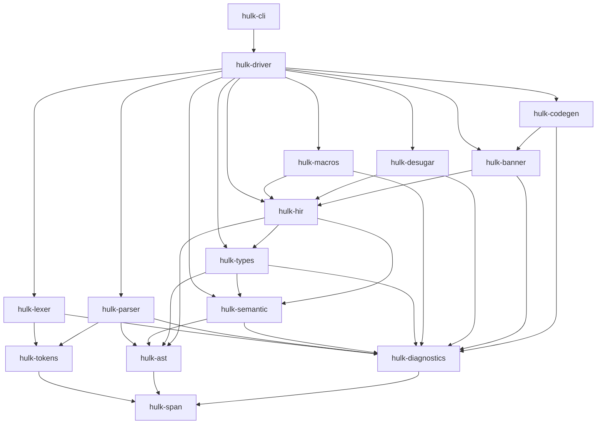

# Sección 01 — Setup del proyecto y arquitectura clean

## Resumen
Establece la base del proyecto: workspace de Cargo, crates esqueleto, CI, GitFlow y documentación inicial.

## Posición en el pipeline
Primera sección, no depende de ninguna anterior. Todas las demás dependen de esta.

## Decisiones técnicas

### Decisión 1: Uso de Cargo workspace con resolver 2
- **Qué se eligió**: Workspace de Cargo con `resolver = "2"` y todos los crates como miembros.
- **Alternativas consideradas**:
  - Un solo crate: menos granularidad, difícil de mantener a medida que crece.
  - Crates separados sin workspace: gestión de dependencias y versiones más compleja.
- **Justificación**: El workspace permite compilar, testear y versionar todo el proyecto de forma centralizada, con dependencias compartidas y sin duplicación.

### Decisión 2: Organización en 15 crates
- **Qué se eligió**: dividir el compilador en 15 crates, uno por responsabilidad del pipeline (`hulk-span`, `hulk-diagnostics`, `hulk-tokens`, `hulk-lexer`, `hulk-ast`, `hulk-parser`, `hulk-semantic`, `hulk-types`, `hulk-hir`, `hulk-macros`, `hulk-desugar`, `hulk-banner`, `hulk-codegen`, `hulk-driver`, `hulk-cli`).
- **Alternativas consideradas**:
  - **Un solo crate**: compilación más rápida al inicio, pero sin barreras arquitectónicas. Cualquier módulo puede importar cualquier otro y las capas se erosionan con el tiempo. Tampoco se pueden ejecutar tests por fase de forma aislada.
  - **~5 crates** (p. ej. `frontend`, `middle`, `backend`, `driver`, `cli`): menos boilerplate de `Cargo.toml`, pero agrupa responsabilidades heterogéneas (lexer y parser juntos, type-checker y resolver juntos). Dificulta sustituir piezas y pierde paralelismo de compilación.
  - **~20 crates** (separar aún más: `hulk-symbol-table`, `hulk-scope`, `hulk-infer`, `hulk-check`, etc.): ganancia marginal en aislamiento pero multiplica el boilerplate y los re-exports sin beneficios arquitectónicos claros.
- **Justificación**: 15 crates alinean 1:1 con las fases del pipeline del compilador. Cada crate tiene una responsabilidad clara y dependencias declaradas explícitamente en `Cargo.toml`, lo que hace que la regla de capas sea verificable automáticamente (tarea 1.1.3). Además, Cargo paraleliza la compilación por crate, por lo que la granularidad acelera builds incrementales.

#### Diagrama de dependencias

**Regla de oro**: las flechas nunca van hacia arriba. Un cambio en el CLI no puede requerir cambios en el lexer. Un cambio en el lexer puede forzar ajustes hacia abajo (parser, etc.), pero eso es deliberado.

## API expuesta por esta capa
No aplica, solo estructura de proyecto.

## Estrategia de testing
No aplica, aún no hay lógica implementada.

## Decisión: Adaptación de GitFlow a proyecto single-developer

### Qué se eligió
Se utiliza una estructura de ramas basada en GitFlow, pero adaptada para un solo desarrollador:

- `main`: rama base, siempre limpia y estable.
- `develop`: rama de integración, parte de `main`.
- `section/X-...`: ramas por sección mayor del proyecto, salen de `develop`.
- `feature/X.Y-...`: ramas de funcionalidad, salen de la rama de sección correspondiente.
- Releases: se fusionan de `develop` a `main`.

### Alternativas consideradas
- **Trunk-based development**: solo una rama principal (main/master), todo se integra ahí. Ventaja: simplicidad y menos overhead. Desventaja: poca trazabilidad por sección/subsección, historia menos estructurada, difícil aislar cambios grandes.
- **GitHub Flow**: ramas cortas desde main, PRs para todo. Ventaja: integración continua, fácil colaboración. Desventaja: requiere PRs/reviews, menos útil en single-developer, historia menos jerárquica.

### Justificación
Se mantiene la estructura jerárquica de ramas para:
- Trazabilidad clara de cambios por sección/subsección del proyecto.
- Permitir aislar y revisar avances por partes lógicas del compilador.
- Facilitar merges controlados y revertibles.
- Aunque no hay PRs ni branch protection, la disciplina se mantiene mediante un checklist auto-impuesto (tests, formato, documentación, mensaje de commit correcto, merges con --no-ff).

Esta adaptación permite aprovechar lo mejor de GitFlow (historia estructurada, ramas temáticas) sin la carga administrativa de PRs y revisiones externas, adecuada para un proyecto individual.

---

## Lecciones aprendidas y gotchas
Asegurarse de que todos los crates estén listados en `members` y que el resolver esté en `2` para evitar problemas de dependencias transitivas.
